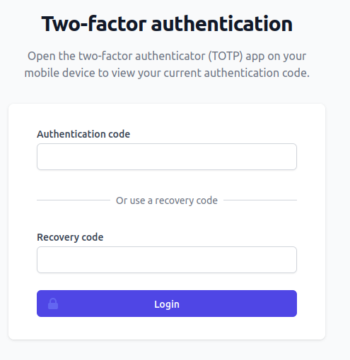
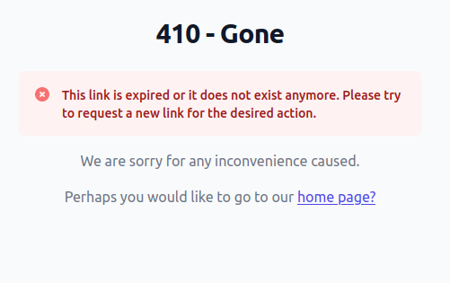
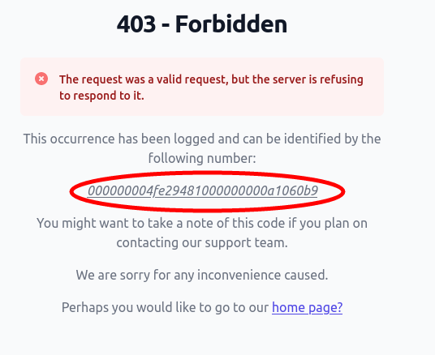

# Error handling in Fortress

<!-- TOC -->
* [Philosophy](#philosophy)
* [Web requests handled by Fortress](#web-requests-handled-by-fortress)
    * [Log identifiers](#log-identifiers)
    * [Disabling the log identifier](#disabling-the-log-identifier)
    * [display_errors](#display_errors)
* [Fortress WP-CLI commands](#fortress-wp-cli-commands)
* [Recommended PHP ini error handling settings](#recommended-php-ini-error-handling-settings)
<!-- TOC -->

## Philosophy

One of the most frustrating experiences in WordPress is having to debug why some third-party plugin functionality did not work as expected.

The culprit is often found when looking at the source of the plugin in question.

You can often find the following anti-pattern where the plugin swallows all exceptions and, therefore, all information.

```php
try {
    acme_plugin_do_something();
} catch (Throwable $e) {
    // Do nothing
}
```

Plugins do this out of fear of White Screen of Death (WSoD).

Fortress aims to raise the bar in WordPress plugin development significantly, and exception handling is no different.

Let's dive into how Fortress does error handling in practice.

## Web requests handled by Fortress

**Important:** The following does only apply to fortress-managed URLs.

> All HTTP requests with the `/snicco-fortress/*` URL prefix are managed by Fortress.

- The core of Fortress is programmed very defensively and will throw exceptions if it encounters "impossible" situations or runtime errors that it can't handle. Unfortunately, there are no "safe" defaults in some cases, and security software is one of them.

- Each unexpected [PHP Error](https://www.php.net/manual/en/errorfunc.constants.php) (notices, warnings, errors, etc.) triggered in **Fortress's code** will be converted to an exception.
  > Fortress has 100% test coverage against each PHP/WordPress combination, and no release can be tagged if any error is thrown in our test suite. Therefore, a [PHP Error](https://www.php.net/manual/en/errorfunc.constants.php) of any kind in Fortress's production build will be treated as a bug by us.

- Each unexpected [PHP Error](https://www.php.net/manual/en/errorfunc.constants.php) in **WordPress core or third-party** plugins DURING Fortress HTTP request cycle will not be converted to an exception unless the severity is `E_USER_ERROR` or higher in which case PHP would halt anyway.

End users will never see a White Screen of Death.

Fortress will always convert exceptions to a useful help screen if possible.

Let's look at the following example:

A user tries to log in and gets redirected to perform his [TOTP-2FA login challenge](../modules/auth/2fa_totp.md), which is valid for `ten minutes`.

|  |
|-------------------------------------------------------------------|

The user leaves his computer and comes back after `eleven minutes`.

His challenge is not valid anymore, so his TOTP login fails.

The user will now see the following screen instead of the WSoD.

|  |
|-----------------------------------------------------------------|

Furthermore, Fortress's [error log](logging.md#e) now contains the following entry:

```log
[01-Feb-2023 17:44:58 UTC] snicco_fortress.http.ERROR The two-factor challenge with selector [atVPwkvZncyJEZ9-9z8p4QhJpGyphV0e5pD2e4EHiQzKisSljkkDOM24nuQNT-_ZnBn7Q_1mq9oi] was expired since [1] second/s.
   Context: ['user_id' => 0, 'request_target' => '/snicco-fortress/auth/totp/challenge/**************', 'request_method' => 'GET', 'identifier' => '00000000386fa518000000005688d11f'] 
   Snicco\Enterprise\Component\Challenge\Exception\ChallengeExpired "The two-factor challenge with selector [atVPwkvZncyJEZ9-9z8p4QhJpGyphV0e5pD2e4EHiQzKisSljkkDOM24nuQNT-_ZnBn7Q_1mq9oi] was expired since [10] second/s." in /var/www/html/wp-content/component/challenge/src/Exception/ChallengeExpired.php:18
   Stack trace:
   #0 /var/www/html/wp-content/plugins/snicco-fortress/src/Auth/Login/Infrastructure/Http/Controller/TOTPLoginController.php(89): Snicco\Enterprise\Component\Challenge\Exception\ChallengeExpired::forSelector('atVPwkvZncyJEZ9...', 10)
        #1 more here. 
```

So the site's developer has complete information about what happened, while the end-user who experienced the issue still has a decent UX.


#### Log identifiers

Exceptions thrown during Fortress's HTTP handling will display a unique identifier that can be used to trace the issue in the error log.

Let's look at an example where for some reason, a user manually navigates to the [TOTP force setup screen](../modules/auth/2fa_totp.md#force-setup-screen) even though is TOTP-Credentials are already configured and valid.

This should usually never happen, and Fortress will throw an exception.

|  |
|--------------------------------------------------------------------------------------------|

Since the user is logged in, Fortress will display the highlighted exception identifier.

```log
[02-Feb-2023 15:18:36 UTC] snicco_fortress.http.ERROR Can't show TOTP force-setup page to user [1] because TOTP setup is already completed.
   Context: ['identifier' => '0000000037d945ab000000004a848bb8', 'user_id' => 1, 'request_target' => '/snicco-fortress/auth/totp/manage/force-setup', 'request_method' => 'GET'] 
   Snicco\Component\Psr7ErrorHandler\HttpException "Can't show TOTP force-setup page to user [1] because TOTP setup is already completed." in /var/www/html/wp-content/plugins/snicco-fortress/src/Auth/TOTP/Infrastructure/Http/Controller/TOTPCredentialsController.php:105
   Stack trace:
```

The corresponding [error log entry](logging.md#error-logs) contains the same identifier, which significantly simplifies troubleshooting issues that a different (non-admin) user might experience.

```log
...
Context: ['identifier' => '0000000037d945ab000000004a848bb8', ...]
...
```

#### Disabling the log identifier

By default, Fortress will only show the log identifier to users that are logged in.

You can customize this behavior with the following code snippet:

```php
use Snicco\Enterprise\Fortress\Shared\Infrastructure\Event\ShouldExceptionLogIdentifierBeShown;

add_action(ShouldExceptionLogIdentifierBeShown::class, function (ShouldExceptionLogIdentifierBeShown $event) {

    // Never show the log identifier on the exception page.
    $event->show = false;
    
    // Only show log identifier to admins.    
    $event->show = current_user_can('manage_options');     
        
});
```

#### display_errors

If your site has the [`display_errors` ini setting](https://www.php.net/manual/en/errorfunc.configuration.php#ini.display-errors) turned on, Fortress will toggle-it off during its HTTP request cycle and re-enable it afterward.

This is needed because Fortress can not send HTTP headers if a [PHP Error](https://www.php.net/manual/en/errorfunc.constants.php) has already been output to the browser.

This should not affect you since `display_errors` should always be turned off in production.

## Fortress WP-CLI commands

The default error handling of the WP-CLI is non-existent, which was one of the primary motivators for us to create [`BetterWPCLI`](https://github.com/snicco/better-wp-cli#motivation).

> - Thrown exceptions go directly to the global shutdown handler (wp_die) and show up in the terminal as the dreaded "There has been a critical error on this website. Learn more about troubleshooting WordPress."

**Important:** The following does ONLY apply Fortress's WP-CLI commands.

- The core of Fortress is programmed very defensively and will throw exceptions if it encounters "impossible" situations or runtime errors that it can't handle. Unfortunately, there are no "safe" defaults in some cases, and security software is one of them.

- Each unexpected [PHP Error](https://www.php.net/manual/en/errorfunc.constants.php) (notices, warnings, errors, etc.) triggered in **Fortress's code** will be converted to an exception.
  > Fortress has 100% test coverage against each PHP/WordPress combination, and no release can be tagged if any error is thrown in our test suite. Therefore, a [PHP Error](https://www.php.net/manual/en/errorfunc.constants.php) of any kind in Fortress's production build will be treated as a bug by us.

- Each unexpected [PHP Error](https://www.php.net/manual/en/errorfunc.constants.php) in **WordPress core or third-party** plugins DURING Fortress CLI command, will not be converted to an exception, unless the severity is `E_USER_ERROR` or higher in which case PHP would halt anyway.

- Exceptions and errors are always written to `STDERR`.

- Encountered exceptions are always logged to the standard Fortress [error log](logging.md#error-logs).

Let's look at the error output that Fortress will produce at different [verbosity levels](../wp-cli/readme.md#output-verbosity).

Here we mistakenly try to set up TOTP credentials for a user that already has credentials.

|                 Default verbosity.<br><br>                 |
|:-----------------------------------------------------------------------------------------------------------------:|
|      **Running with verbose output**<br><br>       |
| **Running with very verbose output**.<br><br> |

## Recommended PHP ini error handling settings

The below recommendations reflect what we believe to be optimal for most WordPress sites.
However, they are optional. Fortress does not require any particular error-handling configuration.

- ALWAYS use `E_ALL` as the error reporting level. You want to know what is going wrong on your site. If your logs get flooded with errors, it's time to upgrade your plugin stack.
- Turn off `display_errors`.
- ALWAYS log errors.
- Don't rely on `WP_DEBUG` to [configure error handling](https://github.com/WordPress/wordpress-develop/blob/6.1/src/wp-includes/load.php#L424-L490). Only set `WP_DEBUG` if you are truly debugging something right now. Many plugins will check for the existence of `WP_DEBUG` and start to behave differently if it's set.

```php
// wp-config.php
// You can also achieve the same with php.ini settings.

// Report all errors.
error_reporting(E_ALL);

// Log all errors.
ini_set('log_errors', '1');

// Never display errors.
ini_set('display_errors', '0')

// Alternative for WP-CLI scripts ONLY.
// ini_set('display_errors', 'stderr')

// Log PHP errors to a custom file.
ini_set('error_log', '/path/to/your/error.log' );

// Only if you are actively debugging something.
// define('WP_DEBUG', true); 
```

--- 

Next: [Logging](logging.md).
