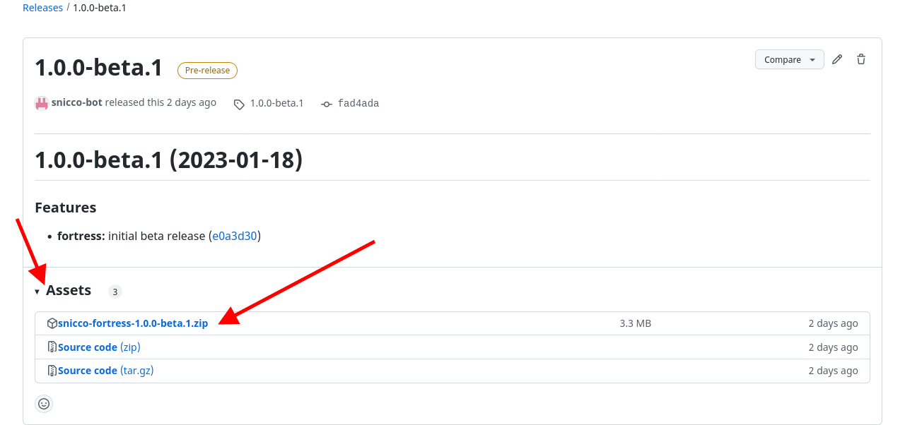

# Downloading Fortress

<!-- TOC -->
* [Downloading Fortress](#downloading-fortress)
  * [Web UI](#web-ui)
  * [REST API](#rest-api)
    * [List all releases (including beta releases):](#list-all-releases-including-beta-releases--)
    * [Get the latest version name (including beta releases)](#get-the-latest-version-name-including-beta-releases-)
    * [Get the download URL of Fortress's latest version](#get-the-download-url-of-fortresss-latest-version)
    * [Download a release](#download-a-release)
    * [Using fetch](#using-fetch)
<!-- TOC -->

---

New versions of Fortress are auto-deployed (as release assets) on each commit to the GitHub release archive.

Fortress strictly follows [semantic versioning (SemVer)](https://semver.org/).

After your GitHub account has been granted access to the development repository
you can download releases using the GitHub Web UI or the GitHub REST API.

> A dedicated license and update server will be available in future versions.

## Web UI

1. Go to the [release archive](https://github.com/snicco/fortress-dist/releases).
2. Click on the version that you want to download.
3. Click on `Assets`.
4. Download the .zip file named `snicco-fortress-<VERSION>.zip`.



## REST API

Make sure that you are authenticating as the GitHub user that has access to the development repository of Fortress.  
You can either use the [GitHub CLI](https://docs.github.com/en/rest/guides/getting-started-with-the-rest-api?apiVersion=2022-11-28#authentication-example) or a [PAT](https://docs.github.com/en/authentication/keeping-your-account-and-data-secure/creating-a-personal-access-token#creating-a-personal-access-token-classic) + [header authentication](https://docs.github.com/en/rest/guides/getting-started-with-the-rest-api?apiVersion=2022-11-28#using-headers).

### [List all releases](https://docs.github.com/en/rest/releases/releases?apiVersion=2022-11-28#list-releases) (including beta releases):

```bash
curl \
  -H "Accept: application/vnd.github+json" \
  -H "Authorization: Bearer <YOUR-PERSONAL_ACCESS_TOKEN>"\
  -H "X-GitHub-Api-Version: 2022-11-28" \
  https://api.github.com/repos/snicco/fortress-dist/releases
   
  # Or GitHub CLI api
  # https://cli.github.com/manual/gh_api

  gh api \
  -H "Accept: application/vnd.github+json" \
  /repos/snicco/fortress-dist/releases
```

The above request will return an array of [release objects](https://docs.github.com/en/rest/releases/releases?apiVersion=2022-11-28#list-releases).

Alternatively, you can download the **latest, stable** release like so:

```shell
curl \
  -H "Accept: application/vnd.github+json" \
  -H "Authorization: Bearer <YOUR-PERSONAL_ACCESS_TOKEN>"\
  -H "X-GitHub-Api-Version: 2022-11-28" \
  https://api.github.com/repos/snicco/fortress-dist/releases/latest
```

### Get the latest version name (including beta releases)

We assume your system has the [`jq`](https://stedolan.github.io/jq/) utility for manipulating JSON data.

```shell
curl \
  -H "Accept: application/vnd.github+json" \
  -H "Authorization: Bearer <YOUR-PERSONAL_ACCESS_TOKEN>"\
  -H "X-GitHub-Api-Version: 2022-11-28" \
  https://api.github.com/repos/snicco/fortress-dist/releases | jq .[0].tag_name

# ==> "1.0.0-beta.1"
```

### Get the download URL of Fortress's latest version

```shell
curl \
  -H "Accept: application/vnd.github+json" \
  -H "Authorization: Bearer <YOUR-PERSONAL_ACCESS_TOKEN>"\
  -H "X-GitHub-Api-Version: 2022-11-28" \
  https://api.github.com/repos/snicco/fortress-dist/releases | jq .[0].assets[0].url

# ==> "https://api.github.com/repos/snicco/enterprise/releases/assets/92177402"
```

### Download a release

```shell
curl -O -J -L \
  -H "Authorization: Bearer <YOUR-PERSONAL_ACCESS_TOKEN>" \
  -H "Accept: application/octet-stream" \
  https://api.github.com/repos/snicco/fortress-dist/releases/assets/92177402

# It's important to set the Accept header to application/octet-stream
```

### Using fetch

[`fetch`](https://github.com/gruntwork-io/fetch) is a standalone binary developed by [gruntwork.io](https://www.gruntwork.io/)
that greatly simplifies the download of GitHub release assets.

Instead of using the above curl commands, you could use the below one-liner:

```shell
export GITHUB_OAUTH_TOKEN=<YOUR-PERSONAL_ACCESS_TOKEN>

fetch \
  --repo="https://github.com/snicco/fortress-dist" \
  --tag="1.0.0-beta.1" \
  --release-asset="snicco-fortress-.*"
```

---

Next: [Preparation](02_preparation.md)
