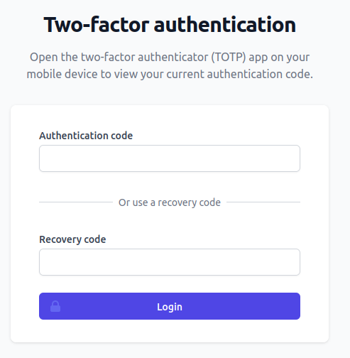
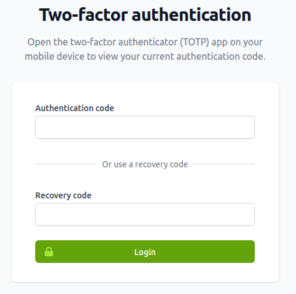

# White-label Fortress

<!-- TOC -->
* [White-label Fortress](#white-label-fortress)
    * [Constants](#constants)
        * [SNICCO_FORTRESS_WHITELABEL_SLUG](#snicco_fortress_whitelabel_slug)
        * [SNICCO_FORTRESS_WHITELABEL_SNAKE_CASE](#snicco_fortress_whitelabel_snake_case)
        * [SNICCO_FORTRESS_WHITELABEL_CLI_NAMESPACE](#snicco_fortress_whitelabel_cli_namespace)
        * [SNICCO_FORTRESS_WHITELABEL_TEXT_CASE](#snicco_fortress_whitelabel_cli_text_case)
    * [Appearance](#appearance)
        * [Colors](#colors)
        * [Template headers and footers](#template-headers-and-footers)
<!-- TOC -->

---

Fortress can be white-labeled down to the deepest level by setting a couple of PHP constants before Fortress boots.

> Your purchased license must grant you permission to white-label Fortress.

## Constants

### SNICCO_FORTRESS_WHITELABEL_SLUG

Default value: `snicco-fortress`.

Usage:
- URL namespace
- WP shortcodes

```php
define('SNICCO_FORTRESS_WHITELABEL_SLUG', 'acme-host-security');
```

The above would change `domain.com/snicco-fortress/auth/totp/manage` to `domain.com/acme-host-security/auth/totp/manage`

**This value must be URL compatible!**

### SNICCO_FORTRESS_WHITELABEL_SNAKE_CASE

Default value: `snicco_fortress`

Usage:
- Database table names
- Log entry prefixes
- Object cache groups
- Syslog prefixes (Fail2Ban)

```php
define('SNICCO_FORTRESS_WHITELABEL_SNAKE_CASE', 'acme_host_security');
```

The above would change the below log entry:

```log
[21-Jan-2023 17:08:00 UTC] snicco_fortress.http.CRITICAL Error rendering view [auth.login.totp_login].
```

to:

```log
[21-Jan-2023 17:08:00 UTC] acme_host_security.http.CRITICAL Error rendering view [auth.login.totp_login].
```

### SNICCO_FORTRESS_WHITELABEL_CLI_NAMESPACE

Default value: `snicco/fortress`.

Usage:
- Namespace of WP-CLI commands

```php
define('SNICCO_FORTRESS_WHITELABEL_CLI_NAMESPACE', 'acme_host/security');
```

Before:

```shell
wp snicco/fortress auth totp:setup admin
```

After:

```shell
wp acme_host/security auth totp:setup admin
```

### SNICCO_FORTRESS_WHITELABEL_TEXT_CASE

Default value: `Snicco Fortress`.

Usage:
- Free-form text

```php
define('SNICCO_FORTRESS_WHITELABEL_TEXT_CASE', 'Acme Host Security');
```

Before: `Manage the Snicco Fortress session module.`

After: `Manage the Acme Host Security session module.`

## Appearance

### Colors

By default, Fortress uses a minimal and modern design for all its front-end views.
The views are built with Tailwind CSS and CSS variables and can be fully customized to match any branding.

Fortress includes its [default-theme.css](../../default-theme.css) file unless you define a [custom CSS file in the configuration](../configuration/02_configuration_reference.md#theme_css_file).

```css
:root {
    --color-primary-light: 99 102 241;
    --color-primary: 79 70 229;
    --color-primary-dark: 67 56 202;
}
```

As an example:

The 2FA login page looks like this using the default theme:



And if you were to use the following [custom CSS theme file](../configuration/02_configuration_reference.md#theme_css_file):

```css
:root {
    --color-primary-light: 163 230 53;
    --color-primary: 101 163 13;
    --color-primary-dark: 77 124 15;
}
```

The 2FA login page (and every other front-end page) now uses your custom branding:



### Template headers and footers

Fortress uses our open-source [templating library](https://github.com/snicco/templating), which allows overwriting templates similar to the WordPress template hierarchy.

Before rendering the actual page content (the 2FA form in this case), Fortress renders a template called `shared.layout-header.php`.
After the body content, a view called `shared.layout-footer.php` is rendered.

These templates are [empty](../../src/Shared/Infrastructure/Http/views/shared/layout-header.php) by [default](../../src/Shared/Infrastructure/Http/views/shared/layout-footer.php) as we aim to keep all views minimalistic and unbranded.

However, you can white-label overwrite those views by registering a custom template directory using the [PHP Config API](../configuration/01_how_to_configure_fortress.md#php-api-experimental-).

```php
<?php
// some-file-that-loads-before-fortress.php
use Snicco\Enterprise\Fortress\Shared\Infrastructure\PublicConfigAPI;

add_action(PublicConfigAPI::class, function (PublicConfigAPI $config_api) :void {
     $config_api->addCustomTemplateDirectory('/var/www/acme-host-security/templates');
});
```

The `/var/www/acme-host-security` directory needs to have the following directory structure;

```
/var/www/acme-host-security
├── templates/
│   ├── shared/                 
│   │   ├── layout-header.php  
│   │   └── layout-footer.php  
│   └── ...             
└── ...
```

Each `.` in the view that Fortress tries to render corresponds to one directory level relative to the template directory you registered with Fortress.

`shared.layout-header.php` => `shared/layout-header.php`.

If you create the following `shared/layout-header.php` file:

```php
<?php
// /var/www/acme-host-security/templates/shared/layout-header.php
declare(strict_types=1);

?>
<div class="mb-8 max-w-3xl mx-auto">
    <h1 class="text-3xl text-center">Acme Hosting Security</h1>
    
    <hr class='solid mt-2'>
</div>
```

All front-end views of Fortress now use the following header:


---

Next: [Activation](04_activation.md)
