# Two-Factor authentication - TOTP

<!-- TOC -->
* [Terminology](#terminology)
* [Interaction with Core and plugins](#interaction-with-core-and-plugins)
  * [When is 2FA enforced?](#when-is-2fa-enforced)
  * [Skipping 2FA for the current request](#skipping-2fa-for-the-current-request)
  * [Changing the redirect context](#changing-the-redirect-context)
  * [Ajax-powered login forms](#ajax-powered-login-forms)
  * [Enforcing 2FA pre login](#enforcing-2fa-pre-login)
  * [Why does Fortress use a redirect to enforce TOTP-2FA?](#why-does-fortress-use-a-redirect-to-enforce-totp-2fa)
  * [The user can log in without 2FA !?](#the-user-can-log-in-without-2fa--)
* [Implementation](#implementation)
  * [Rate Limiting 2FA attempts](#rate-limiting-2fa-attempts)
  * [Replay / Reuse protection](#replay--reuse-protection)
  * [TOTP secrets](#totp-secrets)
  * [Recovery codes](#recovery-codes)
* [UI setup walkthrough](#ui-setup-walkthrough)
  * [Force-setup screen](#force-setup-screen)
  * [Completion screen](#completion-screen)
  * [Delayed completion screen](#delayed-completion-screen)
  * [Recovery codes screen](#recovery-codes-screen)
  * [Management screen](#management-screen)
    * [Access](#access)
    * [Generating new recovery codes](#generating-new-recovery-codes)
    * [Deactivating TOTP](#deactivating-totp)
    * [Activating TOTP](#activating-totp)
* [CLI setup walkthrough](#cli-setup-walkthrough)
  * [Setup command](#setup-command)
  * [Complete command](#complete-command)
  * [Deactivate command](#deactivate-command)
  * [Reset recovery codes command](#reset-recovery-codes-command)
<!-- TOC -->

## Terminology

- TOTP: Time-Based One-Time Password
- OTP: One-Time Password
- 2FA: Two-Factor Authentication

## Interaction with Core and plugins

### When is 2FA enforced?

Fortress hooks into the [`authenticate`](https://developer.wordpress.org/reference/hooks/authenticate/) hook that is fired by the [`wp_signon`](https://developer.wordpress.org/reference/functions/wp_signon/) / [`wp_authenticate`](https://developer.wordpress.org/reference/functions/wp_authenticate/) function.

Fortress's TOTP functionality runs if any primary authentication is successful. Successful means that the `authenticate` hook passes a `WP_User`).

A primary authentication method might be any of the following:

- username/password.
- username/email.
- application passwords.
- custom and or third-party mechanisms.

Fortress is indifferent toward the primary authentication method and the "request type" (HTTP, XML-RPC, REST-API, etc.).

Fortress will perform the following steps IF the user already has TOTP-2FA [configured](#ui-setup-walkthrough):

1. The login attempt is intercepted, and WordPress will not set authentication cookies.
2. Fortress creates and persists a cryptographically secure TOTP login challenge for the user.
3. Fortress redirects the user to the challenge URL.
4. PHP is shut down.
5. The user enters his current OTP.
6. On success, Fortress redirects the user to his intended post-login location from step 1.

| The TOTP challenge page<br><br>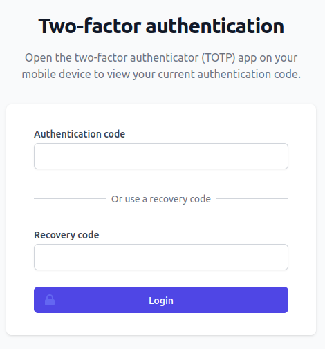 |
|----------------------------------------------------------------------------------------|

### Skipping 2FA for the current request

You can use the following code snippet to make Fortress skip the TOTP-2FA check. In this case, the authentication will succeed as if Fortress was not installed.

We do not advise this, and you should avoid using automated authentication methods like application passwords for high-privilege user accounts requiring 2FA.

```php
use Snicco\Enterprise\Fortress\Auth\Login\Infrastructure\Event\Exposed\DeterminingIf2FaShouldBeSkipped;

add_action(DeterminingIf2FaShouldBeSkipped::class, function (DeterminingIf2FaShouldBeSkipped $event): void {
    
    $some_condition = false;    
        
    if($some_condition){
        $event->should_skip_2fa = true;
    }

});


```

### Changing the redirect context

Fortress tries to parse the intended post-login redirect location from the current environment.

Fortress consecutively checks the `$_REQUEST` super global for the following keys:

- `redirect_to`. Used by WordPress Core and many plugins as a hidden form field.
- `_wp_http_referer`.
- `HTTP_REFERER`

If the `$_REQUEST` does not contain one of the above keys, Fortress will use the [`get_edit_profile_url`](https://developer.wordpress.org/reference/functions/get_edit_profile_url/) function as a fallback.

You can customize the redirect location using the following code snippet, if your site uses a custom login scheme or third-party plugin that does not use any of the above request keys:

```php
use Snicco\Enterprise\Fortress\Auth\Login\Infrastructure\Event\Exposed\Determining2FARedirectContext;

add_action(Determining2FARedirectContext::class, function (Determining2FARedirectContext $event) :void {
   $event->redirect_too = '/some-other-page';
});
```

### Ajax-powered login forms

Suppose your site uses a third-party plugin that performs ajax logins. In that case, you can optionally make Fortress return a `WP_Error` object instead of the standard redirect + PHP shutdown behavior.

The returned `WP_Error` object contains the link to the login challenge, and the plugin will most likely render the error object in its front-end login form.

```php
use Snicco\Enterprise\Fortress\Auth\Login\Infrastructure\Event\Exposed\RedirectingUserWith2FAEnabled;

add_action(RedirectingUserWith2FAEnabled::class, function (RedirectingUserWith2FAEnabled $event) :void {
   $event->turnRedirectIntoWPError();
});
```

### Enforcing 2FA pre login

If a site only has one (or a handful) of [`privileged_users`](../../configuration/02_configuration_reference.md#privileged_user_roles) AND new privileged users are added infrequently, it makes sense to enforce that each user needs to have TOTP-2FA configured BEFORE he can log in.

Doing this protects against the following attack vectors:

- An attack with WRITE access to the database can't delete TOTP credentials to bypass 2FA.
- An attacker with WRITE access to the database can't insert new admin users since they can't create TOTP credentials without the [secret key stored in the filesystem](../../getting-started/02_preparation.md#secrets).
- An attacker with a [stolen auth cookie](../session/session-managment-and-security.md#threat-model) can not create sleeper admin users. 
- A **non-targeted malware** can not insert new admin users using `wp_insert_user`. <br>(If an attacker specifically targets your site AND your site has a vulnerability that gives full OS access, it's game over no matter what).

To achieve this, add your site's [`privileged_user_roles`](../../configuration/02_configuration_reference.md#privileged_user_roles) to the [`require_2fa_for_roles_before_login`](../../configuration/02_configuration_reference.md#require_2fa_for_roles_before_login) option AFTER all privileged users have 2FA configured.

Any privileged user without TOTP-2FA configured will then see the following message when they attempt to log in:

| 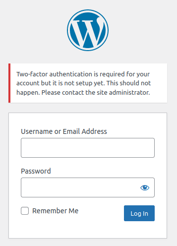 |
|----------------------------------------------------------------------------------------|


### Why does Fortress use a redirect to enforce TOTP-2FA?

This method has the highest compatibility with WordPress Core and all the hundreds of plugins that allow front-end user login.

An HTTP redirect will always work whether your site uses WooCommerce, the default login page, or something entirely different.

In contrast, using a JavaScript-based solution is bound to fail for all login forms besides the native one. Unfortunately, WordFence made this mistake; hence, its 2FA only works on the default login page.

### The user can log in without 2FA !?

Your site uses a plugin that, with almost 100% certainty, bypasses the default WordPress authentication mechanism (adding custom hooks to  [`authenticate`](https://developer.wordpress.org/reference/hooks/authenticate/)) and directly calls [`wp_set_auth_cookie`](https://developer.wordpress.org/reference/functions/wp_set_auth_cookie/).

The following example showcases the issue:

```php
function my_plugin_maybe_log_in_whitelisted_ip_directly() {

    if(true){
       return; // DON'T COPY AND PASTE THIS CODE.
    }
        
    if($_SERVER['REMOTE_ADDR'] === '0.0.0.0') {
        // WordPress and, by extension Fortress does not know about this login attempt.
        wp_set_auth_cookie(1); 
    }    
        
}
```

Fortress does not support this (incorrect) code, but few plugins make this mistake.

## Implementation

The Fortress TOTP implementation conforms with the [RFC 6238 spec](https://www.rfc-editor.org/rfc/rfc6238) and works with all common authenticator apps like:

- 1Password
- Google Authenticator
- etc.


### Rate Limiting 2FA attempts

Not a single WordPress plugin that does TOTP-2FA implements this, although the entire security of TOTP stands and falls with this. **An implementation without 2FA rate limiting is broken.**

Contrary to popular opinion, the thirty-second validity window used by most TOTP implementations does not matter from a brute-force perspective.

The time to brute-force TOTP is calculated using the following formula:

| <br>Go [here](https://lukeplant.me.uk/blog/posts/6-digit-otp-for-two-factor-auth-is-brute-forceable-in-3-days/) to see how this formula is derived. |
|----------------------------------------------------------------------------------------------------------------------------------------------------------------------------------------------------------------------------------|

> The thirty-second window does not appear at all in this formula.

Let's look at concrete examples:

- A TOTP typically consists of six-digits => `numberOfPossibilities = 10^6 = 1 million`
- You are on a good server that can handle ten requests per second => `requestsPerSecond = 10`
- We want a 90% chance of successfully brute-forcing the TOTP implementation => `chanceOfSuccess = 0.9`

Substituting in the above formula gives us => `~ 230258 seconds` => `~ 64 hours`.

Even worse, you typically want the OTP from the previous thirty-second window to be valid for UX reasons which effectively doubles the request rate since you are guessing two numbers at once (one for the current window, one for the previous window).

If your server can handle ten requests per second, **an attacker can brute-force the TOTP implementation in `32 hours`, 90% of the time.**

If the compromised username/password pair belongs to a high-value user, an attacker will take the time and break the 2FA.

If you don't assume that a username/password pair can be compromised by any means, why are you using 2FA at all?

Fortress has your back, even though none of the "competing" WordPress plugins seem even to be aware of the problem!


| 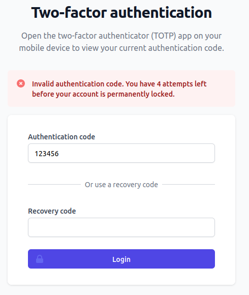 |
|--------------------------------------------------------------------|

By default, Fortress allows five failed 2FA attempts. This can be configured with the [`max_totp_attempts_before_lockout`](../../configuration/02_configuration_reference.md#max_totp_attempts_before_lockout) option.
The failed attempts counter is reset after a successful 2FA login, **unless** the user is considered privileged.

If the threshold is exceeded, Fortress will "lock" the user account which means:

- Destroying all sessions (including the current one) for the associated user.
- Resetting the password of the user to a completely random one.
- Sending the user an email about the incident.

For privileged users, the failed attempts can only be reset by using the: `wp snicco/fortress auth totp:reset-failed-attempts` [command](../../wp-cli/readme.md#totpreset-failed-attempts).

### Replay / Reuse protection

Many TOTP implementations (including Fortress) validate a user-provided OTP against the current AND previous time window.

At any given time, two different OTPs are valid to prevent UX issues where a slight transmission delay makes the user tip over the current time window leading to a failed attempt.

However, almost nobody protects against replaying/reusing an already-used OTP.

Fortress will never allow the same OTP to be used twice during the thirty-second validation window.

### TOTP secrets

The security of TOTP-based 2FA relies on the premise that the TOTP secret key is kept private between the server and the user's authenticator app.

An attacker with access to the secret key will always be able to generate valid OTPs and thus break the 2FA.

Fortress generates the plaintext secret using 256 bits of entropy
and stores it in the database using [libsodiums symmetric encryption](https://www.php.net/manual/de/function.sodium-crypto-stream-xor.php). The encryption key is never stored in the database and must be provided using one of [Fortress's secret storages.](../../getting-started/02_preparation.md#secrets).

### Recovery codes

TOTP recovery codes have 192 bits of entropy and are stored hashed using [libsodiums BLAKE2b hashing](https://www.php.net/manual/de/function.sodium-crypto-generichash.php).

## UI setup walkthrough

### Force-setup screen

After a user whose role mandates TOTP-2FA logs in, they will be intercepted and redirected to the TOTP setup page.

| 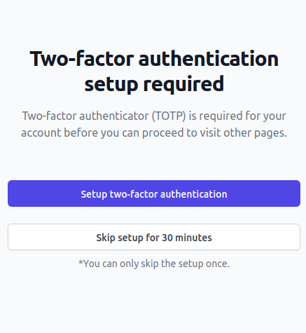 |
|---------------------------------------------------------|

The user will only be able to go to a different page after completing the TOTP setup.

Optionally, for emergencies, the user can skip the TOTP setup ONCE for the duration configured with the [`skip_2fa_setup_duration_seconds`](../../configuration/02_configuration_reference.md#skip_2fa_setup_duration_seconds) option.

### Completion screen

After clicking the "Setup two-factor authentication" button, Fortress will generate and persist a new set of TOTP credentials for the user.

The user can scan the displayed QR code (if the authenticator app supports it) or copy the revealed secret.

**There is no way to see the secret again!**

|  |
|-----------------------------------------------------------------|

To prevent account lockout through some mismatch between Fortress and the authenticator app, Fortress will not activate TOTP-2FA until the user provides a valid OTP.

### Delayed completion screen

If for some reason, the user does not complete the setup immediately, they can resume it later.
Fortress will automatically intercept all requests and redirect the user to the appropriate page.

Fortress will not reveal the current TOTP secret again. However, if the user has not saved it, they can resume the setup with new credentials.

| 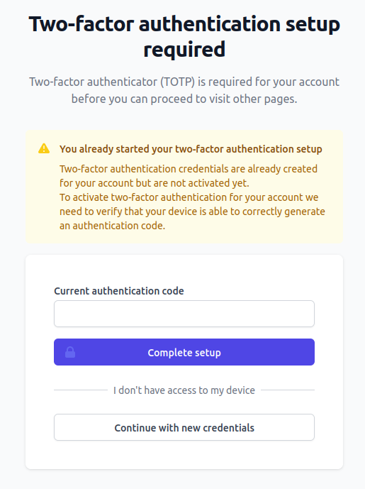 |
|-------------------------------------------------------------------------|

### Recovery codes screen

After providing the correct OTP for the current time window, Fortress will activate TOTP-2FA for the user and reveal eight recovery codes.

The user can use each recovery code once if they lose access to their authenticator device.

The user must save the recovery codes to a secure location like a password manager right away, as Fortress does not have access to the plaintext recovery codes ever again.

| 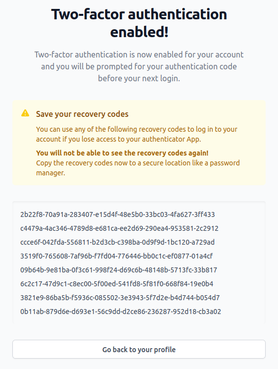 |
|-----------------------------------------------------------------------|


### Management screen

The TOTP management page currently allows the authenticated user to:

- [Generate new recovery codes](#generating-new-recovery-codes)
- [Deactivate TOTP](#deactivating-totp)
- [Activate TOTP](#activating-totp)

#### Access

Authenticated users can access their management page by clicking a link on their profile page. If your site does not allow WP-admin access to some users, you can use the shortcode below to render a direct link to the management page.

- `[snicco-fortress:manage_totp_link]`
- With a custom message:<br>`[snicco-fortress:manage_totp_link]Click here to edit 2FA[/snicco-fortress:manage_totp_link]`


| 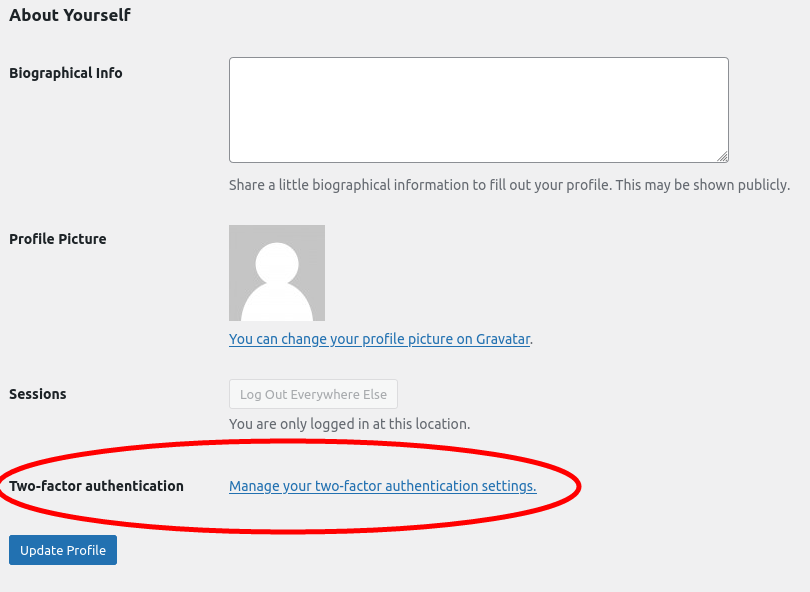 | 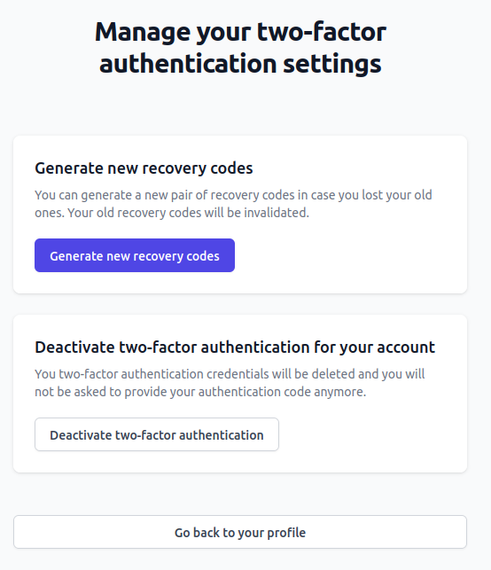 |
|-----------------------------------------------------------------------|----------------------------------------------------------------|

Furthermore, administrators can manage the TOTP settings for other users.


| On the user-edit page<br><br>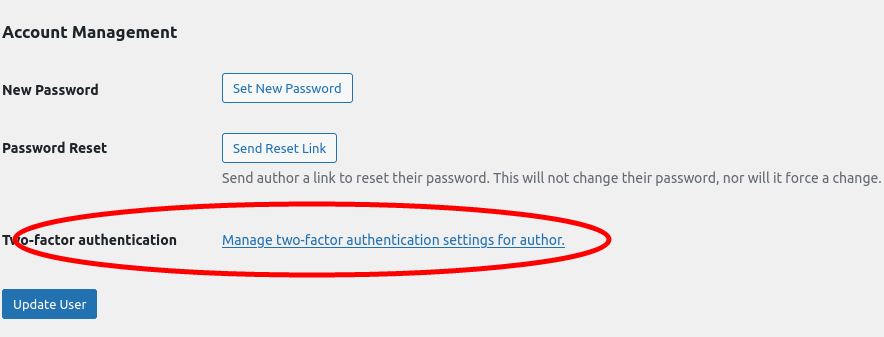 | Manage TOTP for a different user as admin.<br><br>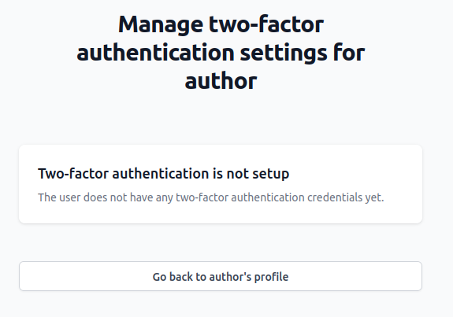 |
|-----------------------------------------------------------------------------------------------------------------|-------------------------------------------------------------------------------------------------------------------------------------------|


#### Generating new recovery codes

Users can generate eight new recovery codes if they lose their current ones or assume they are compromised.

Fortress will invalidate all existing recovery codes for the user and [display the new ones](#recovery-codes-screen).

#### Deactivating TOTP

A user can deactivate TOTP for his account unless the user's role is specified in the [`require_2fa_for_roles_before_login`](../../configuration/02_configuration_reference.md#require_2fa_for_roles_before_login) option.

| 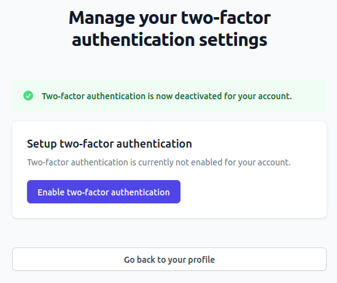 |
|--------------------------------------------------------------------|

A user can re-enable TOTP at any time.<br>If TOTP is [enforced](#force-setup-screen) for the user's role, they will be redirected to the [Force setup screen](#force-setup-screen) immediately when they try to navigate to a new page.

#### Activating TOTP

Every user on the site can access the management page, indecently of this current TOTP status.

A user that does not have TOTP enabled yet can [initiate the TOTP setup flow](#completion-screen) here.

| 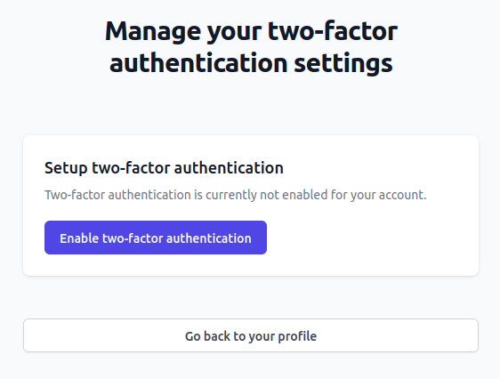 |
|-----------------------------------------------------------------|


## CLI setup walkthrough

Since Fortress has 100% feature parity between UI and CLI, the same steps from the [UI walkthrough](#ui-setup-walkthrough) can also be performed using [Fortress's WP-CLI commands](../../wp-cli/readme.md).

### Setup command

- [Full command reference](../../wp-cli/readme.md#totpsetup).

```console
$ wp snicco/fortress auth totp:setup admin@snicco.io
                                                                                                                      
Secret: 7UQUJXREMBUWZOLEVG6LKI7G53Z4LNCS
```

Fortress writes the TOTP secret to stdout, and the user must copy-paste it into their authenticator app to generate valid OTPs.

### Complete command

- [Full command reference](../../wp-cli/readme.md#totpcomplete).

A valid OTP needs to be provided the complete the setup.

```console
$ wp snicco/fortress auth totp:complete admin@snicco.io 755412
                                                                                                                      
Recovery codes:
058788-3f57cd-e1c68d-775549-a7990f-c30c6f-d77a61-b63623
b9dc19-57f007-76fbf4-59acb0-1b53da-aadd7e-b9651c-93bd54
b49044-aeb7c2-4e8eee-6a5629-917ff4-bcb0dd-c84aec-1a7090
ffdf64-c01273-a70f5f-4f76e5-b7e561-dfb16f-f2863f-a36c0d
025a34-ebe20f-68a092-16d235-185641-927d9e-4fbaf3-9d92ab
f13d68-6c7167-8ef985-b95f17-7442f3-3f65ee-8f5aed-3c31a6
93d697-9c9696-112905-7194a6-a63383-b88b2c-990cf5-ea4a92
f495ae-3e0bc7-04bca3-ecc97d-0cc750-e5a235-864e30-e232b3
```

### Deactivate command

- [Full command reference](../../wp-cli/readme.md#totpdeactivate).

```console
$ wp snicco/fortress auth totp:deactivate admin@snicco.io
```

### Reset recovery codes command

- [Full command reference](../../wp-cli/readme.md#totpreset-recovery-codes).

```console
$ wp snicco/fortress auth totp:reset-recovery-codes admin@snicco.io

f25887-5c3ac1-3cb84b-195b63-3ce680-538d06-711c18-052cbf
479cbf-2b317f-3da52b-4ff0dc-73cb62-bc97c8-44279d-0bb51b
f94e53-39aed5-51b80d-fe2990-79580c-1bcfd5-20dff2-3732cd
4819c4-664a73-e13ac5-13b8b4-62de99-a63551-f9f192-7c975a
b33745-dd0484-b74fcc-584e70-cd5d10-ce8c3d-e4d309-91c5ad
546ede-a4d021-b058f5-1ad35c-465042-1e220f-309ef8-d5cfa5
74a769-fa14d9-866cdb-b21155-db84da-bd700b-71596a-f25b2a
37331f-2e7864-bcdb54-7b0d83-28c302-14d7ee-080695-32619f
```

--- 

Next: [The session module](../session/readme.md)