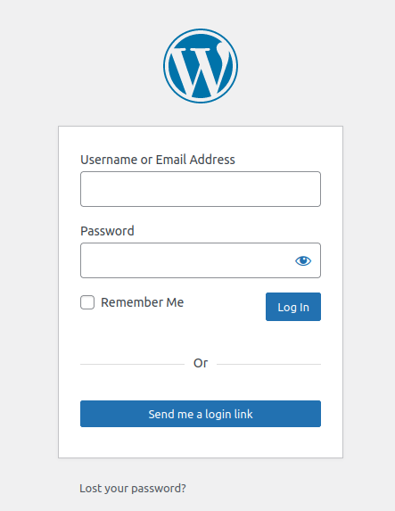
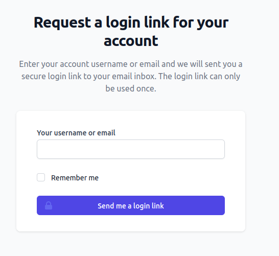
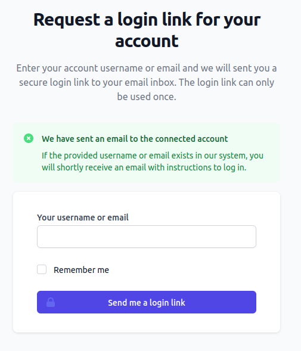
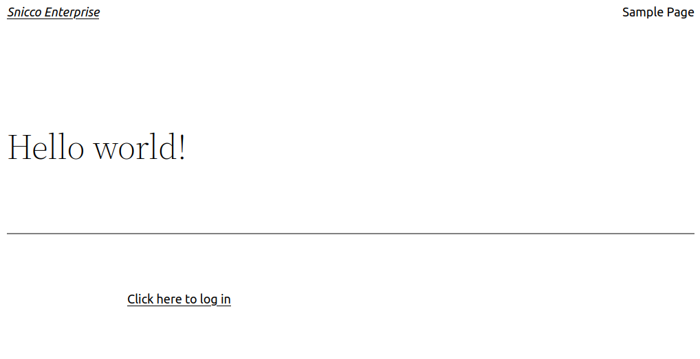
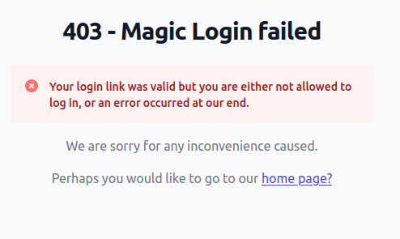

# Magic Login Links

<!-- TOC -->
  * [Introduction](#introduction)
  * [Requesting a magic link](#requesting-a-magic-link)
    * [Who can request a magic link](#who-can-request-a-magic-link)
    * [Default WP-Login Page](#default-wp-login-page)
    * [Shortcode](#shortcode)
    * [Disabling Magic Link creation via HTTP](#disabling-magic-link-creation-via-http)
      * [Remove the Magic Link button from the default wp-login.php page](#remove-the-magic-link-button-from-the-default-wp-loginphp-page)
      * [Disabling all Magic Link requests](#disabling-all-magic-link-requests)
    * [Interaction with 2FA](#interaction-with-2fa)
  * [Generating links via WP-CLI](#generating-links-via-wp-cli)
    * [Primary Login Links](#primary-login-links)
    * [2FA Bypass](#2fa-bypass)
    * [SSO](#sso)
      * [What is the difference between 2FA Bypass and SSO?](#what-is-the-difference-between-2fa-bypass-and-sso)
      * [When should I use SSO over Bypass 2FA?](#when-should-i-use-sso-over-bypass-2fa)
    * [Sending Magic Login Links via email](#sending-magic-login-links-via-email)
    * [User Switching](#user-switching)
  * [Security](#security)
    * [Magic Login Link Generation](#magic-login-link-generation)
    * [Magic Login Link Verification](#magic-login-link-verification)
    * [Attack vectors](#attack-vectors)
      * [SQL-Injection vulnerabilities](#sql-injection-vulnerabilities)
      * [Complete database compromise](#complete-database-compromise)
      * [Brute-Force](#brute-force)
      * [Replaying](#replaying)
      * [Enforced expiry](#enforced-expiry)
      * [Denial Of Service](#denial-of-service)
      * [Information disclosure](#information-disclosure)
<!-- TOC -->

## Introduction

Magic Login Links provide an efficient alternative to conventional username/password authentication methods.
This strategy is especially beneficial in applications that cater to a large number of "end-users"
who engage infrequently.

Consider the scenario of an annual conference facilitating online ticket purchases.
The standard user behavior typically proceeds as follows:

- Users purchase tickets in the first year and subsequently forget their password.
- Upon returning for the next event, users are unable to recall their password.
- Users initiate a password reset request.
- Users reset their password.
- This cycle repeats with every annual event.

In this context, Magic Login Links can simplify the user authentication process, thus enhancing User Experience (UX):

- Users can purchase tickets utilizing their email address, negating the need for a password.
- Users input their email address to facilitate login.
- An auto-login link is sent to the user's account, which, upon selection, automatically logs the user in.

Magic Login Links provide an equivalent level of security as conventional authentication systems
that allow password resets via an email link,
provided they are [securely (!)](#security) implemented.


## Requesting a magic link

### Who can request a magic link

The entire security of Magic Login Links rests on the assumption that
the email account of the user is properly secured.

Requesting Magic Login Links in the UI is disallowed
for [privileged users](../../configuration/02_configuration_reference.md#privileged_user_roles) for
the same reasons that
Fortress [disallows web-based password resets](../password/disabling-password-resets-for-privileged-users.md).

Privileged users can, however, still use a Magic Login Link that
was [generated via WP-CLI](#generating-links-via-wp-cli) much
in the same manner that Fortress allows password resets for privileged users via WP-CLI.

All **non-privileged** users can request links via the UI.

### Default WP-Login Page

As always, Fortress aims to be as unobtrusive in the UI as possible.

By default, Fortress will adjust the default WP-login page like so:

| WP-login page with Fortress Magic Login Link<br><br> |
|-------------------------------------------------------------------------------------------------------------------------------------|

If a user clicks the `"Send me a login link"` button they will go to a Fortress-managed page:

| Fortress Magic Login Link Page<br><br> |
|-------------------------------------------------------------------------------------------------------------------|

As in most other interactions with WordPress, Fortress uses a custom page for maximum compatibility.

Fortress will use your site's default [`wp_mail`](https://developer.wordpress.org/reference/functions/wp_mail/)
configuration to send the Magic Login email,
so make sure that your site is capable of sending transactional emails.

**Important:**

Users will always see the below success message, regardless of whether the provided username/email exists.

| Fortress Magic Login Link Success Message<br><br> |
|--------------------------------------------------------------------------------------------------------------------------------|

### Shortcode

You can display a link to the Magic Login Link page anywhere on your site by using
the `[snicco-fortress:request_magic_link]` shortcode.

By default, this will display as a simple link using your theme's styling.

| Shortcode with default text<br><br> |
|-------------------------------------------------------------------------------------------------------------------------------|

You can also provide your own anchor text by using the shortcode like so:

`[snicco-fortress:request_magic_link]Click here to get a login link[/snicco-fortress:request_magic_link]`

### Disabling Magic Link creation via HTTP

You have two options to disable requesting links via the Web-UI.

#### Remove the Magic Link button from the default wp-login.php page

You can set
the [`auth > magic_link_show_on_wp_login_form` option](../../configuration/02_configuration_reference.md#magic_link_show_on_wp_login_form)
to `false` and
Fortress will stop rendering the link on the default wp-login.php page.

#### Disabling all Magic Link requests

If you want to remove the capability to request Magic Links entirely,
you can use set
the [`auth > magic_link_allow_requesting_via_http` option](../../configuration/02_configuration_reference.md#magic_link_allow_requesting_via_http)
to `false`.

Fortress will then stop rendering the link on the default wp-login.php page **AND**
the custom Magic Login Link page will not exist anymore (identical to a 404 hit).

**Important**: Magic Login Links can always be generated via WP-CLI, even if you disable generation via the UI.

### Interaction with 2FA

All magic links that are generated via the UI will **NOT** bypass 2FA and instead
redirect the user to the 2FA form.

Magic links replace the primary username/password login, not 2FA.

You can generate true SSO links via WP-CLI only.

## Generating links via WP-CLI

As always, Fortress is built with a CLI-first approach, and Magic Login Links are no different.

The Fortress CLI command for Magic Login Links is perfectly suited to building a truly secure SSO/Auto-Login
functionality
into your platform.

Being able to run Fortress CLI commands means having SSH access on the target server.
For that reason, **Fortress allows generating Magic Login Links for privileged users via WP-CLI**.

Furthermore, the [`wp snicco/fortress auth magic-link create` command](../../wp-cli/readme.md#magic-linkcreate) allows you to create three different types of Magic
Login Links, each with different "authentication permissions."

### Primary Login Links

By default, every CLI-generated login link acts as a replacement for the primary username/password authentication,
exactly like Magic Links that were requested via HTTP.

The only difference is that you can also generate them for privileged users.

```console
$ wp snicco/fortress auth magic-link:create admin
                                                                                                                      
https://snicco-enterprise.test/snicco-fortress/auth/magic-link/challenge/HcD69EMqAq377OCT-yuPloY-sWBO9wm4nXEfayTRTpF9MaNlW-uc0ys9E2X_LsQlwbnWrFYYFern?action=magic-login-primary
```

### 2FA Bypass

By adding the `--bypass-2fa` flag to the command, Fortress will generate a Magic Login Link that
allows bypassing Fortress's own 2FA functionality in case 2FA being configured for the user.

```console
$ wp snicco/fortress auth magic-link:create admin --bypass-2fa
                                                                                                                      
https://snicco-enterprise.test/snicco-fortress/auth/magic-link/challenge/w90qe7akw947Av4IJraC-KhcNjh5kZIvLHKRNZDFVIPG9elZo7eYvUYgpWkzyGPV2UXI7xB4aAUR?action=magic-login-primary-2fa
```

### SSO

By adding the `--sso` flag to the command, Fortress will generate a Magic Login Link that
completely bypasses all authentication checks on the site including Fortress's 2FA **AND** other mechanisms that might be
employed by other plugins
on your site.

```console
$ wp snicco/fortress auth magic-link:create admin --sso
                                                                                                                      
https://snicco-enterprise.test/snicco-fortress/auth/magic-link/challenge/KA740Rujq1YlEgGHmAtptGljKV21iOyPOx2G10dRXsC71QkcCai3i9twMizDPZXEajknqwSlUJ7n?action=magic-login-sso
```

#### What is the difference between 2FA Bypass and SSO?

To better understand the difference, it's required to explain how a user is logged-in via a Magic Login Link.

After Fortress successfully validated the Magic Login Link,
the [`authenticate` hook](https://developer.wordpress.org/reference/hooks/authenticate/) will be called
to let Core and other plugins interact with the login attempt.

```php
apply_filters_ref_array('authenticate', [$user, $user->user_login, '']);
```

For example, WordPress Core contains the following hook callback to check if the user that is
trying to log in is a spammer:

```php
function wp_authenticate_spam_check( $user ) {
	if ( $user instanceof WP_User && is_multisite() ) {
		/**
		 * Filters whether the user has been marked as a spammer.
		 *
		 * @since 3.7.0
		 *
		 * @param bool    $spammed Whether the user is considered a spammer.
		 * @param WP_User $user    User to check against.
		 */
		$spammed = apply_filters( 'check_is_user_spammed', is_user_spammy( $user ), $user );

		if ( $spammed ) {
			return new WP_Error( 'spammer_account', __( '<strong>Error</strong>: Your account has been marked as a spammer.' ) );
		}
	}
	return $user;
}
```

If any hook callback to `authenticate` returns a `WP_Error`, Fortress will deny the Magic Link for the purposes `primary login`
and `bypass-2fa`.

Instead, the following page would be displayed (with detailed information being logged):

| Magic Login with WP_Error<br><br> |
|-------------------------------------------------------------------------------------------------------------------|

For a Magic Login link created with `--sso`, Fortress skips the call to `authenticate` and generates a session cookie
straight away.

#### When should I use SSO over Bypass 2FA?

Unless you have a good reason to use `--sso`, stick to `--bypass-2fa`.

A good reason might be any plugin on your site that employs authentication checks
that are fundamentally not compatible with the concept of Magic Login Links.

### Sending Magic Login Links via email

Primary login links can be sent via email by adding the `--email` flag.

For security reasons, links created with `--bypass-2fa | --sso` can not be sent via email.
It is also NOT possible to send Magic Links via email for privileged users.
Fortress will fail the command in both cases.

```console
$ wp snicco/fortress auth magic-link:create subscriber --email

                                                                                                                      
 [OK] The magic link was sent to 'subscriber@snicco.io'.                                                                     
                                                                                                                      
      The link is valid for 600 seconds. 
```

### User Switching

You can use the CLI command as a very simply and straight-forward user switching solution
for occasional debugging. 

You can provide any username to the command to get a link that logs you in as that user.

## Security

### Magic Login Link Generation

While looking pretty straight forward on the surface, implementing secure Magic Login Links
is like navigating a minefield.

As always, we detail our exact protocol and any deviance will be treated as a bug:

The URL for a Magic Login Link is created by generating `57 random bytes` using PHP's [`random_bytes`](https://www.php.net/manual/en/function.random-bytes.php) function. 

The 57 random bytes are split into two parts:

- 24 bytes that act as a `selector`.
- 33 bytes that act as a `verifier`.

Then, we combine all the "inputs" of a magic link:

`messagge = user_id | expiration timestamp | purpose | verifier`

> `purpose` is the type of Magic Link (i.e. primary | bypass-2fa | sso )

and hash the combined `message` using Libsodium's [`sodium_crypto_generichash`](https://www.php.net/manual/en/function.sodium-crypto-generichash.php)
using one of [Fortress's secure secrets](../../getting-started/02_preparation.md#secrets). 

We then store the resulting `hash`, `expiration_timestamp` , `user_id` and `purpose` in the database, with the `selector` being the primary key used for lookup.

The user's URL is then composed of the base64 version of `selector + verifier + purpose` using
Libsodium's side-channel-attack resistant 
[`sodium_bin2base64`](https://www.php.net/manual/en/function.sodium-bin2base64.php) encoding.

**Note**: `verifier` is never stored anywhere. **This is crucial**.

### Magic Login Link Verification

1. Get the Magic Login Link from the URL.
2. Split the Magic Login Link into `selector` and `verifier`.
3. Try to find a row with the primary key being the `selector`, if no row is found abort.<br>
    **Note**: It's crucial to that the `verifier` is never used for MySQL lookups in order to not be vulnerable to [time-based side channel attacks](https://blog.ircmaxell.com/2014/11/its-all-about-time.html#Branching-Based-Timing-Attacks). That's the entire purpose of splitting the URL into two parts in the first place.
4. Re-calculate `hash_from_url = sodium_crypto_generic_hash( user_id_from_db | expiration_timestamp_from_db | purpose_from_url | verifier_from_url)`
5. Compare `hash_from_url` to `hash_stored_in_db` in a [timing-attack-safe manner](https://blog.ircmaxell.com/2014/11/its-all-about-time.html#Branching-Based-Timing-Attacks) using [`hash_equals`](https://www.php.net/manual/en/function.hash-equals.php).
6. Delete the Magic Link from the database.
7. If the hashes are different, abort.
8. Log in the user with WordPress.

This security protocol protects against all the following scenarios:

### Attack vectors

#### SQL-Injection vulnerabilities

It's impossible to use any information stored in the database
to reconstruct a valid Magic Login Link.

#### Complete database compromise

It's impossible to:

- a) Alter any existing magic links (swapping user ids, etc.).
- b) Insert new magic links directly into the database.

because nobody can generate a valid keyed-hash since the[ Fortress secret key is stored securely OUTSIDE the database](../../getting-started/02_preparation.md#secrets).

#### Brute-Force

Brute-Forcing this protocol would be a colossal waste of time since magic links
are created from 57 bytes (456 bits).

Furthermore, the protocol is carefully designed to prevent timing-based side channel attacks
that could dramatically decrease the time to brute force a magic link.

#### Replaying

All Magic Login Links are one-time use only. The Magic Link is deleted from the database
as the first step after being validated to prevent that a crash in PHP leaves a dangling Magic Link in the database forever.

#### Enforced expiry

All Magic Login Links have a forced expiration of ten minutes.
Tampering with the expiry in the database will immediately invalidate the magic link.

#### Denial Of Service

Requesting Magic Login Links in the UI is heavily rate-limited to prevent flooding one's email inbox.

#### Information disclosure

There is no information disclosure on the provided username existing and/or
being privileged.

If a Magic Login Link is being requested for a privileged user,
Fortress will display the same generic success message and an email
will be sent to the user's account informing them of the request.

