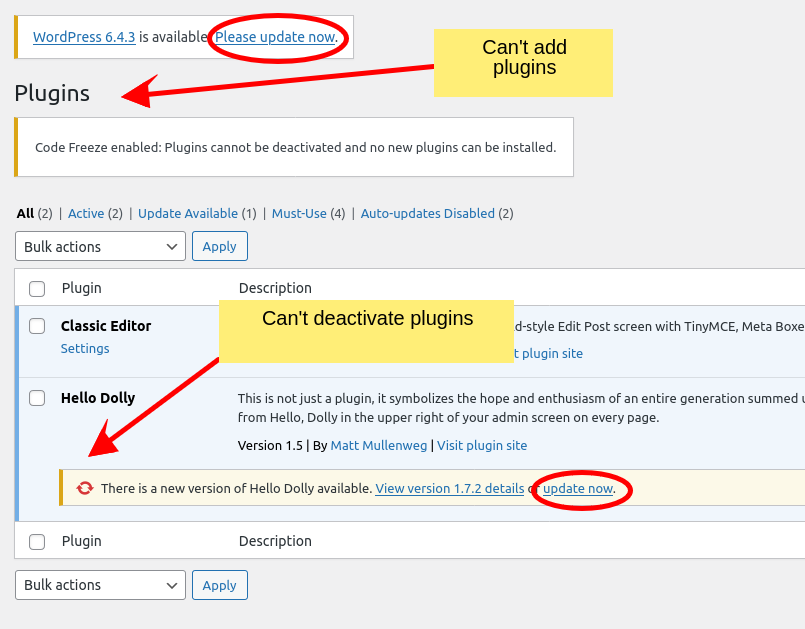
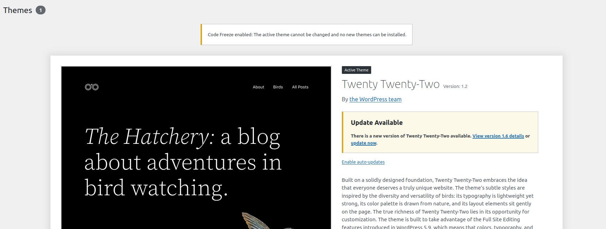

# The Fortress Code Freeze module

<!-- TOC -->
  * [The problem](#the-problem)
  * [What does Code Freeze do?](#what-does-code-freeze-do)
  * [What does Code Freeze not do?](#what-does-code-freeze-not-do)
  * [When is Code Freeze active?](#when-is-code-freeze-active)
    * [WP-CLI](#wp-cli)
  * [Admin interface changes](#admin-interface-changes)
  * [FAQ](#faq)
    * [How do I install the occasional new plugin?](#how-do-i-install-the-occasional-new-plugin)
    * [I need to short-circuit Code Freeze temporarily](#i-need-to-short-circuit-code-freeze-temporarily)
    * [Why not use just `DISALLOW_FILE_MODS` and `DISALLOW_FILE_EDIT`?](#why-not-use-just-disallowfilemods-and-disallowfileedit)
    * [Loose Ends: Page builder PHP blocks](#loose-ends-page-builder-php-blocks)
    * [Loose Ends: Code snippet plugins](#loose-ends-code-snippet-plugins)
    * [Does this protect against zero days that allow arbitrary PHP file uploads?](#does-this-protect-against-zero-days-that-allow-arbitrary-php-file-uploads)
    * [Does this mean a compromise admin account is not a big deal anymore?](#does-this-mean-a-compromise-admin-account-is-not-a-big-deal-anymore)
    * [Immutable Filesystems](#immutable-filesystems)
<!-- TOC -->

---

## The problem

Recent [research](https://wewatchyourwebsite.com/the-real-attack-vector-responsible-for-60-of-hacked-wordpress-sites-in-2023/)
has shown that **70%+ of all WordPress sites compromises are caused by session hijacking or stolen credentials**.

In addition to that, privilege-escalation related plugin vulnerabilities are one of the most exploited types of
vulnerabilities in the WordPress ecosystem:

- https://patchstack.com/articles/critical-elementor-pro-vulnerability-exploited/
- https://patchstack.com/articles/critical-privilege-escalation-in-ht-mega-plugin-affecting-100k-sites/
- https://patchstack.com/articles/critical-privilege-escalation-in-essential-addons-for-elementor-plugin-affecting-1-million-sites/
- https://patchstack.com/articles/critical-easy-digital-downloads-vulnerability/
- https://patchstack.com/articles/advisory-critical-woocommerce-payments-privilege-escalation-vulnerability/

For the vast majority of WordPress sites, **a compromised admin account means it's game over for the site** (and if the
attacker is skilled, the server too).

An attacker will immediately use the admin access to execute arbitrary PHP code by installing or uploading a malicious
plugin or by editing the theme/plugin files.
This then usually leads to RCE (remote code execution) via a reverse shell.

In the WordPress ecosystem, the threat model usually stops at the point of an attacker gaining admin access.

Both users and vendors say something along the lines of:

> Oh well, if an admin account is compromised, there's nothing we can do anyways.

**This is crazy** and practically unheard of in other mature software ecosystems.

In our opinion, it is completely unacceptable to build Web Applications with WordPress (LMS, E-Commerce, Membership
etc.) or
anything remotely important to a business with this mindset.

A compromised admin account is bad, yes.

But the breach MUST be contained at the authentication/user level instead of immediately leading to a full compromise of
the
site/server.

That's what defense-in-depth is all about.

Why?

The following exploits are just a few examples of how an attacker can escalate a compromised admin account:

- **Escaping site isolation to a `root` compromise** of the server (A medium skilled attacker will be able to do this on
  most WP hosting platforms).
- Sending huge amounts of spam using your SMTP credentials.
- Mining bitcoin using your server resources.
- Attacking other sites from your site which will get your IP blacklisted and the server taken down.
- Dumping your entire database or writing arbitrary data to it.
- Revealing all sensitive data from the server's file system.
- Encrypting your site/database/backups and demanding a ransom.
- Creating very hard to detect backdoors with fileless malware.
- Preventing you from restoring backups and recovering fast.
- etc.

None of this would have been possible with a proper separation between an admin account compromise
and the ability to change the code of the site.

That's why every enterprise-hosting company deploys immutable filesystems where nothing can be changed
without a new deployment.

To add insult to injury, the vast majority of WordPress sites don't even need the ability to upload new plugins or
themes
after the initial site build is complete—expect on very rare occasions.

## What does Code Freeze do?

`Code Freeze` adds significant defense-in-depth against attackers who have gained access to an administrator (or
similar)
account through any means.

It doesn't matter how they got in & that Fortress's other modules make it very hard to compromise an account without a
zero-day.

That's what having multiple layers of defense is all about - Redundancy.

The best way to protect against RCE is to use an [immutable filesystem](#immutable-filesystems), and we recommend
anybody that can to do so.
But the (sad) reality is that this will forever be out of reach for 99.99% of WordPress sites.

`Code Freeze` is the next best thing and gives you most of the benefits of an immutable filesystem without all the
technical complexities that come with it.

`Code Freeze` disables all standard ways that a compromised admin account can escalate their privileges to RCE.

This is done **at the (user) capability level**, since that is how the attacker got in.

Concretely, `Code Freeze` ensures that:

- No new plugins can be installed.
- No new plugins can be uploaded.
- No existing plugins can be deactivated.
- No new themes can be installed.
- No new themes can be uploaded.
- The active theme cannot be switched.
- No plugin or theme files can be edited.

This is done in a dynamic way that doesn't deviate too much from the "usual WordPress workflow."

## What does Code Freeze not do?

- `Code Freeze` does NOT prevent updates for existing plugins or themes. Existing plugins are assumed to be coming from
  a
  trusted source.
- `Code Freeze` does NOT prevent WordPress core updates.
- `Code Freeze` does NOT prevent WordPress auto-updates.
- `Code Freeze` does NOT prevent the deletion of inactive plugins.
- `Code Freeze` does NOT modify any filesystem permissions or attributes. This is best locked down at the OS-level with
  an [immutable filesystem](#immutable-filesystems).

All of this ensures that the site can still be kept up to date as usual without incurring all the risk that unrestricted
file changes bring.

## When is Code Freeze active?

`Code Freeze` can be configured via
the [`code_freeze.enabled`](../../configuration/02_configuration_reference.md#enabled) option.

The default value is `auto` which means that Fortress will automatically enable `Code Freeze`
if the site is running in
the [production environment](https://make.wordpress.org/core/2020/08/27/wordpress-environment-types/).

The WordPress environment is set by hosting companies using the `WP_ENVIRONMENT_TYPE` constant, and it **defaults to
`production`** if not set.

Many hosting companies change its value to `staging` for their integrated staging environments which
will then automatically disable `Code Freeze` and enable full capabilities again.

This means that on staging sites, plugins & themes can be installed
normally which is fine from a security perspective since staging environments can then be locked down by applying
network level
restrictions such as Basic Auth or IP whitelisting—which might not be possible in production.

If you want to test/install a new plugin, you add it to a staging environment first, test, and then push it to
production.

This is in accordance with general development best practices as well.

If this automatic behavior is not desired, you can set
the [`code_freeze.enabled`](../../configuration/02_configuration_reference.md#enabled) option to `yes` or `no` to always
enable/disable `Code Freeze` regardless of the environment.

### WP-CLI

`Code Freeze` is **always disabled when using WP-CLI** since anybody that can run shell commands
on your server can already do anything they want.

This also means that `Code Freeze` will not affect any automation that runs with WP-CLI and
you can install plugins and themes as usual.

## Admin interface changes

When `Code Freeze` is active, the plugins and themes pages in the admin interface will be modified to reflect that fact.



In the above screenshot, WordPress automatically removes the "Add New" button, while
Fortress adds a notice to the top of the page to inform the user about the limitations.

WordPress also removes "row actions" automatically, however, it does NOT do so for the bulk actions dropdown.

It's still possible to update plugins, and enable auto-updates for plugins as usual.



On the theme page, WordPress automatically removes the "Add New" button and hides all non-active themes (since
switching themes is disabled).

Fortress adds a notice to the top of the page to inform the user about the theme limitations.

Furthermore, WordPress will automatically remove the respective menu items of disabled functionality in the sidebar.

## FAQ

### How do I install the occasional new plugin?

The recommended workflow is using `code_freeze.enabled` = `"auto"` and using a staging environment.

1. Push to staging.
2. Install plugin(s) and test.
3. Push to production.

This should be done regardless of security concerns.

If you don't want to use a staging environment, you can:

- a) Install any wp.org plugin using WP-CLI: `wp plugin install <slug> --activate`
- b) Upload "pro" plugins via S(FTP)/SSH and activate them via the admin dashboard.
- c) Set `code_freeze.enabled` to `no` temporarily and then install the plugin via the admin dashboard. This requires a
  Fortress [config reload](../../configuration/01_how_to_configure_fortress.md#testing-your-configuration-sources).
- d) [Short-Circuit](#i-need-to-short-circuit-code-freeze-temporarily) `Code Freeze` (see below).

### I need to short-circuit Code Freeze temporarily

You can put the following code into your `wp-config.php` (or another file that's loaded before Fortress) to
short-circuit `Code Freeze` in emergencies:

```php
define('SNICCO_FORTRESS_CODE_FREEZE_SHORT_CIRCUIT', 1);
```

Remember to remove the constant after you are done.

### Why not use just `DISALLOW_FILE_MODS` and `DISALLOW_FILE_EDIT`?

In our opinion, you should not use `DISALLOW_FILE_MODS` and `DISALLOW_FILE_EDIT` unless your filesystem
is actually immutable.

The reason is that many security-**unrelated** plugins will look for these constants and change
functionality depending on their value.

An example might be cache plugins that stop creating new cache files, etc.

Furthermore, these constants prevent the automatic updates of WordPress core, plugins and themes and you can't see any update notifications in the admin dashboard
for plugins anymore.

If that's your goal is to prevent auto-updates, a better way is using the below must-use plugin.

It disables all automatic updates (plugins, themes, and core) while still allowing you to perform manual updates via the admin dashboard.

```php
<?php

/*
 * Plugin Name: No Auto Updates
 * Description: Disables all automated updates for WordPress Core, plugins and themes, but still allows manual updates from the dashboard.
 * Version: 1.0
 * Author: Snicco
 * Author URI: https://snicco.io
 * License: MIT
 *
 */
declare(strict_types=1);

add_filter('file_mod_allowed', function (bool $allowed, string $context) :bool {
    if ($context === 'automatic_updater') {
        return false;
    }
    
    return $allowed;
}, 10,2 );
```

**Note:** You can still use both constants + `Code Freeze` if you want to. This will ensure that users can't disable
plugins/themes
in addition to the effects of the constants.

### Loose Ends: Page builder PHP blocks

Some of the newer page builders allow users to insert PHP code blocks into their pages which
are then executed with eval.

In our opinion this functionality should not exist for obvious security reasons, and
the [Bricks](https://snicco.io/vulnerability-disclosure/bricks/unauthenticated-rce-in-bricks-1-9-6)
and [Cwicly](https://snicco.io/vulnerability-disclosure/cwicly/remote-code-execution-cwicly-1-4-0-2) RCE vulnerabilities
only proof the point that it's super hard to get this right.

It's not enough to disable this functionality in the page builder settings either because a compromised
admin account can just re-enable them.

It needs to be disabled at the code level via hooks.

Both Bricks and Cwicly added these filters as per our recommendations. Furthermore, it's also possible to disable that
functionality in the GeneratePress theme.

It's highly recommended to do so. Keep in mind that this will disable potential pre-existing code blocks
stored in your database.

You copy the below (must-use) plugin to easily disable the eval functionality in Bricks, Cwicly and GeneratePress.

```php
<?php

/*
 * Plugin Name: CodeFreeze: no eval in page builders
 * Description: Prevents code execution via eval in Bricks/Cwicly/GeneratePress.
 * License: GPLv2 or later
 * Author: Snicco
 * Author URI: https://snicco.io
 */
\add_action('plugins_loaded', static function () :void {
    // We need to always disable this. Unlike with plugins, there is no mechanism to
    // ensure that no new code can be added while also no existing code can be eval'd.
    // With page builders it's all or nothing.
    $cb = static fn() :bool => false;
    
    \add_filter('bricks/code/allow_execution', $cb);
    
    \add_filter('cwicly/code/execute_eval', $cb);
    
    // New version of GP.
    \add_filter('generate_hooks_execute_php', $cb);
    // Old versions of GP.
    \define('GENERATE_HOOKS_DISALLOW_PHP', true);
});

// Show a notice to the user that code execution is disabled.
\add_action('admin_notices', static function () :void {
    $request_uri = $_SERVER['REQUEST_URI'];
    
    if (false !== \strpos($request_uri, 'wp-admin/admin.php?page=bricks-settings')) {
        $message = 'CodeFreeze: Code execution is disabled regardless of Bricks settings.';
    } elseif (false !== \strpos($request_uri, 'wp-admin/admin.php?page=cwicly-roleeditor')) {
        $message = 'CodeFreeze: Code execution is disabled regardless of Cwicly settings.';
    } elseif (false !== \strpos($request_uri, 'themes.php?page=generate-options')) {
        $message = 'CodeFreeze: Code execution is disabled regardless of GeneratePress settings.';
    }
    
    if (! isset($message)) {
        return;
    }
    
    echo '<div class="notice notice-warning">
              <p>'.\esc_html($message).'</p>
          </div>';
});
```

### Loose Ends: Code snippet plugins

Don't use them, and if you absolutely must, we recommend using the free [FluentSnippets](https://fluentsnippets.com)
plugins
because it allows you to convert all snippets into a must-use plugin that works independently of FluentSnippets.

Only use it to create snippets, and then delete the plugin.

If you use code snippets plugins in production, you get very limited value from `Code Freeze` because
they allow running arbitrary PHP code.

Storing code in the database and then eval'ing it is a terrible idea from a security & performance perspective.

### Does this protect against zero days that allow arbitrary PHP file uploads?

No. `Code Freeze` tackles the widely more common threat of [compromised admin accounts](#the-problem).

Decent protection against file upload zero-days is preventing direct PHP execution in
the `wp-content` or at least `wp-content/uploads` directory.

This is because most arbitrary PHP file upload vulnerabilities allow uploading .php files to the `wp-content/uploads`
directory.

But this is not foolproof because:

- WordPress still automatically includes files in several locations without the need to execute them directly such as
  files in the `wp-content/mu-plugins` directory.
- The file upload might be able to overwrite existing php files which will then be executed automatically.

Instead, you can restrict the filesystem permissions of the PHP user and webserver group.

Assuming your WordPress sites lives at `/var/www/site.com` you can set the following permissions:

- Directories: `555` (Read and Execute)
- Files: `444` (Read only)

```shell
find /var/www/site.com -type d -exec chmod 555 {} +
find /var/www/site.com -type f -exec chmod 444 {} +
```

Then you can lighten the restrictions for the `wp-uploads` directory to `755` so that the media library still works.

```shell
chmod 755 /var/www/site.com/wp-content/uploads
```

If some of your plugins require write access to a custom folder inside `wp-content` you can add it aswell:

```shell
chmod 755 /var/www/site.com/wp-content/cache
```

As a general rule of thumb, **the webserver must not be able to execute any php files in writable directories.**

`wp-content/plugins`, `wp-content/themes` and `wp-content/mu-plugins` should not be
writable because they are executed by WordPress directly for every request automatically.

**Note:** This means that you will not be able to perform self-updates from within WordPress anymore.
When you want to perform updates, you can switch back the permissions to `755` and `644` respectively, perform your
updates, and then switch back to `555` and `444`.

### Does this mean a compromise admin account is not a big deal anymore?

TL;DR It's still a big deal.

---

Almost all attacks that use stolen session cookies or credentials are fully automated.

The attacker will usually immediately try to upload a malicious plugin to escalate their privileges to RCE.

Many automated scripts will stop at that point and move on to the next target—But it's not guaranteed.

While Code Freeze prevents the absolute [worst exploit types](#the-problem), the attacker can still do a lot of damage
using the normal functionality of WordPress.

They could:

1. Insert malicious Javascript into the site that steals user's credit card information while they type.
2. Steal your sensitive data / API keys.
3. Change your `site_url` so that it points to a phishing site.
4. Delete your backups from your backup plugin.
5. Deface your site by:
    1. uploading malicious images/videos/links.
    2. creating SEO spam links/content.

All of these are undeniable bad things and [there's no silver bullet.](https://en.wikipedia.org/wiki/No_Silver_Bullet)

But you can recover more easily from these types of exploits by restoring a safe backup, and you can further prevent
them
by:

1. Set `define('DISALLOW_UNFILTERED_HTML', true);` [in your `wp-config.php`](https://make.wordpress.org/core/handbook/contribute/design-decisions/#unfiltered-html-for-editors-administrators-multisite),
use a [custom Content Security Policy](https://csp.withgoogle.com/docs/index.html) and
don't use "Header & Footer" snippet plugins.
2. [Use Vaults & Pillars](../vaults_and_pillars/readme.md).
3. [Use Vaults & Pillars](../vaults_and_pillars/readme.md).
4. Use server-side & remote backups.
5. Defacement is hard to prevent, as even low-access (author+) users can change content on a sites.
   It's a good idea to limit permissions by post-type and user role and to use restrict media content via security
   headers.
   Does your site really need the ability to display images/iframes/video from every single external domain?

### Immutable Filesystems

To our knowledge, the following hosting services offer some form of immutable/read-only filesystems:

- GridPane
- Ymir
- Altis DXP
- Pantheon
- Pagely
- WordPress VIP

If you're using an immutable/read-only filesystem you can still leverage `Code Freeze` to prevent users from
deactivating plugins.

Just set `code_freeze.enabled` to `yes` and you're good to go.

The performance impact of `Code Freeze` is near zero.

