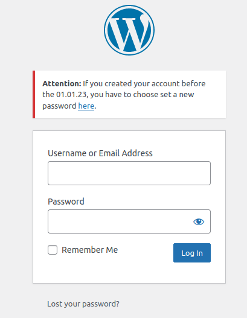

# Secure password hashing

<!-- TOC -->
* [Fortress password hashing](#fortress-password-hashing)
    * [Scheme](#scheme)
    * [Security benefits](#security-benefits)
* [What about existing passwords?](#what-about-existing-passwords)
    * ["Competing" solutions -> Opportunistic password rehashing only](#-competing-solutions---opportunistic-password-rehashing-only)
    * [Proactive password rehashing in Fortress](#proactive-password-rehashing-in-fortress)
    * [Force resetting all passwords](#force-resetting-all-passwords)
    * [Disallowing legacy hashes](#disallowing-legacy-hashes)
    * [Informing users about forced password resets](#informing-users-about-forced-password-resets)
* [Compatability with Core and third-party plugins](#compatability-with-core-and-third-party-plugins)
    * [TL;DR](#tldr)
    * [Detailed explanation](#detailed-explanation)
        * [Doing it wrong 01](#doing-it-wrong-01)
        * [Doing it wrong 02](#doing-it-wrong-02)
        * [Doing it wrong 03](#doing-it-wrong-03)
* [Migrating out hashes](#migrating-out-hashes)
<!-- TOC -->

---

As of 2023, WordPress still uses
a [md5 based hashing scheme](https://github.com/WordPress/WordPress/blob/master/wp-includes/class-phpass.php#L152)
and there are [no hopes](https://core.trac.wordpress.org/ticket/39499) of that changing anytime soon.

However, fortunately, the password-hashing functions that WordPress and third-party plugins use
are [pluggable](https://codex.wordpress.org/Pluggable_Functions), which means that Fortress can replace them with
its implementations that are based on [`libsodium (ext-sodium)`](https://doc.libsodium.org/), the best
cryptography bindings available in PHP.

## Fortress password hashing

### Scheme

Fortress replaces
the [wp_hash_password](https://github.com/WordPress/WordPress/blob/master/wp-includes/pluggable.php#L2483)
and [wp_check_password](https://github.com/WordPress/WordPress/blob/b879d0435401b8833bae66483895ffe189e5d35a/wp-includes/pluggable.php#L2533)
functions.

The hashing schema that Fortress uses is the following:

Given a user that provides the password `cocoa-hospital-wold-belt`:

1. Calculate `hash = argon2(cocoa-hospital-wold-belt)`
   using [`sodium_crypto_pwhash_str`](https://www.php.net/manual/de/function.sodium-crypto-pwhash-str.php).
2. Use [authenticated encryption](https://doc.libsodium.org/secret-key_cryptography/secretbox) to
   calculate `ciphertext = encrypt(hash, user_id)`
   using [`sodium_crypto_stream_xor`](https://www.php.net/manual/en/function.sodium-crypto-stream-xor.php).<br>
   Fortress encrypts the password hash with the `ID` of the corresponding user as additional data.
3. Store `ciphertext` in the database.

### Security benefits

- An attacker that can access the database can't even begin to crack the password hashes because they are
  encrypted with the [encryption key](../../getting-started/02_preparation.md#secrets) being stored in the filesystem.
- Assuming full server compromise where the encryption key is also obtained, cracking password hashes offline is *
  **significantly more computation intensive**.
- Online brute force attacks have a near zero chance of being successful.
- An attacker with write access to the database is not able to swap his own (known) password with the one of a more
  privileged account since an encrypted hash is always bound to the user ID for which it was initially
  created.
- An attacker with write access to the database can't insert new user accounts because he does not have the encryption
  key used for validation.

## What about existing passwords?

### "Competing" solutions -> Opportunistic password rehashing only

There have been plenty [intents](https://github.com/roots/wp-password-bcrypt) of replacing the WordPress hashing with
better alternatives.

However, none of them can rehash existing legacy password hashes proactively.

Instead, typically, a user's password hash is only rehashed after successfully logging in (because this is the only time you have access to his plaintext password).
It's an "opportunistic upgrade" strategy which is
a [bad play](https://nakedsecurity.sophos.com/2016/12/15/yahoo-breach-ive-closed-my-account-because-it-uses-md5-to-hash-my-password/).

Assuming your site currently has `100k` users and your database is hacked two months from now.
In those two months, `20k` users logged into your site and thus had their passwords rehashed securely.

This still leaves `80K` user passwords vulnerable simply because they did not login in on time.

### Proactive password rehashing in Fortress

In addition to opportunistic password rehashing, we managed to solve the tricky problem of rehashing the
current password hashes proactively while **still allowing users to keep their current password**.

Here is the (very) simplified summary of how this works:

1. Each password hash in the database is currently stored as `legacy_hash = legacy_hash_algo(password)`.

2. Fortress inspects `legacy_hash` and can extract the hash settings (`legacy_hash_settings`) needed to reproduce
   the same hash output for a given plaintext password (e.g., salts, costs, rounds, etc.).
   <br>`legacy_hash_settings` is then stored in the database.<br><br>Fortress can detect legacy hashes created from the following sources:
    - plain md5
    - phpass in compat mode
    - phpass with blowfish
    - crypt(blowfish)
    - crypt(md5)
    - crypt(sha256)
    - crypt(sha512)
    - argon2
    - argon2id
3. Fortress updates the user's password hash to `upgraded_legacy_hash = encryption(argon2(legacy_hash))`.
4. Once a user tries to log in with his (unchanged) password, Fortress checks
   if `upgraded_legacy_hash === encryption(argon2(legacy_hash_algo(password, legacy_hash_settings)))`.
5. The user is authenticated, and Fortress deletes `legacy_hash_settings` and
   stores `new_strong_hash = encryption(argon2(password))`.

You can perform this process automatically in batches **without** disrupting regular site operations using
Fortress's [`wp snicco/fortress password upgrade-legacy-hashes` command](../../wp-cli/readme.md#upgrade-legacy-hashes).

### Force resetting all passwords

The only downside to proactively rehashing all existing password hashes is that the plaintext passwords might be very insecure.

> You can have the most secure password hashing in the world, but it doesn't matter if a user's password is "qwerty".

There is no way to check if stored password hashes resulted from secure passwords since we don't have access to the
plaintexts.

Fortress allows you to force reset all or a subset of users' passwords, so they have to choose a new password that complies with Fortress's [password policy](password-policy.md).

Surprisingly, there is no option in WordPress to bulk-reset user passwords.

For that reason, Fortress includes
the [`wp snicco/fortress password force-reset-all` command](../../wp-cli/readme.md#force-reset-all) to handle this
process in batches **without** disrupting normal site operation.

### Disallowing legacy hashes

Adding a malicious (undetected) admin user is one of the most common ways WordPress sites get hacked.

Whether through PHP or directly through write access at the database level, the goal is to insert
a new admin user with a known password.

For backward compatibility
reasons, [WordPress still supports plain `md5` hashes](https://github.com/WordPress/wordpress-develop/blob/6.1/src/wp-includes/pluggable.php#L2540),

So, if an attacker inserts a user with the user:

- username: `johndoe`
- password hash: `5f4dcc3b5aa765d61d8327deb882cf99` (the plain md5 of `password`)

He can log in using `johndoe/password` as his credentials.

Fortress allows you to completely prevent this from happening by setting
the [`allow_legacy_hashes`](../../configuration/02_configuration_reference.md#allow_legacy_hashes) to `false`.

From there on, only password hashes that use Fortress's encryption + hashing scheme will be accepted.

An attacker can never "pin" a password hash this way unless he has a full server compromise to read Fortress's
encryption keys.

**Caution!**

Only set [`allow_legacy_hashes`](../../configuration/02_configuration_reference.md#allow_legacy_hashes) to false if one
of the following conditions are met:

- You are using Fortress on a brand-new site.
- You have [upgraded all legacy hashes](#proactive-password-rehashing-in-fortress).
- You have [force reset](#force-resetting-all-passwords) all user passwords.
- As an alternative way to force every user to choose a new password.

Otherwise, you might prevent yourself and other users from logging in.

### Informing users about forced password resets

If you [force reset all user passwords](#force-resetting-all-passwords), you need to inform your users about this to
avoid confusion.

Fortress can't know how your site handles user logins (default wp-login vs. WooCommerce vs. LMS, etc.)
which is why no visual feedback about a forced password reset can be given to users by Fortress.

If you are using the default WordPress login page, you might use the following code snippet.

```php
add_filter('login_message', function (string $message) :string{
    
    if(!empty($message)){
        return $message;
    }
    
    $url = wp_lostpassword_url();
    
    return sprintf(
        '<div id="login_error"><strong>Attention:</strong> If you created your account before the 01.01.23, you have to choose set a new password <a href="%s">here</a>.</div>',
        esc_url($url)
    );
    
});
```

---



---

## Compatability with Core and third-party plugins

### TL;DR

The entire Fortress password hashing functionality is 100% compatible unless a plugin does something wrong.

### Detailed explanation

WordPress Core exposes the following password hashing APIs:

- [The PasswordHash](https://github.com/WordPress/WordPress/blob/master/wp-includes/class-phpass.php#L44) class:<br>
  Which is commonly used in Core and plugins like so:

```php
global $wp_hasher;

if ( empty( $wp_hasher ) ) {
    require_once ABSPATH . WPINC . '/class-phpass.php';
   // By default, use the portable hash from phpass.
   $wp_hasher = new PasswordHash( 8, true );
}
```

- [wp_hash_password](https://github.com/WordPress/WordPress/blob/master/wp-includes/pluggable.php#L2483):<br> Which is
  meant for low entropy input such as user-provided passwords. The default implementation of this function uses
  the [The PasswordHash](https://github.com/WordPress/WordPress/blob/master/wp-includes/class-phpass.php#L44) class.
- [wp_check_password](https://github.com/WordPress/WordPress/blob/b879d0435401b8833bae66483895ffe189e5d35a/wp-includes/pluggable.php#L2533):<br>
  Which is the counterpart to `wp_hash_password`. The default implementation of this function uses
  the [The PasswordHash](https://github.com/WordPress/WordPress/blob/master/wp-includes/class-phpass.php#L44) class.

The only scenario that might cause issues is if a plugin mixes the usage of `wp_hash/create_password`
and `PasswordHas::Hash/CreatePassword`.

Mixing the two is a **programmatic error that should be considered a bug**.

The only reason that this bug stays hidden on default WordPress installations is that the default implementations
of `wp_hash/create_password` uses `PasswordHas::Hash/CreatePassword`.

- Hashes created with `PasswordHash::HashPassword` must only be validated with `PasswordHash::CheckPassword`.
- Hashes created with `wp_hash_password` must only be validated with `wp_check_password`.

#### Doing it wrong 01

The following code will never work if Fortress is installed.

```php
$secret = 'super-secret';

$hash = wp_hash_password($secret);

$wp_hasher = new PasswordHash();

$wp_hasher->CheckPassword('super-secret', $hash);
```

However, this is a programmatic error, and not something Fortress can support.

WordPress Core does not contain this error.

#### Doing it wrong 02

The below code is also an obvious programmatic error, but it will still work with Fortress **UNLESS** Fortress is
configured to [disallow legacy hashes](../../configuration/02_configuration_reference.md#allow_legacy_hashes).

```php
$secret = 'super-secret';

$wp_hasher = new PasswordHash();

$hash = $wp_hasher->HashPassword($secret);

wp_check_password('super-secret', $hash);
```

WordPress Core does not contain this error after WP 6.2.

Prior to WP 6.2 Core had a bug with recovery mode tokens that we found and fixed.
See the [ticket on trac](https://core.trac.wordpress.org/ticket/56787#ticket).

You can use the below snippet to allow legacy hashes at runtime which can be useful to "hotfix" a bug
in plugin code.

```php
use Snicco\Enterprise\Fortress\Password\Infrastructure\Event\CheckingGenericHash;

add_action(CheckingGenericHash::class, function (CheckingGenericHash $event) :void {
    
    // Overwrite this variable with your own logic.
    $allow_generic_legacy_hash = false;
    
    if($allow_generic_legacy_hash){
        $event->allow_legacy_hash = true;
    }    

});
```


#### Doing it wrong 03

A more hypothetical issue listed here for completeness is making assumptions about the output length of `wp_hash_password`.

The hash that is generated by default in WordPress has a length of `34` characters.

Due to the authenticated encryption, the output of Fortress's `wp_hash_password` implementation is `303` characters.

So far, we have **never seen** a situation where this has been an issue.

## Migrating out hashes

If Fortress is uninstalled WordPress will fall back to its default implementation of `wp_(hash/check)_password`.

That means that all password hashes that Fortress has created will not be valid anymore, and **all users have to reset their password**.

There is currently no good solution to "migrating out" the encrypted password hashes.

---

Next: [Password policy](password-policy.md)