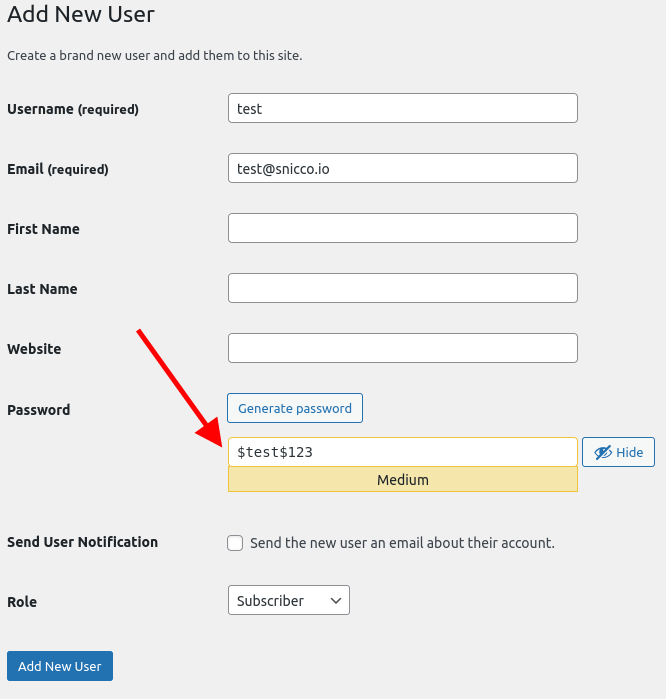
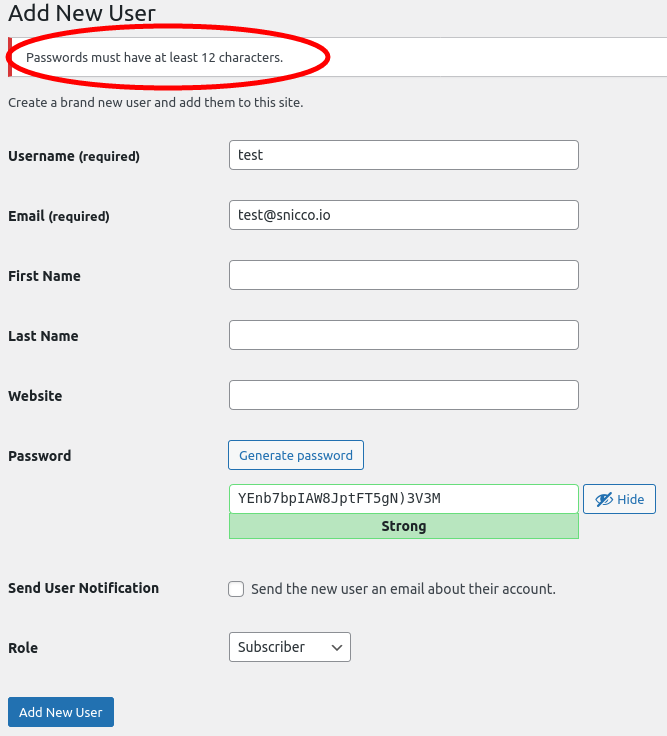
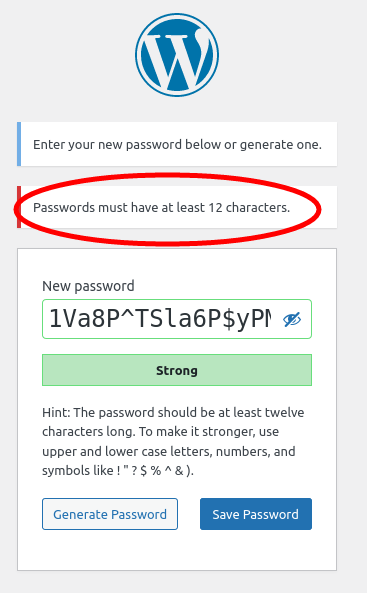
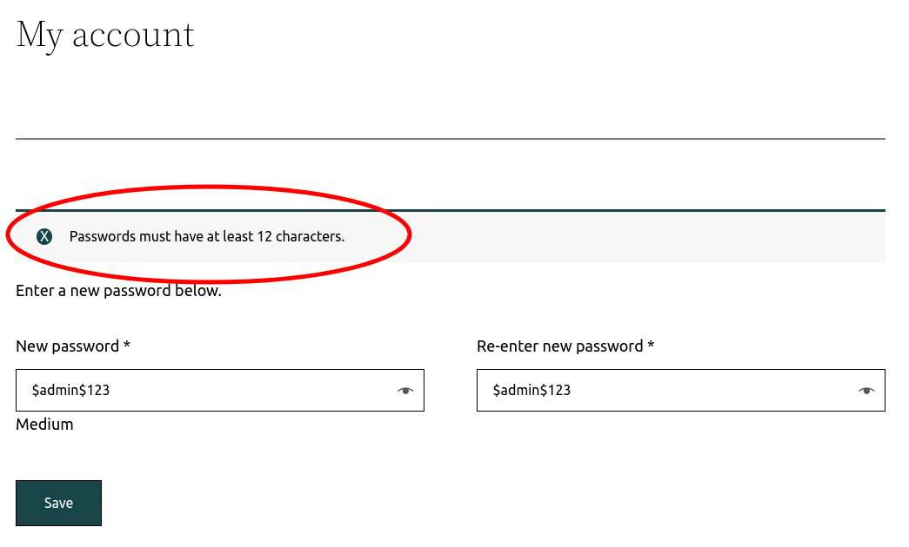
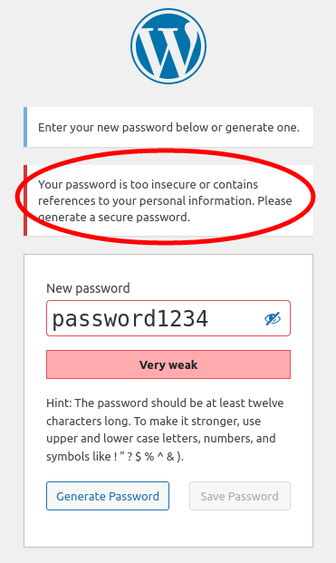
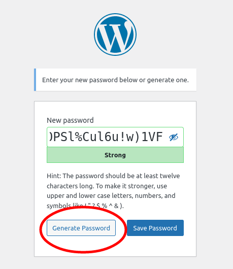

# Password policy

<!-- TOC -->
* [Rules](#rules)
* [Password strength estimator](#password-strength-estimator)
* [When is the policy enforced?](#when-is-the-policy-enforced)
    * [WP-admin area](#wp-admin-area)
    * [Front end](#front-end)
    * ["Confirm use of weak password"](#confirm-use-of-weak-password)
* [Excluding users from the password policy](#excluding-users-from-the-password-policy)
    * [Excluding user roles](#excluding-user-roles)
    * [Excluding users dynamically](#excluding-users-dynamically)
* [Edge cases with third-party plugins](#edge-cases-with-third-party-plugins)
<!-- TOC -->

## Rules

Fortress enforces a NO-BS password policy for **all** user accounts, which means:

- Between 12 and 4096 characters.
- No character restrictions and full Unicode support. <br> `🧐🧐漢字👀docker-horse-chair` is a perfectly valid password.
- Password strength must score at least a 3 out of 4 [(See below)](#password-strength-estimator).

## Password strength estimator

Instead of using some homegrown password strength "algorithm" that merely counts the number of digits and special characters, Fortress uses a PHP port of the battle-tested password entropy estimator [`zxcvbn`](https://github.com/dropbox/zxcvbn), initially created by DropBox.

The password entropy is rated on a scale from 1 to 4. The higher, the better.

> zxcvbn is a password strength estimator inspired by password crackers. Through pattern matching and conservative estimation, it recognizes and weighs 30k common passwords, common names and surnames according to US census data, popular English words from Wikipedia and US television and movies, and other common patterns like dates, repeats (aaa), sequences (abcd), keyboard patterns (qwertyuiop), and l33t speak.

> - **More secure:** policies often fail both ways, allowing weak passwords (P@ssword1) and disallowing strong passwords.
> - **More flexible:** zxcvbn allows many password styles to flourish so long as it detects sufficient complexity — passphrases are rated highly given enough uncommon words, keyboard patterns are ranked based on length and number of turns, and capitalization adds more complexity when it's unpredictaBle.
> - **More usable:** zxcvbn is designed to power simple, rule-free interfaces that give instant feedback. In addition to strength estimation, zxcvbn includes minimal, targeted verbal feedback that can help guide users towards less guessable passwords.

## When is the policy enforced?

### WP-admin area

Fortress enforces the password policy each time the [`user_profile_update_errors`](https://developer.wordpress.org/reference/hooks/user_profile_update_errors/) hook is fired.
WordPress fires this hook once a user edits his profile on the `/wp-admin/profile.php` page and when a new user is created on the `/wp-admin/user-new.php` page.


|  |  |
|------------------------------------------------|-------------------------------------------------------------------|


### Front end

Fortress will evaluate the password policy each time the [`validate_password_reset`](https://developer.wordpress.org/reference/hooks/validate_password_reset/) hook is fired.
<br>WordPress core fires this hook when a user resets his password on the `wp-login.php` page.

When the [`validate_password_reset`](https://developer.wordpress.org/reference/hooks/validate_password_reset/) is fired, Fortress tries to find the user-submitted password in one of the following POST parameters:

- `pass1`
- `password_1`
- `password1`

The password policy can't be enforced if Fortress can't find the password in one of these POST parameters.

This technique works right out of the gate with most third-party plugins allowing users to reset their password (.ie. WooCommerce, LMS, etc.).

| <br>WordPress Password reset<br><br> | <br>WooCommerce My Account Password reset<br><br> |
|-------------------------------------------------------------------------------------|-----------------------------------------------------------------------------------------------------------------------|


### "Confirm use of weak password"

On the front end, the default WordPress password reset form uses the JavaScript version of [`zxcvbn`](https://github.com/dropbox/zxcvbn) to provide feedback on the password strength.

However, this only acts as a guideline and is not enforced. Neither in the front end nor on the back end.

**Fortress will never allow weak passwords server-side**, even if the "Confirm use of weak password" checkbox is clicked.

The default "Generate Password" button always generates passwords that Fortress considers secure.

|  |  |  |
|--------------------------------------------------------|--------------------------------------------------------|-------------------------------------------------|


You can hide the checkbox using CSS in case this is a UX issue for your users:
Unfortunately, there is no better way, as WordPress has no hooks to prevent the checkbox from showing.

```php
add_action('login_head', function () {
    echo '<style> .pw-weak {display: none!important;} </style>';
});
```

## Excluding users from the password policy

By default, Fortress uses an opt-out approach and enforces its password policy for all users.

### Excluding user roles

You can use the [`password_policy_excluded_roles`](../../configuration/02_configuration_reference.md#password_policy_excluded_roles) option to exclude one or more user roles.

### Excluding users dynamically

Fortress will fire the [`CheckingPasswordPolicy`](../../../src/Password/Infrastructure/Event/CheckingPasswordPolicy.php) event before deciding to enforce the password policy.

The event gives you access to the `WP_User` object in question.

```php
use Snicco\Enterprise\Fortress\Password\Infrastructure\Event\CheckingPasswordPolicy;

add_action(CheckingPasswordPolicy::class, function (CheckingPasswordPolicy $event) :void {

    $user = $event->user;
        
    if(user_can($user, 'some-cap')){
        $event->skip = true;
    }    
        
});
```

## Edge cases with third-party plugins

Some plugins (wrongly) allow password resets without firing the [`validate_password_reset`](https://developer.wordpress.org/reference/hooks/validate_password_reset/) hook.

In this case, you either have to notify the plugin's vendor and ask them to add the hook, or you have to inspect
their code and fire it yourself at the appropriate time.

One example is the WooCommerce "My Account" page for logged-in users.

A user can change his account details all at once, including his password, and the `validate_password_reset` hook is not fired.

We can quickly fix this behavior by adding the following callback to the `woocommerce_save_account_details_errors` action.

```php
add_action('woocommerce_save_account_details_errors', function (WP_Error $error, stdClass $user) {
    // Ensure that password resets are validated on the WooCommerce My Account page.
    do_action('validate_password_reset', $error, new \WP_User($user));
}, 10, 2);
```

---

Next: [Disabling password resets for privileged users](disabling-password-resets-for-privileged-users.md).