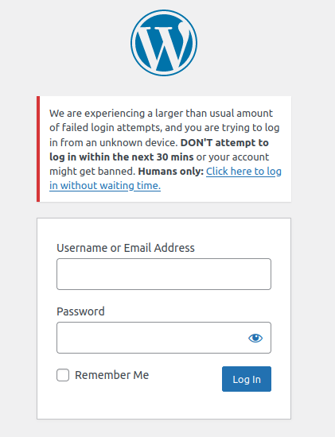
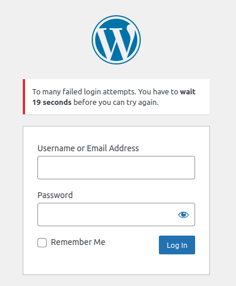
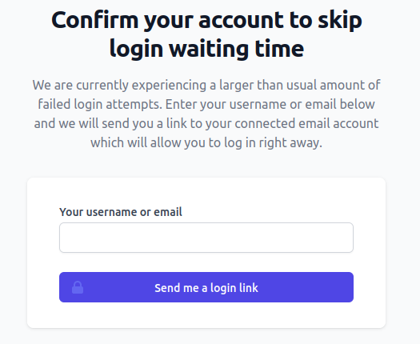
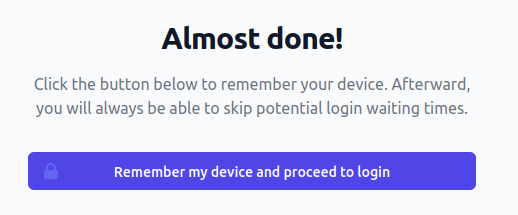
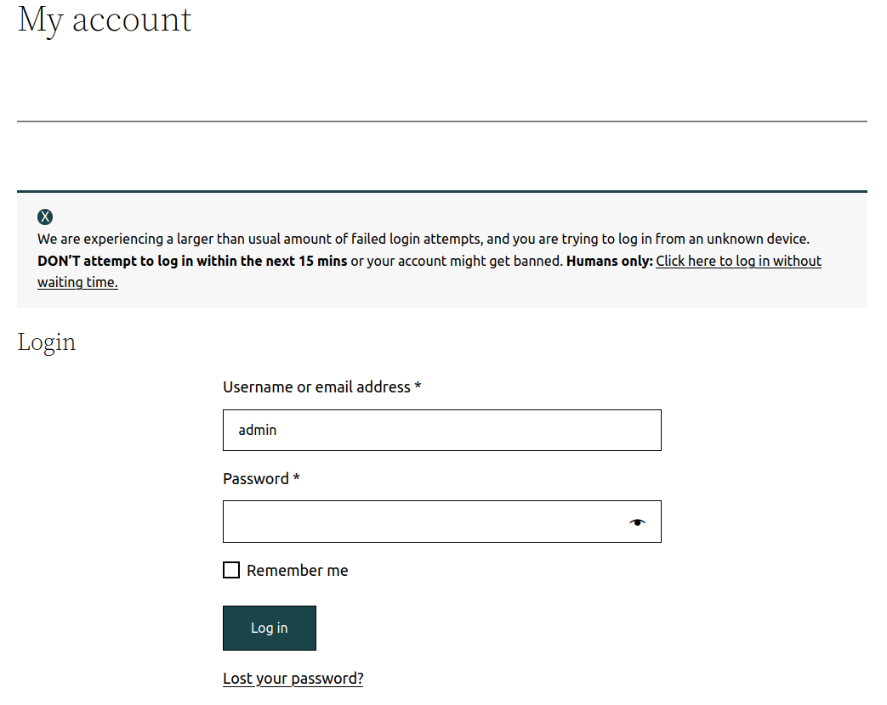

# Login throttling

<!-- TOC -->
* [Attack vectors](#attack-vectors)
  * [How WordPress plugins fail](#how-wordpress-plugins-fail)
  * [What about Fail2Ban?](#what-about-fail2ban)
  * [What about (re)Captcha?](#what-about--re--captcha)
* [Fortress login throttling](#fortress-login-throttling)
  * [The device ID system](#the-device-id-system)
  * [Throttling dimensions](#throttling-dimensions)
    * [Username throttling](#username-throttling)
    * [IP throttling](#ip-throttling)
    * [Global throttling](#global-throttling)
    * [Device ID throttling](#device-id-throttling)
  * [When is the throttling enforced?](#when-is-the-throttling-enforced)
    * [Issues with third-party plugins](#issues-with-third-party-plugins)
  * [Fail2Ban integration](#fail2ban-integration)
  * [IP detection](#ip-detection)
<!-- TOC -->

## Attack vectors

There are three attacks where an attacker aims to gain control over a user's account using the site's authentication mechanism.

| Attack type         | Description                                                                             |
|---------------------|-----------------------------------------------------------------------------------------|
| Brute Force         | Testing multiple passwords from a dictionary or other sources against a single account. |
| Credential Stuffing | Testing username/password pairs obtained from the breach of another site.               |
| Password Spraying   | Testing a single weak password against many different accounts.                         |

Each of these attacks can be carried out from a single IP or, way more commonly today, from thousands of IPs.

### How WordPress plugins fail

Most WordPress security plugins can only protect against attacks from a single IP because they still operate with the 2000s mindset of "one attacker = one IP".
Of course, this could not be further from the truth in 2023.

Generally speaking, WordPress plugins use the following scheme:

1. Get the correct (or [incorrect](https://snicco.io/blog/how-to-safely-get-the-ip-address-in-a-wordpress-plugin)) IP that tries to log in.
2. Fetch the number of failed attempts for that IP from the DATABASE (often without using indexes).<br>Plugins typically store each failed login as one row.
3. Deny the request if the count of rows is greater than some threshold.

The above scheme is useless against today's attackers that can carry out attacks using thousands, if not millions (botnets) of different IPS.

Other downsides of solely relying on IPs for login-throttling include:

- Legitimate users might be banned (corporate networks, public wifi, shared VPS, etc.).
- Huge database size and shrinking performance since each row typically represents one failed login.

### What about Fail2Ban?

Fail2Ban was an excellent choice for many years. However, it operates under the faulty assumption that "one attacker = one (or a handful) of IPs", which makes it useless against attacks that involve thousands, if not millions, of attacking IPs.

### What about (re)Captcha?

There are countless resources online on why (re)Captcha is a bad play in 2023.

The summary is as follows:

- Ineffective against bots.
- Horrific experience for real users.
- Captcha farms.
- Vulnerable to man-in-the-middle attacks.
- Privacy(GDPR) concerns.
- Only works on UI login forms and not for XML-RPC or the WP-REST API.

## Fortress login throttling

Fortress rate limits login attempts based on four different dimensions. Due to this, Fortress **effectively protects against each of the [attack vectors](#attack-vectors), no matter whether an attacker uses one or thousands of IPs.**

Fortress **even protects against slow, distributed brute force attacks WITHOUT being vulnerable to DoS.**

Furthermore, instead of naively storing each failed login attempt in the database, Fortress uses [its Token Bucket Rate Limiter](implementation.md) that only needs to keep counters in the WordPress object cache (or database as a fallback only).


### The device ID system

Before we dive deeper, it's necessary to clarify the concept of a device ID.

In Fortress, a device ID is a cryptographic signature that is stored in the user's browser as a cookie
after he successfully logs in. The cookie has an expiration of one year.

Fortress creates the signature by calculating the [BLAKE2B hash](https://libsodium.gitbook.io/doc/hashing/generic_hashing#notes) of the username with a [securely stored secret key](../../getting-started/02_preparation.md#secrets).

- **An attacker can not forge a device ID**, unless he breaks the underlying cryptography in `ext-sodium` (the internet would be on fire).
- A legitimate user can only use his device ID for his account.

Fortress trusts login requests with a valid device ID for the target username to be carried out by the account owner and, consequently, will impose a much looser rate limit even when the site is under heavy attack.

**Think of a device ID as a cat flap.**

Once the front door shuts closed due to the site being attacked, a legitimate user is not affected since he can enter through the cat flap.

| Bots have a 30-minute wait time.<br><br> | The legitimate account owner only has a 20-second wait time after five failed attempts.<br><br> |
|----------------------------------------------------------------------------------------------------------------------|----------------------------------------------------------------------------------------------------------------------------------------------------------------------------|

<br>

The device ID system has **two significant advantages** over any "competing" solution:

- It removes the age-old issue of legitimate users being DoS'd during a (distributed) brute-force attack.
- It allows imposing stringent rate limits for requests without device IDs since all honest users will eventually possess one.

**An honest user will never experience a DoS** unless:

- The user tries to sign in for the first time DURING an ongoing attack where Fortress has shut the front door.
- The user cleared his browser cookies.
- The user tries to log in with a new and unknown device.

For all these scenarios, Fortress allows the user to (re) access the cat flap by confirming the ownership of his account email.

Fortress will then send a link to the user's account email that, when clicked, will issue a new device ID so the user can log in without distributions.


|  |  |
|---------------------------------------------------------------------|---------------------------------------------------------------|

A link to the "request device ID page" is always included in rate limit error messages, and guest users can access the page directly by going to <br>`domain.com/snicco-fortress/rate-limit/device-id`.


### Throttling dimensions

An honest user with a valid [device ID](#the-device-id-system) will be rate limited by his **device ID only**.

Fortress will throttle all other users with varying strictness based on the following dimensions:

- the targeted username.
- the remote IP.
- the global count of failed logins.

**General rules:**

- A request with **invalid** credentials will only decrease the amount of [available tokens](implementation.md) if throttling is NOT activated yet.
- A request with **valid** credentials during throttling will NOT log the user in.
- If multiple dimensions throttle a user, the strictest limit will apply.

#### Username throttling

- [burst](implementation.md#token-bucket-rate-limiter): `5`
- [refill_frequency](implementation.md#token-bucket-rate-limiter): `15 minutes`
- Tries/day for same username: `96 = 24 * 60 * 60 / (15 * 60)`
- Time to brute force six-digit password: `28.53 years = 10^6 / (96 * 365 )`
- configuration_options: [`username_burst`](../../configuration/02_configuration_reference.md#username_burst) and [`username_refill_one_token_seconds`](../../configuration/02_configuration_reference.md#username_refill_one_token_seconds)

Example request flow:

1. `username1|wrong_password` ==> accepted
2. `username1|wrong_password` ==> accepted
3. `username1|wrong_password` ==> accepted
4. `username1|wrong_password` ==> accepted
5. `username1|wrong_password` ==> accepted, `15 minutes timeout` for username1 activated.
6. `username1|wrong_password` ==> Dropped
7. `username1|correct_password` ==> Dropped, even though it's the correct password.
8. `username2|wrong_password` ==> accepted, different username.<br><br>
9. Wait `15 minutes`<br><br>
10. `username1|wrong_password` ==> accepted, `15 minutes timeout` for username1 activated.<br><br>
11. Wait `75 minutes (5*15)`<br><br>
12. `username1|wrong_password` ==> accepted
13. `username1|wrong_password` ==> accepted
14. `username1|wrong_password` ==> accepted
15. `username1|wrong_password` ==> accepted
16. `username1|wrong_password` ==> accepted, `15 minutes timeout` for username1 activated.


#### IP throttling

- [burst](implementation.md#token-bucket-rate-limiter): `20`, higher burst prevent false-positives (cooperate offices, public wifi, shared proxies, etc.)
- [refill_frequency](implementation.md#token-bucket-rate-limiter): `30 minutes`
- Tries/day from the same IP for any username: '48 = 24 * 60 * 60 / (15 * 60)`
- configuration_options: [`username_burst`](../../configuration/02_configuration_reference.md#username_burst) and [`username_refill_one_token_seconds`](../../configuration/02_configuration_reference.md#username_refill_one_token_seconds)

#### Global throttling

This dimension considers all failed logins, irrespective of the target username and the remote IP.

- [burst](implementation.md#token-bucket-rate-limiter): `100`.
- [refill_frequency](implementation.md#token-bucket-rate-limiter): `30 seconds`
- configuration_options: [`global_burst`](../../configuration/02_configuration_reference.md#global_burst) and [`global_refill_one_token_seconds`](../../configuration/02_configuration_reference.md#global_refill_one_token_seconds)

The above default configuration means that over the long run, Fortress will only allow up to two failed logins per minute **for users without device ID**. Remember that stricter individual rate limits might apply to some usernames or IPs.
For traffic spikes where many (untrusted) users try to log in at once, 100 "failures" are reserved.

Global login throttling is the only way to slow down a distributed credential-stuffing or password-spraying attack.
Make no mistakes. Pulling off such an attack is most likely above the pay grade of your average hacker targeting WordPress, both in terms of skill AND cost.

That said, Fortress will have your back even in this unlikely scenario.

#### Device ID throttling

This dimension only applies if a valid [device ID](#the-device-id-system) can be provided for the target username.

- [burst](implementation.md#token-bucket-rate-limiter): `5`
- [refill_frequency](implementation.md#token-bucket-rate-limiter): `20 seconds`
- Tries/day for same username: `4320 = 24 * 60 * 60 / 20`
- Time to brute force six-digit password: `~ 231 days = 10^6 / (4320 * 365 )`
- configuration_options: [`device_id_burst`](../../configuration/02_configuration_reference.md#device_id_burst) and [`device_id_refill_one_token_seconds`](../../configuration/02_configuration_reference.md#device_id_refill_one_token_seconds)

The primary purpose of device ID throttling is to prevent a human with direct access to the browser that stores the device ID from guessing a password.
Since Fortress implicitly trusts device IDs, this rate limit is considerably lower.

A typical scenario that this rate limit prevents is a co-worker in a shared office using someone else's machine to guess (not brute-force) his password.

### When is the throttling enforced?

TL;DR: Always.

Detailed explanation:

The login throttling functionality is hooked into the [`authenticate`](https://developer.wordpress.org/reference/hooks/authenticate/) filter, which is called by the [`wp_authenticate`](https://developer.wordpress.org/reference/functions/wp_authenticate/) that WordPress Core and (almost all) plugins use to authenticate a user.

This means that the login throttling is applied for all kinds of authentication requests like:

- The default login form.
- Third-party plugin forms.
- XML-RPC.
- WP-REST API with application passwords.

If any throttling dimension is exceeded, a `WP_Error` object will always be passed to the call site.

Fortress (for a good reason) has the ultimate veto power since it hooks into `authenticate` with a priority of `PHP_INT_MAX`.

| Fortress rate limiting works right out the gate for most plugins.<br>This example shows the WooCommerce My Account page.<br><br>  |
|--------------------------------------------------------------------------------------------------------------------------------------------------------------------------------------------------|

#### Issues with third-party plugins

Some plugins call the [`wp_authenticate`](https://developer.wordpress.org/reference/functions/wp_authenticate/) function correctly, but instead of displaying the error messages of the returned `WP_Error` object, they show some generic default error message.

As an example, EDD will always display the following error message no matter what caused the login to fail:

`Error: Invalid username or password.`

They do this because they don't want to show the "invalid username" or "invalid password" messages that WordPress Core returns.

This intent is good, but swallowing all error messages is lousy execution.

Instead, something along the lines of the following code has to be used in the plugin:

```php
$credentials = [
    'user_login'    => $user_login,
    'user_password' => $user_pass,
    'remember'      => $remember,
];

$user_or_error = wp_signon( $credentials );

if($user_or_error instanceof WP_Error){
    
    $code = $user_or_error->get_error_code();
    
    // Only overwrite WordPress default error messages.
    if($code === 'invalid_username' || $code === 'invalid_password'){
        $user_or_error = new WP_Error('acme-plugin-invalid-login', 'Error: Invalid username or password.');
    }
    
    // A filter might even be used here to allow customization.
}

return $user_or_error;
```


### Fail2Ban integration

Fail2Ban is not sufficient on its own, but blocking IPs that fail to respect Fortress's rate-limiting permanently can be beneficial.

In this scenario, Fail2Ban serves the purpose of reducing the load on the server. **It's not needed for security!**

If the [`log_to_syslog`](../../configuration/02_configuration_reference.md#log_to_syslog) option is enabled, Fortress will write the following message to the configured system log, if an **invalid** login request is made **during active throttling**:


`Failed login while throttling was activated. Context: {"username": "admin"}. Remote Addr: 68.154.20.235`

You can configure strict Fail2Ban jails since an honest user should never make invalid login requests during throttling. Bots, however, will do so.

As a starting point, we recommend permanently banning an IP if the above message appears three times a day. But, of course, your threat model may vary.

### IP detection

Fortress (rightfully) only reads the IP address from `$_SERVER['REMOTE_ADDR']` and performs no data transformation or validation.

You might ask yourself why.

**TL;DR** <br>Fortress runs at the application layer and can conceptually not deal with infrastructure layer concerns. No matter how clever you think your solution is, it is virtually impossible to securely get the IP from anywhere but `$_SERVER['REMOTE_ADDR']`.
Trying so leads to severe security vulnerabilities, which we have seen (and reported) in every single security plugin that does login throttling.

**The IP address has to be configured correctly at the webserver level!**

For example, you can use the following configuration if the site's web server uses NGINX + CloudFlare.

```nginx
# Example Cloudflare IP
set_real_ip_from 173.245.48.0/20;

# repeat for all Cloudflare IPs listed at:
# IPv4 list https://www.cloudflare.com/ips-v4
# IPv6 list https://www.cloudflare.com/ips-v6
```

Furthermore, to be 100% safe against IP spoofing, you must ensure that nobody can directly connect to your web server.
All requests must go through Cloudflare first.

```nginx
# https://www.cloudflare.com/ips
# IPv4
allow 103.21.244.0/22;
allow 103.22.200.0/22;
allow 103.31.4.0/22;
allow 104.16.0.0/12;
allow 108.162.192.0/18;
allow 131.0.72.0/22;
allow 141.101.64.0/18;
allow 162.158.0.0/15;
allow 172.64.0.0/13;
allow 173.245.48.0/20;
allow 188.114.96.0/20;
allow 190.93.240.0/20;
allow 197.234.240.0/22;
allow 198.41.128.0/17;

# IPv6
allow 2400:cb00::/32;
allow 2405:b500::/32;
allow 2606:4700::/32;
allow 2803:f800::/32;
allow 2c0f:f248::/32;
allow 2a06:98c0::/29;

deny all; # deny all remaining ips
```

Many small scripts are [available online](https://www.google.com/search?q=set+real+ip+cloudflare) to keep the NGINX configuration in sync with Cloudflare's IPs.
**Detailed explanation:**

If you don't accept our words at face value, we wrote the definitive guide on this subject.

https://snicco.io/blog/how-to-safely-get-the-ip-address-in-a-wordpress-plugin.

---

Next: [Password reset throttling](password-reset-throttling.md).
