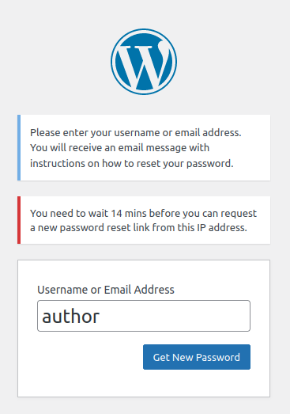
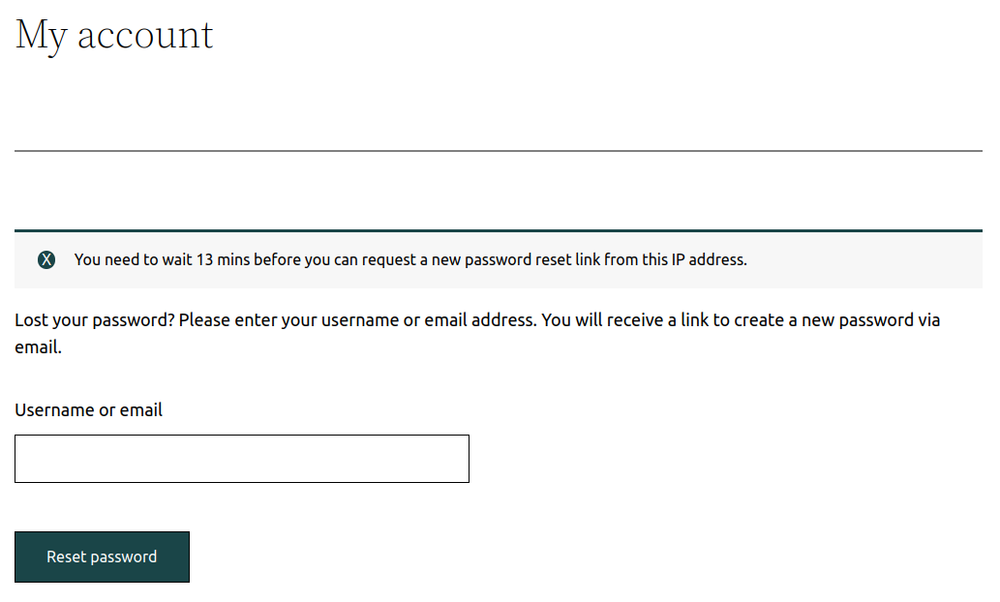

# Password reset throttling

Fortress rate limits password reset requests by hooking into the [`allow_password_reset`](https://developer.wordpress.org/reference/hooks/allow_password_reset/) hook.

The following [Token Bucket scheme](implementation.md#token-bucket-rate-limiter) is applied per IP:

- [burst](implementation.md#token-bucket-rate-limiter): `3`
- [refill_frequency](implementation.md#token-bucket-rate-limiter): `15 minutes`

> Each IP address can only request one password reset email every 15 minutes.

The purpose of doing this is twofold:

- Prevent an attacker from flooding a user's email inbox with password reset emails.
- Prevent an attacker from tricking your SMTP service into sending many password reset emails.

| Default WordPress password reset.   | WooCommerce password reset.   |
|-------------------------------------------------------------------------------------------------------|-----------------------------------------------------------------------------------------------------|

---

Next: [The authentication module](../../modules/auth/readme.md).
