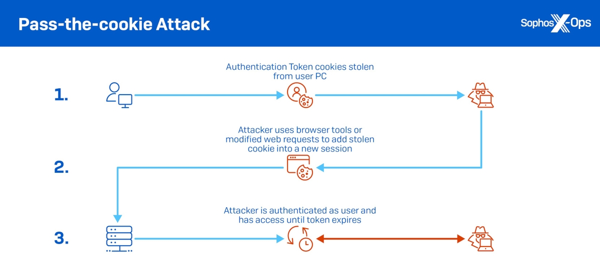
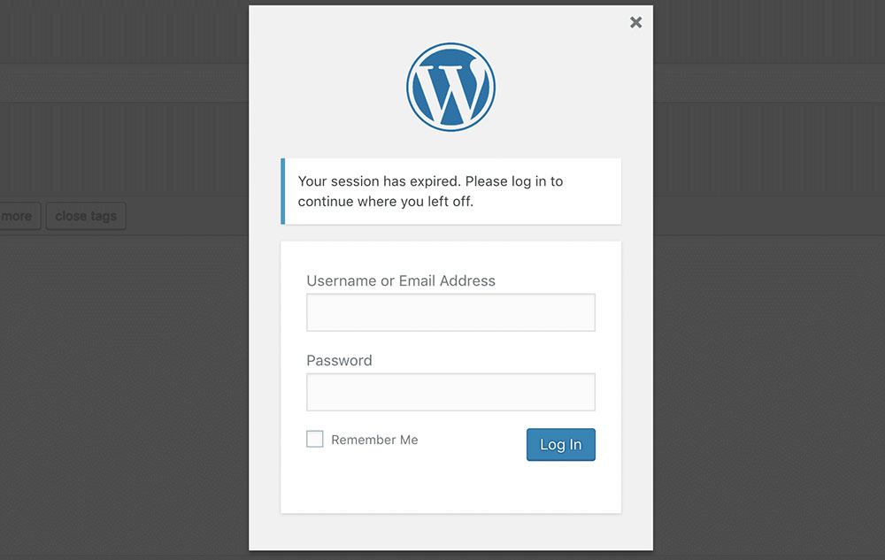

# Session management and security

<!-- TOC -->
* [Threat model](#threat-model)
    * [Default WordPress session management](#default-wordpress-session-management)
    * [Fortress's solution](#fortresss-solution)
* [The absolute timeout](#the-absolute-timeout)
    * [Definition](#definition)
    * [Use-case](#use-case)
    * [Configuration](#configuration)
* [The rotation timeout](#the-rotation-timeout)
    * [Definition](#definition-1)
    * [Use-case](#use-case-1)
    * [Configuration](#configuration-1)
* [The idle timeout](#the-idle-timeout)
    * [Definition](#definition-2)
    * [Use-case](#use-case-2)
    * [Configuration](#configuration-2)
* [The sudo mode timeout](#the-sudo-mode-timeout)
    * [Definition](#definition-3)
    * [Use-case](#use-case-3)
    * [Configuration](#configuration-3)
* [Relationship between the timeouts](#relationship-between-the-timeouts)
* [Troubleshooting](#troubleshooting)
    * [WordPress nonces and Single Page Application Plugins](#wordpress-nonces-and-single-page-application-plugins) 
    * [WordPress nonces with multiple browser tabs](#wordpress-nonces-with-multiple-browser-tabs)
<!-- TOC -->

## Threat model

WordPress uses cookies for authenticating users, which are issued after a user provides their correct credentials (username/password + optional 2FA from plugins).

Consider a valid authentication cookie as a session to keep things simple.
However, in reality, the authentication cookie contains a session token that links to the actual [WordPress session](custom-session-storage.md#wordpress-sessions).

An attacker can only generate a valid authentication cookie with a full server compromise. However, attackers can steal already valid cookies.

A cookie can be stolen in two ways:

- via network communication (mostly irrelevant due to HTTPS).
- via the user's computer.

The main risk lies in a computer being infected by a cookie stealing malware.

| <br><br/>Image: [Sophos](https://news.sophos.com/en-us/2022/08/18/cookie-stealing-the-new-perimeter-bypass/) |
|---------------------------------------------------------------------------------------------------------------------------------------------------------------------------------------|

Stolen cookies are then sold to hackers in huge batches on the dark web.

> [Read more about this attack here](https://news.sophos.com/en-us/2022/08/18/cookie-stealing-the-new-perimeter-bypass/)

WordPress sites are wide open to these attacks. <br><br>**Neither Core nor third-party security plugins have a solution or seem to be even aware of the subject matter.**

### Default WordPress session management

An authentication cookie is valid for two or 14 days if the user wants to be remembered.

That is the only protection.

### Fortress's solution

Fortress uses four dimensions (timeouts) to significantly harden WordPress session security.

Each timeout is needed for a unique reason, and together they cover most attack angles.

## The absolute timeout

### Definition

Fortress will expire a session regardless of user activity after the absolute timeout has passed.

For example:

A user that logs in at 12:00 with an absolute timeout of 10 hours will be able to use that same session until 22:00.

At 22:01, the authentication cookie will be invalid, and the user will have to log in again.

There is no way to extend the absolute timeout.

The absolute timeout roughly corresponds to what WordPress Core does by default, and you might have witnessed this situation
by seeing the following pop-up in the admin area.

|  |
|----------------------------------------------------------------------|


Finding an appropriate absolute timeout depends heavily on the average usage duration of a user.

Lower absolute timeouts increase security but decrease usability.

Fortress uses the following default absolute timeout:

- User without "remember me": '12 hours`.
- User with "remember me": '24 hours`.

### Use-case

The absolute session timeout limits an attacker's window to exploit an already stolen authentication cookie.

Example:

- A user logs in at 10:00, and the absolute timeout is `1 hour`.
- A malware steals the cookie from the user's computer at `10:30`.
- The attacker starts using the stolen cookie at `10:45` => After 15 minutes (at 11:00), the attacker will be logged out again with no way back in until their malware starts sending a new cookie.


### Configuration

- The [`absolute_timeout` option](../../configuration/02_configuration_reference.md#absolute_timeout) applies to all user by default.
- The [`absolute_timeout_per_cap` option](../../configuration/02_configuration_reference.md#absolute_timeout_per_cap) overwrites the default value if the user has one of the specified WordPress capabilities.
- The [`absolute_timeout_remembered_user` option](../../configuration/02_configuration_reference.md#absolute_timeout_remembered_user) applies to all user that want to be remembered.
- The [`absolute_timeout_remembered_user_per_cap` option](../../configuration/02_configuration_reference.md#absolute_timeout_remembered_user_per_cap) applies to all users that want to be remembered and have one of the specified capabilities.

Finally, the following hook can be used to overwrite both options at runtime:

```php
use Snicco\Enterprise\Fortress\Session\Infrastructure\Event\DeterminingAbsoluteTimeout;

// Set a five-minute absolute timeout for the user with ID 1.
add_action(DeterminingAbsoluteTimeout::class, function (DeterminingAbsoluteTimeout $event) :void {

    if($event->user_id === 1) {
        if($event->wants_to_be_remembered)   {
            $event->timeout_in_seconds = 60*10
        } else {
            $event->timeout_in_seconds = 60*5
        }
    }

})
```


## The rotation timeout

### Definition

Once the rotation timeout (or rotation interval) is exceeded, the contents of the current user session are copied to a newly generated session token (auth-cookie). In contrast, the current session token (auth-cookie) is invalidated.

The first incoming client request with a valid auth cookie will receive the new auth cookie.

Fortress uses the following default rotation timeout of '20 minutes`.

### Use-case

The rotation interval significantly shortens the window to start an exploit if an auth cookie has been stolen.

At a given rotation timeout of X, an attacker must use the stolen token within X of it being created.

Example: 

- A user logs in at 10:00, and the rotation timeout is `5 minutes`.
- A malware steals the cookie from the user's computer at `10:01`.
- The user keeps using the site and visits his profile page at `10:06`. => The user receives a new auth cookie, and the old one is invalidated server side.
- The attacker tries to use the stolen cookie at `10:07,` but it has already been invalidated and does not work anymore.

The rotation timeout does not offer protection if the attacker immediately starts exploiting the stolen auth cookie. If that is the case, there is a race condition between the attacker and the legitimate user. The client that makes the first request after the rotation interval is exceeded will get the new auth cookie while the other client is logged out.

This is why having an absolute and rotation timeout is essential.

### Configuration

- The [`rotation_timeout` option](../../configuration/02_configuration_reference.md#rotation_timeout) applies to all user by default.
- The [`rotation_timeout_per_cap` option](../../configuration/02_configuration_reference.md#rotation_timeout_per_cap) overwrites the default value if the user has one of the specified WordPress capabilities.

Finally, the following hook can be used to overwrite both options at runtime:

```php
use Snicco\Enterprise\Fortress\Session\Infrastructure\Event\DeterminingRotationTimeout;

// Set a five-minute rotation timeout for the user with ID 1.
add_action(DeterminingRotationTimeout::class, function (DeterminingRotationTimeout $event) :void {
    
    if($event->user_id === 1) {
        $event->timeout_in_seconds = 60*5
    }
    
})
```

## The idle timeout

### Definition

A session (auth-cookie) is idle if no HTTP request carrying that cookie has been made within the configured idle timeout.

A session's last activity is continuously tracked on the server, not the client.

You might know this functionality from your banking site, where you are logged out after X minutes of being away from the screen.

(Almost) every HTTP to WordPress will update the session's last activity and will thus reset the idle timeout. The following requests are an exception:

- WP-Cron, there is never an auth cookie during WP cron requests.
- Heartbeat API in the WordPress admin area. By default, WordPress will poll an ajax endpoint once a minute if the logged-in user is in the WP admin area. Those requests are automatic and will not update a session's last activity.

Fortress uses a default idle timeout of '30 minutes`.

### Use-case

- A short idle timeout limits the time to guess a valid auth cookie (Impossible anyway since Fortress generates session tokens with 256 bits of entropy).

- Protects users that left their computer unattended or god-forbid used a public computer.

The idle timeout is insufficient since an attacker using a stolen cookie within the idle timeout could keep generating activity indefinitely.

### Configuration

- The [`idle_timeout` option](../../configuration/02_configuration_reference.md#idle_timeout) applies to all user by default.
- The [`idle_timeout_per_cap` option](../../configuration/02_configuration_reference.md#idle_timeout_per_cap) overwrites the default value if the user has one of the specified WordPress capabilities.

Finally, the following hook can be used to overwrite both options at runtime:

```php
use Snicco\Enterprise\Fortress\Session\Infrastructure\Event\DeterminingIdleTimeout;

// Set a five-minute idle timeout for the user with ID 1.
add_action(DeterminingIdleTimeout::class, function (DeterminingIdleTimeout $event) :void {

    if($event->user_id === 1) {
        $event->timeout_in_seconds = 60*5
    }

})
```

## The sudo mode timeout

### Definition

The sudo mode timeout is when a user's session has elevated privileges, starting directly after the login.

Any sensitive action will require the user to enter his password again.

Upon entering his password, the user enters the sudo mode again for the configured interval and can perform sensitive actions without re-authenticating.

You may know this from eCommerce sites that will keep you logged in for a very long time without clearing your basket. But the moment you try to change your billing settings, you have to authenticate again.

This concept is [explained on a separate documentation page in great detail](sudo-mode.md).

The default sudo timeout in Fortress is '10 minutes`.

### Use-case

The sudo mode timeout complements the [absolute timeout](#the-absolute-timeout) and [idle timeout](#the-idle-timeout) as it allows increasing both while still retaining a good portion of the offered security.

Example:

- A user logs in at 10:00, and the sudo mode timeout is `5 minutes`. The absolute and idle timeout can be set higher.
- A malware steals the cookie from the user's computer at `10:01`.
- The attacker tries to use the stolen cookie at `10:07` and can log in. 
- However, the attacker can't perform sensitive actions like uploading new plugins, adding users, etc., since they don't know the impersonated user's password.


### Configuration

- The [`sudo_timeout` option](../../configuration/02_configuration_reference.md#sudo_timeout) applies to all user by default.
- The [`sudo_timeout_per_cap` option](../../configuration/02_configuration_reference.md#sudo_timeout_per_cap) overwrites the default value if the user has one of the specified WordPress capabilities.

Finally, the following hook can be used to overwrite both options at runtime:

```php
use Snicco\Enterprise\Fortress\Session\Infrastructure\Event\DeterminingSudoTimeout;

// Set a five-minute sudo timeout for the user with ID 1.
add_action(DeterminingIdleTimeout::class, function (DeterminingSudoTimeout $event) :void {
    
    if($event->user_id === 1) {
        $event->timeout_in_seconds = 60*5
    }
    
})
```

## Relationship between the timeouts

There are two rules for configuring the timeouts:

- `sudo timeout < idle timeout < absolute timeout`.
- `rotation timeout < absolute timeout`.

They are (currently) not enforced at the code level, but breaking them does not make much logical sense, i.e.:

A `rotation timeout > absolute` would mean that no session gets rotated.

## Troubleshooting

**The following sections apply only to logged-in users.**

### WordPress nonces and Single Page Application Plugins

Many popular WordPress plugins are implement as Single Page Applications (SPA) that are rendered
once, and then use ajax for all consequent requests. 

However, **some** of these SPA plugins don't fetch a new WordPress Nonce for a logged-in user if the
current one is expired. This then leads to not being able to save the current state because of a nonce mismatch.

By default, WordPress nonces are valid for 24 hours which means that issue should surface rarely. 

However, with Fortress enabled, the `rotation timeou`t will always limit the timeframe in which a nonce created with [`wp_create_nonce`](https://developer.wordpress.org/reference/functions/wp_create_nonce/) is valid.

This is because WordPress [uses the user's current session token as part of the nonce](https://github.com/WordPress/wordpress-develop/blob/6.1/src/wp-includes/pluggable.php#L2341).

If the session is rotated, the session token will be different; thus, a nonce created before rotating the session token will no longer be valid.

If this becomes an issue in your workflow, **we always recommend creating different user roles**
for content editing and "real" administrative tasks.
That way, you can keep the shorter rotation timeouts for privileged users while allowing users
that solely edit content to use SPA plugins without any issues. 

Alternatively, you can use the [`disable_rotation_for_ajax_like_requests_per_cap`](../../configuration/02_configuration_reference.md#disablerotationforajaxlikerequestspercap) to define
user capabilities for which Fortress should not rotate the session token for ajax like requests.
This allows you to use your SPA plugins without issues while still being able to benefit from 
the security of a short rotation timeout.

Fortress considers a request to be ajax like if any of the following conditions are true:

- The request specified `application/json` as the `HTTP_ACCEPT` header.
- The request specifies `XMLHttpRequest` in the `HTTP_X_REQUESTED_WITH` header.
- The request goes to the `wp-admin/admin-ajax.php` endpoint.
- The request goes to the WordPress REST-API `/wp-json`.

### WordPress nonces with multiple browser tabs

Take the following example:

- A user logs in at 10:00 and goes to `/page-1`, which contains a form with a nonce. The rotation timeout is `five minutes`.
- At 10:06, the user clicks on a link to a `/article-1` that opens a new browser tab.
- The request to `/article-1` will rotate the session and issue a new auth-cookie.
- The user closes the tab, goes to `/page-1`, and submits the form with the nonce that was created pre-rotation.
- The nonce will be invalid because the session was rotated.

This is an edge case that you should run into very infrequently. However, if it's an issue, you can [increase the rotation timeout](#configuration-1).

Fortress can not solve this since there is no way for a server to update HTML that has already been sent (unless WebSockets are used).

--- 

Next: [The sudo mode](sudo-mode.md).
