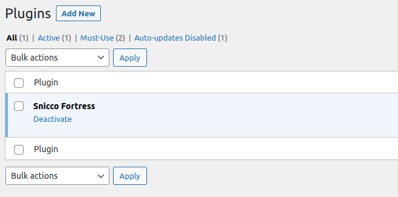

# The Fortress sudo mode

<!-- TOC -->
* [Introduction](#introduction)
* [How does it work in practice?](#how-does-it-work-in-practice)
    * [For a session in sudo mode](#for-a-session-in-sudo-mode)
    * [For a non-sudo mode session](#for-a-non-sudo-mode-session)
* [Protected pages](#protected-pages)
* [Testing the sudo mode](#testing-the-sudo-mode)
* [Skipping the sudo mode check](#skipping-the-sudo-mode-checks)
    * [Skipping the sudo more for application passwords](#skipping-the-sudo-mode-checks-for-application-passwords)
<!-- TOC -->

## Introduction

> Before you continue reading, make sure to familiarize yourself with the [session managment](session-managment-and-security.md) documentation to see how the sudo mode works in the big picture.

The Fortress sudo mode, in analogy to the Linux [sudo](https://www.sudo.ws/) command, defines a period in which Fortress will assign elevated privileges to a user's session.

As a rule of thumb, a sudo mode session is equal to a "normal" user session when Fortress is not installed.

A particular session is only in sudo mode for a [configurable duration](session-managment-and-security.md#configuration-3) after logging in (through any means) for the first time.

After the [sudo timeout](session-managment-and-security.md#the-sudo-mode-timeout) has passed, Fortress will downgrade the user's session to a low-privileged one.

## How does it work in practice?

### For a session in sudo mode

Simple. There is no difference. A user can use the site in the same manner as if Fortress wasn't installed.

### For a non-sudo mode session

A user will only notice that Fortress downgraded his session privileges once they try to access one of the configured [protected pages](#protected-pages).

At that point, Fortress will intercept that request and redirect the user to a page that asks them to confirm their password.

If the user can provide his password, Fortress will reset the sudo timeout and redirect the user to their intended location.

| The user tries to access the sensitive plugins.php page.<br><br> | On success, Fortress redirects the user back.<br><br> |
|------------------------------------------------------------------------------------------------------------------------------------|------------------------------------------------------------------------------------------------------------------------|

Fortress will only intercept requests to protected pages for non-sudo mode sessions, while all other pages on the site can still be accessed.

## Protected pages

A protected page can only be accessed by a user whose session is in sudo mode.

By default, Fortress considers the following pages to be protected:

```php
$protected_pages = [
    // Updates
    '/wp-admin/update-core.php',
    
    // Appearance
    '/wp-admin/themes.php',
    '/wp-admin/theme-install.php',
    
    // Plugins,
    '/wp-admin/plugins.php',
    '/wp-admin/plugin-install.php',
    
    // Users
    '/wp-admin/users.php',
    '/wp-admin/user-new.php',
    '/wp-admin/profile.php',
    
    // Update
    '/wp-admin/update.php',
    
    // Options > *
    '/wp-admin/options-*',
    
    // Authorize application password.
    'wp-admin/authorize-application.php',
    
    // Tools > *
    '/wp-admin/tools.php',
    '/wp-admin/import.php',
    '/wp-admin/export.php',
    '/wp-admin/site-health.php',
    '/wp-admin/export-personal-data.php',
    '/wp-admin/erase-personal-data.php',
    '/wp-admin/theme-editor.php',
    '/wp-admin/plugin-editor.php',
];
```

You can use the [`protected_pages` option](../../configuration/02_configuration_reference.md#protected_pages) to define your list of protected pages.

**Important:** This will completely overwrite the default protected pages of Fortress!

If you want to use all of Fortress's default protected pages AND some custom ones, you need to either:

- copy the default and add your own, or
- use the runtime PHP hooks to customize protected pages.

```php
use Snicco\Enterprise\Fortress\Session\Infrastructure\Event\ConfirmingSudoMode;

add_action(ConfirmingSudoMode::class, function (ConfirmingSudoMode $event) :void {
    $event->addProtectedPath('/my-account');
    
    // "*" Can be used as a wildcard.
    $event->addProtectedPath('/parent-page/*');
})
```

The `*` character can be used as a wildcard.

Examples:

`/wp-admin/*` will protect the entire WordPress admin area.
- `/post-*` will match `/post-1`, `/post-2` and `/post-1/child/sub-child`.

## Testing the sudo mode

It is cumbersome to test that the correct pages on your site are protected because you will have to wait for the sudo timeout to pass.

For this reason, Fortress includes a WP-CLI command that will toggle the sudo mode status of a user's most recently created session.

```shell
wp snicco/fortress session toggle-sudo {username}
```

Refer to the [complete command reference here](../../wp-cli/readme.md#toggle-sudo).

## Skipping the sudo mode checks

You might have plugins on your site that act on behalf of a WordPress user.
This is typically only the case when you have any third-party application performing requests to your WordPress site.

Common examples are management tools like MainWP/ManageWP.

If you experience any issues it's likely because they try act on behalf of WordPress user even-though the user is not making actual request. 

This means that Fortress can't find a session token to check the sudo mode.

> The sudo mode is always checked per user session, not per user.

As always, Fortress will error on the site of caution and abort the request as a missing 
session token might very well indicate a misconfiguration of your site. 

In any case you can skip the sudo checks at runtime with a WordPress filter like so:

```php
// Put this into a custom must-use plugin ideally.
// A normal plugin or functions.php is also fine.

use Snicco\Enterprise\Fortress\Session\Infrastructure\Event\ShouldSudoModeCheckBeSkipped;

add_action(ShouldSudoModeCheckBeSkipped::class, function (ShouldSudoModeCheckBeSkipped $event) {
     
    // You need to confirm with manageWP how to determine this.
    $is_this_a_ManageWP_request = false;
    
    if ($is_this_a_manage_wp_request){
        $event->skip_for_current_request = true;
    }
    
});
```

The action must be added before the `admin_init` hook for admin requests, or before the `wp_loaded` hook for other requests.

### Skipping the sudo mode checks for application passwords

If your site uses application passwords you might also need to skip sudo mode checks.

To achieve this you can make use of the [application_password_did_authenticate](https://developer.wordpress.org/reference/hooks/application_password_did_authenticate/) hook that WordPress fires after a request was authenticated successfully with an application password.

```php
// Put this into a custom must-use plugin ideally.
// A normal plugin or functions.php is also fine.

use Snicco\Enterprise\Fortress\Session\Infrastructure\Event\ShouldSudoModeCheckBeSkipped;

add_action('application_password_did_authenticate', function (WP_User $user) :void {

    $user_id = $user->ID;
        
    add_action(ShouldSudoModeCheckBeSkipped::class, function (ShouldSudoModeCheckBeSkipped $event) use($user_id){
         
        if ($user_id === $event->user_id){
            $event->skip_for_current_request = true;
        }
        
    });
        
}, 10, 1);
```

You need to define this before the `init` hook fires.

---

Next: [WP-CLI](../../wp-cli/readme.md).