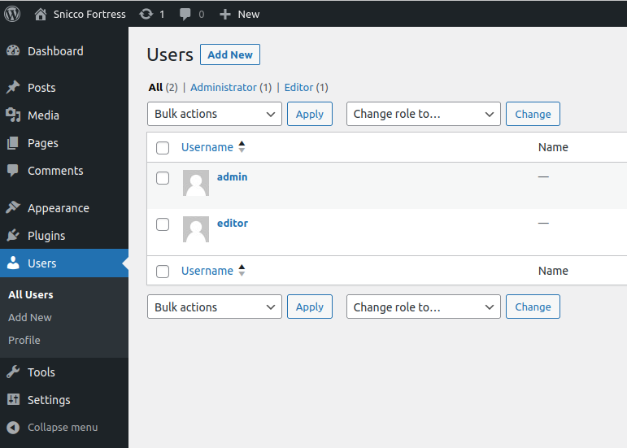
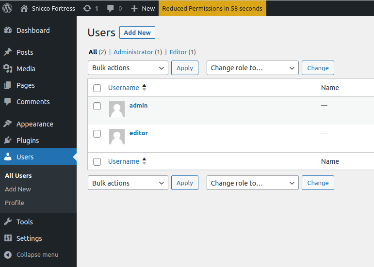
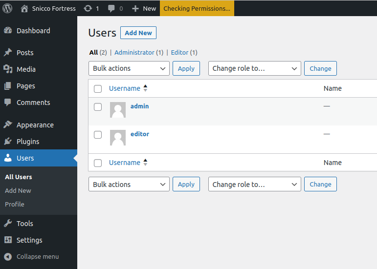
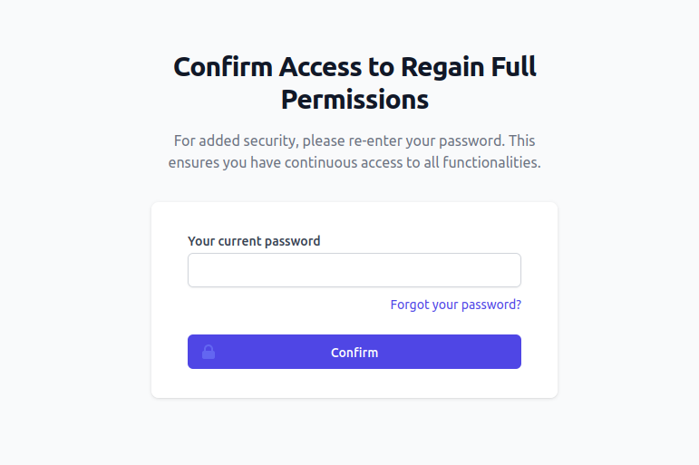
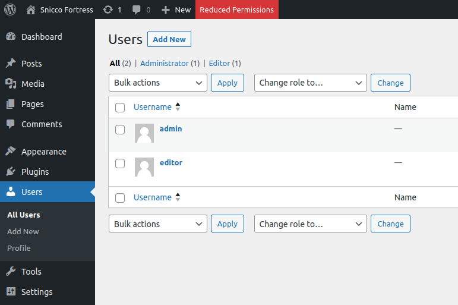
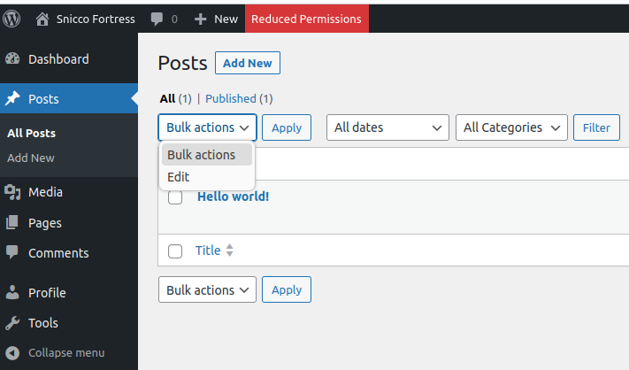
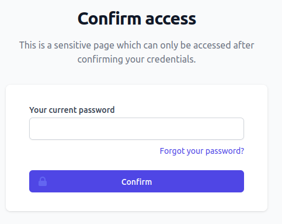
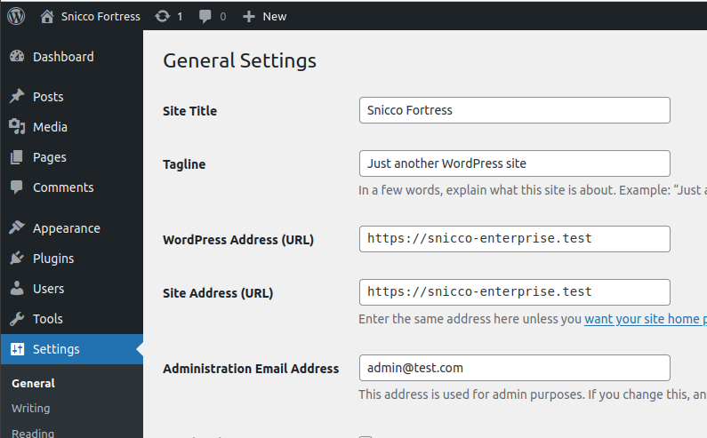
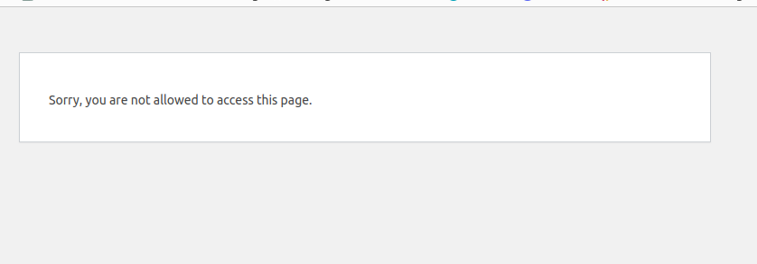
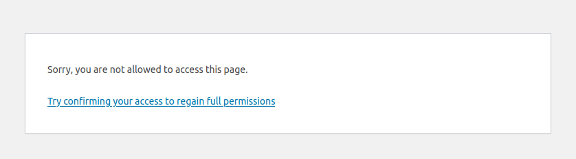

# The Fortress sudo mode

  * [Introduction](#introduction)
  * [How the Sudo Mode Works in Practice](#how-the-sudo-mode-works-in-practice)
    * [1. Session in Sudo Mode](#1-session-in-sudo-mode)
    * [2. Approaching Sudo Mode Expiry](#2-approaching-sudo-mode-expiry)
    * [3. Reduced Permissions — A Session Outside Sudo Mode](#3-reduced-permissions--a-session-outside-sudo-mode)
  * [Protected Capabilities](#protected-capabilities)
    * [Configuring Protected Capabilities](#configuring-protected-capabilities)
  * [Protected Pages](#protected-pages)
    * [Configuring Protected Pages](#configuring-protected-pages)
      * [Wildcards](#wildcards)
  * [Distinguishing Between Protected Capabilities & Protected Pages](#distinguishing-between-protected-capabilities--protected-pages)
    * [The Nuances](#the-nuances)
    * [Visualizing the Difference](#visualizing-the-difference)
  * [Testing the sudo mode](#testing-the-sudo-mode)
<!-- TOC -->

## Introduction

> Before diving deeper, it's essential to have a grasp of the [session management](session-managment-and-security.md)
> principles.
> This provides context on how the sudo mode fits within the broader framework.

The Fortress sudo mode mirrors the concept of the Linux [`sudo`](https://www.sudo.ws/) command.
Essentially, after a user logs in, there's a
specific period where the user's session operates in a high-privileged state.

This heightened session privilege lasts for a [set duration](session-managment-and-security.md#configuration-3).
Once this [sudo timeout](session-managment-and-security.md#the-sudo-mode-timeout) expires, Fortress transitions the
user's session from a high-privileged to a low-privileged state.

This means certain sensitive actions become restricted
unless the user re-confirms their credentials.

The essence of this mechanism relies on two main components:

- protected capabilities
- and protected pages.

We'll delve deeper into these shortly.

> Note: It's crucial to understand that the user remains logged in the entire time.
> Only specific sensitive actions are limited, while non-sensitive tasks continue uninterrupted.

## How the Sudo Mode Works in Practice

### 1. Session in Sudo Mode

Upon logging in, the user's session instantly activates the sudo mode. In this state:

- The user has full capabilities, allowing them to perform any action that they normally could on the site.
- This unrestricted access persists for the sudo timeout's duration, which is 15
  minutes [by default](session-managment-and-security.md#configuration-3).
- Visually, the admin dashboard appears as usual.



### 2. Approaching Sudo Mode Expiry

As this privileged mode approaches its conclusion:

- A lightweight JS script added by Fortress to the admin footer alerts the user when
  only 1 minute remains before sudo mode expiration.



- Rather than relying on a static countdown, Fortress fetches timeout details from the server via AJAX, updating every
  10 seconds.
  Adjust this frequency through the
  [`non_sudo_mode_recheck_frequency`](../../configuration/02_configuration_reference.md#non_sudo_mode_recheck_frequency)
  option.

**Note**: Fortress initiates these checks only when less than 60 seconds remain in the sudo mode.



- At any point, users can select the alert in the admin bar, guiding them to a new tab. Here, they can verify their
  identity and renew the sudo timer.



If a user doesn't act, the sudo mode ends, and permissions decrease.

### 3. Reduced Permissions — A Session Outside Sudo Mode

If users don't re-authenticate prior to the sudo timeout:

- The session's limited permission state is highlighted by Fortress,
  which continues to monitor and update the sudo mode status.



- With reduced permissions, users can't execute highly sensitive tasks.
  This restriction is implemented by filtering out all set [protected capabilities](#protected-capabilities) at runtime.
- Fortress employs official WordPress APIs for these operations, ensuring seamless functionality.

Consider a scenario where a user accesses the post overview page:

- While editing and viewing remain available, specific functions, such as bulk post deletion (
  a [protected capability](#protected-capabilities)), are disabled.
- WordPress automatically removes certain functionalities and menu items, like the "Settings" and "Plugins" menu items
  are no longer visible.



If a user, despite the missing "Settings" menu item tries accessing `/wp-admin/options-general.php` -
a [protected page](#protected-pages) - Fortress intercepts and redirects them:



Providing correct credentials resets the sudo timer, and the user gets redirected to their intended destination.



## Protected Capabilities

Fortress recognizes the following capabilities as protected. As a result, only users in sudo mode can execute them.

It's worth noting that most of these capabilities are typically reserved for administrators.
Hence, **everyday users or content editors will largely remain unaffected by these restrictions**.

| Capability                | Reason                                                                                                 |
|---------------------------|--------------------------------------------------------------------------------------------------------|
| `activate_plugins`        | Allows activation of plugins. Restricted to prevent unwanted or malicious plugins.                     |
| `delete_plugins`          | Allows deletion of plugins. Restricted to safeguard essential plugins.                                 |
| `delete_themes`           | Allows theme deletion. Restricted to protect the site's appearance and functionality.                  |
| `delete_users`            | Grants user deletion privileges. Restricted to prevent unauthorized user removal.                      |
| `edit_dashboard`          | Provides access to edit the dashboard. Restricted to maintain dashboard integrity.                     |
| `edit_files`              | Permits direct file editing. Restricted to prevent unwanted file modifications.                        |
| `edit_plugins`            | Allows plugin file edits. Restricted to prevent plugin tampering or injection.                         |
| `edit_theme_options`      | Grants theme option modifications. Restricted to maintain site appearance and settings.                |
| `edit_themes`             | Grants access to edit theme files. Restricted to prevent tampering with theme.                         |
| `edit_users`              | Allows editing user profiles. Restricted to prevent unauthorized user profile changes.                 |
| `export`                  | Permits data export. Restricted to prevent unauthorized data exports.                                  |
| `import`                  | Grants data import capabilities. Restricted to avoid malicious or unwanted data imports.               |
| `install_plugins`         | Grants plugin installation. Restricted to avoid malicious plugin installations.                        |
| `install_themes`          | Allows theme installations. Restricted to safeguard site appearance.                                   |
| `manage_options`          | Provides access to various settings. Restricted to preserve site configurations.                       |
| `promote_users`           | Allows user role changes. Restricted to maintain role hierarchies.                                     |
| `remove_users`            | Grants user removal capabilities. Restricted to prevent unauthorized removals.                         |
| `list_users`              | Permits viewing user lists. Restricted to protect user privacy.                                        |
| `create_users`            | Allows user creation. Restricted to prevent unauthorized user additions.                               |
| `switch_themes`           | Grants theme switching. Restricted to maintain site's appearance and user experience.                  |
| `unfiltered_html`         | Allows posting HTML without filtering. Restricted to prevent XSS attacks.                              |
| `unfiltered_upload`       | Permits uploads without filtering. Restricted to avoid uploads of JS and HTML files.                   |
| `update_core`             | Grants WordPress core update. Restricted to ensure stable updates and site integrity.                  |
| `update_plugins`          | Allows plugin updates. Restricted to avoid compatibility or security issues.                           |
| `update_themes`           | Permits theme updates. Restricted to maintain site appearance and stability.                           |
| `manage_categories`       | Allows category management. Restricted to maintain content taxonomy.                                   |
| `delete_pages`            | Grants page deletion. Restricted to prevent loss of critical site pages.                               |
| `delete_private_pages`    | Permits deletion of private pages. Restricted to maintain content integrity.                           |
| `delete_published_pages`  | Allows deleting published pages. Restricted to preserve site structure and content.                    |
| `delete_others_pages`     | Grants deletion of pages by other users. Restricted to maintain content consistency.                   |
| `delete_posts`            | Grants post deletion. Restricted to maintain content consistency.                                      |
| `delete_private_posts`    | Permits deletion of private posts. Restricted to maintain content integrity.                           |
| `delete_published_posts`  | Allows deleting published posts. Restricted to maintain content consistency.                           |
| `delete_others_posts`     | Grants deletion of posts by other users. Restricted to maintain content quality and consistency.       |
| `edit_comment`            | Provides access to edit and delete comments. Restricted to prevent unauthorized comment modifications. |
| `view_site_health_checks` | Grants access to site health data. Restricted to protect sensitive site info.                          |
| `install_languages`       | Allows language installations. Restricted to maintain site language consistency.                       |

On a **WordPress Multisite**, additional capabilities are protected:

| Capability               | Reason                                                                                                             |
|--------------------------|--------------------------------------------------------------------------------------------------------------------|
| `create_sites`           | Allows creating new sites within the network. Restricted to control the growth and structure of the network.       |
| `delete_sites`           | Grants the ability to delete sites. Restricted to prevent unwanted removal of sites within the network.            |
| `manage_network`         | Provides overall network management access. Restricted to maintain network settings and integrity.                 |
| `manage_sites`           | Allows managing sites within the network. Restricted to ensure site consistency within the network.                |
| `manage_network_users`   | Grants ability to manage network-wide users. Restricted to protect user roles and data across the network.         |
| `manage_network_plugins` | Provides access to manage plugins network-wide. Restricted to maintain consistent plugin use across sites.         |
| `manage_network_themes`  | Allows managing themes across the network. Restricted to ensure a consistent look and feel for all sites.          |
| `manage_network_options` | Grants access to manage network-wide options. Restricted to maintain consistent settings across sites.             |
| `upgrade_network`        | Allows network-wide upgrades. Restricted to ensure stable upgrades and maintain site integrity across the network. |
| `setup_network`          | Provides access to set up the network initially. Restricted to maintain a consistent initial network setup.        |

### Configuring Protected Capabilities

You have two methods at your disposal to alter the list of protected capabilities:

1. **Custom List:** Begin with a blank slate by defining your unique list of protected capabilities. You can achieve
   this using the
   [`protected_capabilities`](../../configuration/02_configuration_reference.md#protected_capabilities) option.<br>
   ⚠️ Be cautious: Utilizing this method will overwrite Fortress's default protected capabilities!
2. **Using WordPress Hooks:** This method allows you to add or remove specific capabilities using WordPress hooks.

```php
<?php

/*
* Plugin Name: Customize Fortress's Protected Capabilities
*/

use Snicco\Enterprise\Fortress\Session\Infrastructure\Event\DeterminingProtectedCapabilities;

add_action(DeterminingProtectedCapabilities::class, function (DeterminingProtectedCapabilities $event) :void {
    
    // Add a single capability.
    $event->addProtectedCapability('my_custom_capability');
    // Add multiple capabilities.
    $event->addProtectedCapability('my_custom_capability_1', 'my_custom_capability_2');
   
   // Remove a single capability.
    $event->removeProtectedCapability('my_custom_capability');
    // Remove multiple capabilities.
    $event->removeProtectedCapability('my_custom_capability_1', 'my_custom_capability_2');
}
```

**Key Point:** Ensure your hook callback is initialized before the `plugins_loaded` hook gets triggered.

To incorporate the callback, you can either place it in a custom plugin or within a must-use plugin. However, **don't
attempt to add it to the theme's functions.php** file — it's too late in the process and will not function correctly.

## Protected Pages

Within Fortress, a "protected page" can solely be accessed by users whose session is in "sudo mode."
Those operating in non-sudo mode are redirected to the "Confirm Access" page.

Protected pages are determined by inspecting the URL path of the current request.

By default, these are the pages Fortress marks as protected.
It's important to note that the majority of these pages are
primarily accessible to administrators:

| Path                                 | Functionality & Usage                                                                                       |
|--------------------------------------|-------------------------------------------------------------------------------------------------------------|
| `/wp-admin/update-core.php`          | Allows updating of WordPress core, plugins, and themes.                                                     |
| `/wp-admin/themes.php`               | Manages installed themes and customize the active theme.                                                    |
| `/wp-admin/theme-install.php`        | Enables installation of new themes from the WordPress repository or upload.                                 |
| `/wp-admin/plugins.php`              | Manages installed plugins (activate/deactivate/delete).                                                     |
| `/wp-admin/plugin-install.php`       | Enables installation of new plugins from the WordPress repository or upload.                                |
| `/wp-admin/users.php`                | Manages site users, roles, and their details.                                                               |
| `/wp-admin/user-new.php`             | Adds new users to the site.                                                                                 |
| `/wp-admin/profile.php`              | Allows users to edit their own profile and settings.                                                        |
| `/wp-admin/update.php`               | Processes updates for plugins, themes, and the WordPress core.                                              |
| `/wp-admin/options-*.php`            | Provides various site-wide settings and configurations.                                                     |
| `/wp-admin/options.php`              | Allows viewing confidential site settings.                                                                  |
| `wp-admin/authorize-application.php` | Authorizes external applications to connect to the site.                                                    |
| `/wp-admin/tools.php`                | Offers tools such as import/export, site health, and data erasure.                                          |
| `/wp-admin/import.php`               | Imports content from other WordPress installations or platforms.                                            |
| `/wp-admin/export.php`               | Exports site content in a WordPress compatible format.                                                      |
| `/wp-admin/site-health.php`          | Checks site health and provides information about server configurations, performance, and potential issues. |
| `/wp-admin/export-personal-data.php` | Exports personal data of a user for GDPR compliance.                                                        |
| `/wp-admin/erase-personal-data.php`  | Erases personal data of a user upon request.                                                                |
| `/wp-admin/theme-editor.php`         | Provides a code editor to modify theme files directly.                                                      |
| `/wp-admin/plugin-editor.php`        | Provides a code editor to modify plugin files directly.                                                     |

For those utilizing **WordPress Multisite**, additional protected pages come into play:

| Page                               | Functionality & Usage                                                                      |
|------------------------------------|--------------------------------------------------------------------------------------------|
| `/wp-admin/network.php`            | Displays the main dashboard of the Network Admin for multisite installations.              |
| `/wp-admin/ms-admin.php`           | Deprecated network admin file; rarely used in recent versions.                             |
| `/wp-admin/ms-delete-site.php`     | Allows for the deletion of a subsite within the multisite network.                         |
| `/wp-admin/ms-edit.php`            | Allows for the editing of a particular site's settings within the multisite network.       |
| `/wp-admin/ms-options.php`         | Manages network-wide settings for the multisite installation.                              |
| `/wp-admin/ms-sites.php`           | Manages all the sites within the multisite network.                                        |
| `/wp-admin/ms-themes.php`          | Controls the themes that are available for subsites within the multisite network.          |
| `/wp-admin/ms-upgrade-network.php` | Handles the upgrading process for the entire network when WordPress core updates are made. |
| `/wp-admin/network/*`              | Represents a wildcard for various other network administration tasks and settings.         |

### Configuring Protected Pages

You have two methods at your disposal to alter the list of protected capabilities:

1. **Custom List:** Begin with a blank slate by defining your unique list of protected pages.
   You can achieve this using the
   [`protected_pages`](../../configuration/02_configuration_reference.md#protected_pages) option.<br>
   ⚠️ Be cautious: Utilizing this method will overwrite Fortress's default protected pages!
2. **Using WordPress Hooks:** This method allows you to add specific pages using WordPress hooks.

```php
<?php

/*
* Plugin Name: Customize Fortress's Protected Pages
*/

use Snicco\Enterprise\Fortress\Session\Infrastructure\Event\ConfirmingSudoMode;

add_action(ConfirmingSudoMode::class, function (ConfirmingSudoMode $event) :void {
    $event->addProtectedPath('/my-account');
    
    // "*" Can be used as a wildcard.
    $event->addProtectedPath('/parent-page/*');
})
```

#### Wildcards

In defining paths, the * symbol acts as a wildcard, offering broad match possibilities.

For instance:

- `/wp-admin/*` will match the entire WordPress admin domain.
- `/post-*` matches paths like `/post-1`, `/post-2`, and even `/post-1/child/sub-child`.

## Distinguishing Between Protected Capabilities & Protected Pages

At a glance, both "Protected Capabilities" and "Protected Pages" might seem similar, but they serve distinct purposes:
the former revolves around security, while the latter enhances usability.

### The Nuances

**1. Protected Capabilities:**

- These primarily ensure security by dictating who can perform certain actions.
- If you solely use protected capabilities without protected pages, users might encounter not so pretty error displays.

**2. Protected Pages:**

- These focus on user experience by ensuring users don't stumble upon confusing (WordPress) error pages.
- Fortress redirects users to the "Confirm Access" page, where they can re-authenticate and renew their sudo mode.

### Visualizing the Difference

**1. Standard WordPress Error:**

- By default, if WordPress detects a missing permission, it shows the "wp_die" page.



- To put it bluntly, it's not the most pleasant user experience.

**2. Fortress's Enhanced UX:**

- In contrast, Fortress redirects users to a more approachable "Confirm Access" page.


**3. Edge Case:**

- If a user tries accessing a page that requires a protected capability but isn't a protected page, Fortress detects this
  and enhances the default wp_die page with a link to the "Confirm Access" page.




## Testing the sudo mode

It is cumbersome to test that your sudo mode configuration works as expected
since it has a time-based component and requires you to wait out the sudo timeout.

For this reason, Fortress includes a WP-CLI command that will toggle the sudo mode status of a user's most recently
created session.

```shell
wp snicco/fortress session toggle-sudo <user_id>
```

Refer to the [complete command reference here](../../wp-cli/readme.md#toggle-sudo).

---

Next: [Vaults & Pillars](../vaults_and_pillars/readme.md).