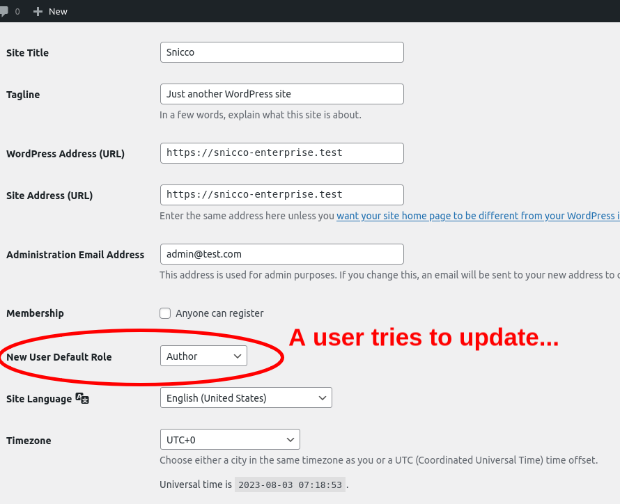
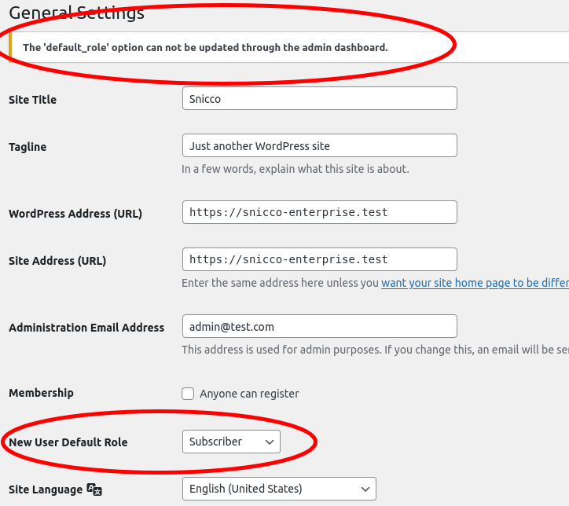

# Vaults & Pillars for WordPress Options

<!-- TOC -->
* [Motivation](#motivation)
* [Vaults](#vaults)
    * [What should be a Vault](#what-should-be-a-vault)
    * [Setting up Vaults](#setting-up-vaults)
    * [How to identify option names](#how-to-identify-option-names)
    * [Covering Vaults](#covering-vaults)
    * [Partial Vaults](#partial-vaults)
        * [How to identify the correct path for Partial Vaults](#how-to-identify-the-correct-path-for-partial-vaults)
        * [Options whose names contain a `.`](#options-whose-names-contain-a-)
* [Pillars](#pillars)
    * [What should be a Pillar](#what-should-be-a-pillar)
    * [Setting up Pillars](#setting-up-pillars)
    * [Covering Pillars](#covering-pillars)
    * [Partial Pillars](#partial-pillars)
    * [Valid Pillar Values](#valid-pillar-values)
    * [ENV Pillars](#env-pillars)
* [Recommended Defaults](#recommended-defaults)
* [Workflows](#workflows)
    * [Adding New Vaults and Pillars](#adding-new-vaults-and-pillars)
    * [Removing a Vault or Pillar](#removing-a-vault-or-pillar)
    * [Removing All Vaults and Pillars](#removing-all-vaults-and-pillars)
    * [Staging to Production Workflows](#staging-to-production-workflows)
        * [Full Database + Files Push](#full-database--files-push)
        * [Partial Database + Files Push](#partial-database--files-push)
        * [Partial Database + Partial Files Push](#partial-database--partial-files-push)
        * [Last Resort: Manual](#last-resort-manual)
* [Validation Rules for Vaults and Pillars](#validation-rules-for-vaults-and-pillars)
* [Understanding the Flow of Data with Vaults and Pillars](#understanding-the-flow-of-data-with-vaults-and-pillars)
    * [Fetching Options](#fetching-options)
        * [Customizing the returned value with hooks](#customizing-the-returned-value-with-hooks)
    * [Updating Options](#updating-options)
        * [End-User Feedback](#end-user-feedback)
    * [Deleting Options](#deleting-options)
    * [Adding Options](#adding-options)
* [Strict Mode in Vaults and Pillars](#strict-mode-in-vaults-and-pillars)
    * [Enabling Strict Mode](#enabling-strict-mode)
    * [Implications of Strict Mode](#implications-of-strict-mode)
    * [Checking if Strict Mode is activated](#checking-if-strict-mode-is-activated)
    * [Disabling the Strict Mode](#disabling-the-strict-mode)
* [Security and Threat Models](#security-and-threat-models)
    * [Prevention of Sensitive Data Exposure through SQL Injections](#prevention-of-sensitive-data-exposure-through-sql-injections)
    * [Protection against Sensitive Data Exposure through File Disclosure & File Downloads](#protection-against-sensitive-data-exposure-through-file-disclosure--file-downloads)
    * [Mitigation of Configuration Manipulation:](#mitigation-of-configuration-manipulation)
* [Performance Impact of Vaults and Pillars](#performance-impact-of-vaults-and-pillars)
* [Compatibility and Troubleshooting](#compatibility-and-troubleshooting)
    * [Plugins directly querying the database](#plugins-directly-querying-the-database)
    * [An option with Vault/Pillar is fetched before Fortress boots](#an-option-with-vaultpillar-is-fetched-before-fortress-boots)
<!-- TOC -->

---

## Motivation

WordPress and its ecosystem have expanded to handle increasingly complex applications with multiple third-party service
integrations per site. Yet the security model has unfortunately remained stagnant. This has left a considerable gap in
WordPress security, especially when it comes to securing sensitive data.

Storing sensitive data in plaintext within the WordPress database is a substantial security risk. This practice, common
in many WordPress Core and third-party plugins/themes, opens up the potential for severe security breaches:

- **A stolen Stripe API key** could lead
  to [substantial financial fraud](https://webdesigneracademy.com/my-stripe-account-was-hacked-and-stripe-said-i-have-to-repay-70k/).
- **A stolen SMTP/Transaction Email key**
  could [initiate large-scale spam campaigns sent through your account]((https://www.binarydefense.com/resources/threat-watch/stolen-sendgrid-accounts-used-in-phishing-attacks/)).
- **A stolen API token** could potentially result in
  a [complete takeover of your WordPress site](https://snicco.io/vulnerability-disclosure/malcare/site-takeover-through-stolen-api-credentials-in-combination-with-sqli-malcare-5-09).

The ramifications of these breaches are not just theoretical. They happen in the real world, causing significant harm to
businesses and individuals alike.

In software ecosystems like Laravel, Symfony, Ruby on Rails, etc., which have mature security practices, storing
sensitive information in plaintext is essentially unheard of; sensitive data is always encrypted or supplied from the
environment.

This discrepancy has prompted the creation of the Vaults & Pillars (VnP) module, which addresses this critical gap by
introducing an encryption layer for sensitive data stored in the WordPress database.

Fortress acts as a hidden translation layer between WordPress and the database,
which means that **all functionality of
the [WordPress Option API](https://developer.wordpress.org/plugins/settings/options-api/) continues to work as
expected
without any code modification in WordPress Core or plugins**.

## Vaults

A Fortress `Vault` secures a WordPress option (or a subset of it) by storing it encrypted in the `wp_options` table.

Vaults are a vital part of Fortress's `Vaults & Pillars` (VnP) module. They represent a specific way of storing and
managing your WordPress options that need to be kept secret.

One of [Fortress's `Secure Secrets`](../../getting-started/02_preparation.md#secrets) is used as the encryption key,
meaning that decryption of the database value is impossible unless the entire server (filesystem) is compromised.

Although the option is stored encrypted, WordPress always receives the "real" value from Fortress.

Fortress is a hidden translation layer between [WordPress Options API](https://developer.wordpress.org/plugins/settings/options-api/) and the database.

In the following sections, we will delve deeper into what should ideally be stored in a Vault and how to set one up.

### What should be a Vault

In an ideal scenario, a `Vault` should contain any sensitive information that, if exposed, could lead to significant
security breaches or compromised functionality. This generally includes API keys, transactional email keys, and
other tokens or secrets providing access to external systems.

Typical examples include:

- WooCommerce Stripe Keys.
- SMTP/Transaction Email Keys.
- Custom Plugin/Theme API Tokens.
- Third-party API integrations like Zapier, Shipstation, and others.

The exact content of a `Vault` can depend on the specifics of your WordPress setup and the third-party plugins or themes
in use.

A guiding principle is that any information that's deemed sensitive and is currently stored as plaintext in
the `wp_options` table could and should be stored in a `Vault`.

`Vaults` are **mutable** by default but can be made immutable. More on that later.

### Setting up Vaults

> ⚠️⚠️⚠️ ALWAYS ADD/TEST NEW VAULTS IN A STAGING ENVIRONMENT. NO EXCEPTIONS.

Setting up `Vaults` is as simple as defining an array of option names in
your [Fortress configuration](../../configuration/01_how_to_configure_fortress.md) under the `vaults_and_pillars`object.

Let's take an example of how to set up a `Vault` for the Core `admin_email` option:

```json
{
  "vaults_and_pillars": {
    "option_vaults": {
      "admin_email": {}
    }
  }
}
```

In the above example, `admin_email` is the WordPress option we want to secure.

The `option_vaults` object is a key-value pair where the keys are the option names, and the values are an empty
object `{}`.

In this case, the entire `admin_email` option will be stored as an encrypted `Vault`.
This is called a [`Covering Vault`](#covering-vaults).

We'll later explain how to turn only a subset of a large option into a [`Partial Vault`](#partial-vaults).

The above configuration is all that is needed to turn any option into a securely encrypted `Vault`.

### How to identify option names

Option names in WordPress are the unique identifiers used to store, update, and retrieve data in the `wp_options` table
of the WordPress database.

Option names can be found in various ways:

1. You can navigate to the `wp_options` table via the database management tool (like phpMyAdmin) provided by your host.

2. Developers can find option names directly in the source code. They are typically found in calls to
   WordPress' [Options API](https://developer.wordpress.org/plugins/settings/options-api/) functions such
   as `get_option`, `add_option`, `update_option`, etc.

3. If the option you are looking for belongs to a plugin, check the plugin's documentation. It might contain the
   information you are looking for.

4. Use WordPress' [WP CLI](https://wp-cli.org/)
   to [list all options](https://developer.wordpress.org/cli/commands/option/list/) or search for specific ones:

    ```console
   $ wp option list --search=fluent* 
   
    +---------------------+----------------------------------------------------------------------------------------------+
    | option_name         | option_value                                                                                 |
    +---------------------+----------------------------------------------------------------------------------------------+
    | fluentmail-settings | a:3:{s:8:"mappings";a:1:{s:10:"c@snicc.io";s:32:"4c306fbcb8ebdbbe8a4a463134794946";}s:11:"co |
    |                     | nnections";a:1:{s:32:"4c306fbcb8ebdbbe8a4a463134794946";a:2:{s:5:"title";s:11:"SMTP server"; |
    |                     | s:17:"provider_settings";a:14:{s:11:"sender_name";N;s:12:"sender_email";s:10:"c@snicc.io";s: |
    |                     | 15:"force_from_name";s:2:"no";s:16:"force_from_email";s:3:"yes";s:11:"return_path";s:3:"yes" |
    |                     | ;s:4:"host";s:7:"mailhog";s:4:"port";s:4:"1025";s:4:"auth";s:2:"no";s:8:"username";N;s:8:"pa |
    |                     | ssword";N;s:8:"auto_tls";s:2:"no";s:10:"encryption";s:4:"none";s:9:"key_store";s:2:"db";s:8: |
    |                     | "provider";s:4:"smtp";}}}s:4:"misc";a:4:{s:10:"log_emails";s:3:"yes";s:23:"log_saved_interva |
    |                     | l_days";s:2:"14";s:22:"disable_fluentcrm_logs";s:2:"no";s:18:"default_connection";s:32:"4c30 |
    |                     | 6fbcb8ebdbbe8a4a463134794946";}}                                                             |
    +---------------------+----------------------------------------------------------------------------------------------+
    ```

   This is an example of searching for all options that start with `fluent`. The WP CLI output shows the option
   name (`option_name`) and its value (`option_value`).

### Covering Vaults

A `Covering Vault` encompasses the entirety of an option, encrypting and securing all of its content. This is the default
type of `Vault` and the easiest to set up.

In a `Covering Vault`, every aspect of the option's content is unreadable without the decryption key. This
is highly secure but can also be restrictive if only parts of an option need to be secured.

To set up a `Covering Vault`, add the desired option name to the `option_vaults` object in the Fortress
configuration file, as seen in our earlier example:

```json
{
  "vaults_and_pillars": {
    "option_vaults": {
      "admin_email": {}
    }
  }
}
```

In this example, the entire `admin_email` option is converted into a `Covering Vault`, encrypting all its content.

### Partial Vaults

WordPress plugins often store all their settings as one large serialized array for convenience and easier management.

The settings usually group both sensitive and non-sensitive data.

This is where `Partial Vaults` come in handy.

They allow for more granular control, encrypting only specified parts of an option while leaving the rest in plaintext.

This is useful when you have a large option, and only a subset of that option needs to be secured.

To set up a `Partial Vault`, specify the path(s) to the subset of the option you want to secure.

Paths are defined using dot notation, with each dot representing a level in the array.

```json
{
  "vaults_and_pillars": {
    "option_vaults": {
      "large_option.secrets.api_key": {}
    }
  }
}
```

In this example, `large_option.secrets.api_key` is the "path" to the option subset we want to turn into a `Partial Vault`.

#### How to identify the correct path for Partial Vaults

In our above example, we have a large option called `large_option`, and we want to secure the `api_key`, which is nested
under `secrets`.

But how can we identify the correct names `secrets` and `api_key`?

Assuming that you already [identified the correct option name](#how-to-identify-option-names), the easiest ways are the
following:

1. Developers can find option names directly in the source code. They are typically found in calls to
   WordPress' [Options API](https://developer.wordpress.org/plugins/settings/options-api/) functions such
   as `get_option`, `add_option`, `update_option`, etc.

    ```php
    $api_key = get_option('large_option')['settings']['api_key'];
    ```

2. Use WordPress' [WP CLI](https://wp-cli.org/)
   to [get an option value](https://developer.wordpress.org/cli/commands/option/get/):

    ```console
    $ wp option get large_option --format=json | jq
   
   {
      "settings": {
        "site_url": "https://mywebsite.com",
        "cache": "enabled"
      },
      "secrets": {
        "api_key": "1234567890abcdef"
      },
      "misc": {
        "version": "1.0.0",
        "author": "Author Name"
      }
    }
    ```

   This JSON output shows that `api_key` is nested under `secrets`, which is a part of the `large_option`option.
   > The [`jq`](https://jqlang.github.io/jq/manual/) utility is not required and is only used to format the output of the WP-CLI command nicely. [`jq`](https://jqlang.github.io/jq/manual/) should be preinstalled on most Linux servers.

#### Options whose names contain a `.`

In the rare case that one of the options that you want to secure contains an actual dot in its `option_name`, you
can set the `expand_key` property to `false` to instruct Fortress not to create a `Partial Vault`:

```json
{
  "vaults_and_pillars": {
    "option_vaults": {
      "an_option_that.contains.dots": {
        "expand_key": false
      }
    }
  }
}
```

## Pillars

`Pillars`, in the context of Fortress's `Vaults & Pillars` (VnP) module,
serve a crucial role in enhancing the security and stability of your WordPress site.

Unlike `Vaults`, which store sensitive data encrypted, `Pillars` are used to manage highly security-critical configuration
flags
and lock options in the `wp_options` table that are essential for the reliability, integrity, and stability of your
WordPress site.

`Pillars` are not necessarily sensitive and not stored in the database. Instead, they are defined in the
[Fortress configuration](../../configuration/01_how_to_configure_fortress.md) and loaded into the WordPress environment
at initialization.

The use of `Pillars` reflects a more mature security approach, more common in frameworks such as Laravel,
where crucial settings are typically defined in the codebase rather than in the database with a management GUI on top.

**`Pillars` are always immutable**, and they can't be changed without deploying a new version of the Fortress
configuration, thereby providing an added layer of security and stability for your WordPress site.

### What should be a Pillar

**1. Highly Security-Critical Configuration Flags**

These are settings that have a significant impact on the security of your application.
They are typically boolean(on/off) settings that determine the application's behavior.

Traditionally, in more security-mature ecosystems, changes to these settings would
require a new version of the application to be deployed.

In WordPress, however, these
settings are often stored in the database for ease of use, which can pose a security
risk if a vulnerability is exploited or an account is compromised.

Examples are:

- `users_can_register`: Controls whether the WordPress site allows user registration in the front end.
- `default_role`: The default role for new users without an explicitly assigned one.

The combination of the above two options [is a common way hackers take over sites by first
enabling registration and then setting the default role to `administrator`](https://patchstack.com/articles/critical-elementor-pro-vulnerability-exploited/).

**2. Locking Options for Reliability, Integrity, and Stability**

These are settings that, if
changed, could disrupt the stable operation of your WordPress site. They are often
boolean settings or simple strings that shouldn't be modified in a production
environment and much less by non-developers without understanding how the entire site works from a 360-degree angle.

For example, the `permalink_structure` option in WordPress can be changed in the admin
dashboard, potentially disrupting existing links and causing issues with site navigation.

In more advanced frameworks like Laravel or Ruby on Rails, such settings would be defined in a routing
file, which doesn't provide a user interface for modification in production.

Another example is the `blog_public` option which instructs WordPress to discourse search engines
from indexing the site. It should never be possible to accidentally turn off this setting in a production
environment.

### Setting up Pillars

> ⚠️⚠️⚠️ ALWAYS ADD/TEST NEW VAULTS IN A STAGING ENVIRONMENT. NO EXCEPTIONS.

`Pillars` follow a similar [setup process](#setting-up-vaults) as `Vaults`. Here's the syntax for adding a `Pillar` to the `default_role` option:

```json
{
  "vaults_and_pillars": {
    "option_pillars": {
      "default_role": {
        "value": "subscriber"
      }
    }
  }
}
```

The only difference is that pillars are under the `option_pillars` key and that each `Pillar` must be a JSON object with
a `value` key.

The process for identifying the appropriate option names [is identical to the process for `Vaults`](#how-to-identify-option-names).

### Covering Pillars

By default, a `Pillar` is covering, which means that
the [WordPress Options API](https://developer.wordpress.org/plugins/settings/options-api/) (`get_option`, `update_option`,
etc.) will always return the value of the `value` key as is, ignoring the value stored in the database.

```php
// $default_role is ALWAYS (string) subscriber.
// No matter what is stored in the database.
$default_role = get_option('default_role');
```

### Partial Pillars

Just as there a [`Partial Vaults`](#partial-vaults), there are also `Partial Pillars`.

A `Partial Pillar` targets a specific subset within a multi-dimensional array that's serialized and stored in the
database.

The `Partial Pillar` is immutable, while the rest of the option can still be updated.

For example, assume there is the following option:

```console
$ wp option get payment_gateway_settings --format=json | jq

{
  "settings": {
    "is_sandbox_mode": "0"
  },
  "secrets": {
    "api_key": "1234567890abcdef"
  }
}
```

> The [`jq`](https://jqlang.github.io/jq/manual/) utility is not required and is only used to format the output of the WP-CLI command nicely. [`jq`](https://jqlang.github.io/jq/manual/) should be preinstalled on most Linux servers.


To ensure that nobody can accidentally enable the `is_sandbox_mode` setting in a production environment, you can use the
following `Partial Pillar`:

```json
{
  "vaults_and_pillars": {
    "option_pillars": {
      "payment_gateway_settings.settings.is_sandbox_mode": {
        "value": "0"
      }
    }
  }
}
```

Identifying the correct sub-keys is identical to [`Partial Vaults`](#partial-vaults). Refer
to [this section](#how-to-identify-the-correct-path-for-partial-vaults).

### Valid Pillar Values

`Pillar` values are returned as is by Fortress to WordPress with no data transformations performed.
The values must respect the following restrictions based on their types:

**Scalar, non-string values:**

These include `integers`, `booleans`, `floats/numerics`, and `NULL`.

They MUST be provided in their
string representations to mimic the native WordPress behavior that stores every option value in a long text column,
which
performs these data transformations implicitly.

For example:

- `false` MUST be provided as `""` (an empty string)
- `true` MUST be provided as `"1"`
- `0` MUST be provided as `"0"`
- `1` MUST be provided as `"1"`
- `null` MUST be provided as `""` (an empty string)

**Arrays:**

You can use the actual types for **arrays**, as WordPress would serialize them before storage and, thus, also retain real
types.

These are only limited by what constitutes valid JSON.

This is valid:

```json
{
  "value": [
    1,
    true,
    null,
    "string"
  ]
}
```

This is also valid:

```json
{
  "value": {
    "foo": "bar",
    "enabled": true,
    "array": [
      1,
      null
    ]
  }
}
```

Remember that the provided values will be used as is when they are when fetched through
the [WordPress Options API](https://developer.wordpress.org/plugins/settings/options-api/).

### ENV Pillars

Environment Pillars (or `ENV Pillars`) provide an advanced way to define `Pillars` using environment variables,
which are ideal for sensitive data you don't want to hard code into your application.

You can use `ENV Pillars` as an alternative to [Vaults](#vaults) in scenarios where you have complete control
over the deployment of your WordPress application and its runtime environment.

To use an `ENV Pillar`, instead of setting a `value` property in your JSON configuration file,
you specify an `env_var` property with the environment variable's name that holds the desired value.

Here's an example JSON configuration for an `ENV Pillar`:

```json
{
  "vaults_and_pillars": {
    "option_pillars": {
      "woocommerce_stripe_settings.secret_key": {
        "env_var": "ACME_STRIPE_API_KEY"
      }
    }
  }
}
```

In this example, the `ACME_STRIPE_API_KEY` environment variable's value would be used by Fortress each time
the [WordPress Options API](https://developer.wordpress.org/plugins/settings/options-api/)
tries to fetch/use the `woocommerce_stripe_settings` option.

If the `ACME_STRIPE_API_KEY` environment does not exist, the `ENV Pillar` will be ignored (unless
the [Strict Mode](#strict-mode-in-vaults-and-pillars) is enabled).

Again, `woocommerce_stripe_settings.secret_key` could also have been a [Vault](#vaults) but it might be more beneficial
to use
an `ENV Pillar` in the following scenarios:

- You have complete control over the WordPress application and its runtime.
- Your application is already using ENV secrets for other parts of your custom code, and you also want WordPress Core<br>
  and third-party plugins to be aware of them.
- You are using a secret management service such as [`AWS KMS`](https://aws.amazon.com/kms/) or [`Hashicorp Vault`](https://www.vaultproject.io/) and need a way to integrate them into
  WordPress Core and plugin options.

Furthermore, it's important to note that you would **not** use an `ENV Pillar` in your custom code.

<br>**`Vaults & Pillars` are for code you don't control**.

I.E., Don't do this:

```json
{
  "vaults_and_pillars": {
    "option_pillars": {
      "my_custom_option.stripe_api_key": {
        "env_var": "ACME_STRIPE_API_KEY"
      }
    }
  }
}
```

```php
$stripe_key = get_option('my_custom_option')['stripe_api_key']
```

When you can just as well achieve the same result without any `Pillars` at all.

```php
$stripe_key = $_SERVER['ACME_STRIPE_API_KEY'];
```

The process for [identifying option names](#how-to-identify-option-names)
and [path segments](#how-to-identify-the-correct-path-for-partial-vaults) for `ENV Pillars` is the same as for regular
`Vaults` and `Pillars`.

When setting environment variables, remember to respect the [valid `Pillar` values](#valid-pillar-values).

## Recommended Defaults

Below are our recommended default `Vaults` and `Pillars` for WordPress Core settings/options.

These are currently **not** added by default.

```json
{
  "vaults_and_pillars": {
    "option_pillars": {
      "users_can_register": {
        "value": "0"
      },
      "blog_public": {
        "value": "1"
      },
      "permalink_structure": {
        "value": "/%postname%"
      },
      "tag_base": {
        "value": ""
      },
      "category_base": {
        "value": ""
      },
      "default_role": {
        "value": "subscriber"
      }
    }
  }
}
```

Explanation/Rational:

- `users_can_register`: Prevent user registration if you don't need it, and disallow it from being turned on in your
  production environment.
- `blog_public`: Avoid letting anyone turn off search engine visibility in your production environment.
- `permalink_structure`: Keep the URL structure consistent across your website by setting a fixed permalink
  structure. `/%postname` is an example. Set this to whatever you like and then keep it consistent. Changing permalinks
  on a production site can have many unwanted consequences if one does not know the entire site architecture.
- `tag_base`: Same reason as for  `permalink_structure`.
- `category_base`: Same reason as for `permalink_structure`.
- `default_role`: Guard your site against potential security breaches by preventing anyone from changing the default user
  role to "administrator" or any other high-privilege role. You can change `subscriber` to another low-privileged role
  using custom roles.

Optional: `wp_user_roles`

The `wp_user_roles` setting determines the capabilities for each user role in WordPress. By setting it as a [`Value
Pillar`](#covering-pillars), you
can avoid unauthorized changes to your user roles, such as adding administrator capabilities to lower privilege roles
like `subscriber`.

The name of this option follows the scheme `WORDPRESS_DATABASE_PREFIXuser_roles`, i.e., `wp_user_roles` for the
database prefix `wp_`.

You can configure role permissions to your liking and obtain the final value through WP-CLI:

```console
$ wp option get wp_user_roles --format=json | jq

{
  "administrator": {
    "name": "Administrator",
    "capabilities": {
      "switch_themes": true,
      "edit_themes": true,
      "activate_plugins": true,
      "edit_plugins": true,
      "edit_users": true,
      "edit_files": true,
      "manage_options": true,
      "moderate_comments": true,
      "manage_categories": true,
      "manage_links": true,
      "upload_files": true,
      "import": true,
      "unfiltered_html": true,
      "edit_posts": true,
      "edit_others_posts": true,
      "edit_published_posts": true,
      "publish_posts": true,
      "edit_pages": true,
      "read": true,
      "level_10": true,
      "level_9": true,
      "level_8": true,
      "level_7": true,
      "level_6": true,
      "level_5": true,
      "level_4": true,
      "level_3": true,
      "level_2": true,
      "level_1": true,
      "level_0": true,
      "edit_others_pages": true,
      "edit_published_pages": true,
      "publish_pages": true,
      "delete_pages": true,
      "delete_others_pages": true,
      "delete_published_pages": true,
      "delete_posts": true,
      "delete_others_posts": true,
      "delete_published_posts": true,
      "delete_private_posts": true,
      "edit_private_posts": true,
      "read_private_posts": true,
      "delete_private_pages": true,
      "edit_private_pages": true,
      "read_private_pages": true,
      "delete_users": true,
      "create_users": true,
      "unfiltered_upload": true,
      "edit_dashboard": true,
      "update_plugins": true,
      "delete_plugins": true,
      "install_plugins": true,
      "update_themes": true,
      "install_themes": true,
      "update_core": true,
      "list_users": true,
      "remove_users": true,
      "promote_users": true,
      "edit_theme_options": true,
      "delete_themes": true,
      "export": true
    }
  },
  "editor": {
    "name": "Editor",
    "capabilities": {
      "moderate_comments": true,
      "manage_categories": true,
      "manage_links": true,
      "upload_files": true,
      "unfiltered_html": true,
      "edit_posts": true,
      "edit_others_posts": true,
      "edit_published_posts": true,
      "publish_posts": true,
      "edit_pages": true,
      "read": true,
      "level_7": true,
      "level_6": true,
      "level_5": true,
      "level_4": true,
      "level_3": true,
      "level_2": true,
      "level_1": true,
      "level_0": true,
      "edit_others_pages": true,
      "edit_published_pages": true,
      "publish_pages": true,
      "delete_pages": true,
      "delete_others_pages": true,
      "delete_published_pages": true,
      "delete_posts": true,
      "delete_others_posts": true,
      "delete_published_posts": true,
      "delete_private_posts": true,
      "edit_private_posts": true,
      "read_private_posts": true,
      "delete_private_pages": true,
      "edit_private_pages": true,
      "read_private_pages": true
    }
  },
  "author": {
    "name": "Author",
    "capabilities": {
      "upload_files": true,
      "edit_posts": true,
      "edit_published_posts": true,
      "publish_posts": true,
      "read": true,
      "level_2": true,
      "level_1": true,
      "level_0": true,
      "delete_posts": true,
      "delete_published_posts": true
    }
  },
  "contributor": {
    "name": "Contributor",
    "capabilities": {
      "edit_posts": true,
      "read": true,
      "level_1": true,
      "level_0": true,
      "delete_posts": true
    }
  },
  "subscriber": {
    "name": "Subscriber",
    "capabilities": {
      "read": true,
      "level_0": true
    }
  }
}
```

> The [`jq`](https://jqlang.github.io/jq/manual/) utility is not required and is only used to format the output of the WP-CLI command nicely. [`jq`](https://jqlang.github.io/jq/manual/) should be preinstalled on most Linux servers.

Optional: `active_plugins`

This `active_plugins` setting controls the active plugins on your WordPress site. You can lock down the active plugins
on your
site to prevent unauthorized activation or deactivation of plugins in your production environment.

You can obtain the value for the `Covering Pillar` using WP-CLI:

```console
$ wp option get active_plugins --format=json | jq

[
  "fluent-smtp/fluent-smtp.php"
]
```

> The [`jq`](https://jqlang.github.io/jq/manual/) utility is not required and is only used to format the output of the WP-CLI command nicely. [`jq`](https://jqlang.github.io/jq/manual/) should be preinstalled on most Linux servers.

## Workflows

This section will guide you through several common workflows when working with Fortress `Vaults & Pillars`. Remember
this crucial principle while modifying, testing, or deploying `Vaults & Pillars` configurations:

> ⚠️ ⚠️ ⚠️ ALWAYS TEST/MODIFY VAULT & PILLAR CONFIGURATION ON A STAGING SITE AND TAKE A BACKUP BEFORE ANY CHANGES.

### Adding New Vaults and Pillars

Follow these steps when adding a new `Vault` or `Pillar`:

1. Ensure the [`Strict Mode` is deactivated](#checking-if-strict-mode-is-activated).
2. Add your new [`Vaults`](#vaults) and [`Pillars`](#pillars) to
   your [configuration](../../configuration/01_how_to_configure_fortress.md) as [described](#setting-up-vaults) [above](#setting-up-pillars).
3. [Test and reload](../../configuration/01_how_to_configure_fortress.md#testing-your-configuration-sources) your
   configuration by running:
    ```shell
    wp snicco/fortress shared config:test --reload-on-success
    ```
4. To encrypt all `Vaults` and replace `Pillars` with placeholders in the database, run the [following command](../../wp-cli/readme.md#optionsseal-all):
    ```shell
    wp snicco/fortress vnp options:seal-all
    ```
5. Optionally: [Re-enable the `Strict Mode`](#strict-mode-in-vaults-and-pillars).
6. Find your preferred [staging to production workflow](#staging-to-production-workflows).

### Removing a Vault or Pillar

Follow these steps when removing one or more **Vaults** and/or **Pillars**:

1. Ensure the [`Strict Mode` is deactivated](#checking-if-strict-mode-is-activated).
2. Activate WordPress Maintenance Mode to prevent `Vaults`/`Pillars` from being fetched during removal:
   ```shell
   wp maintenance-mode activate
    ```
3. To decrypt all `Vaults` in the database and replace `Pillar` placeholders with real values, run the [following command](../../wp-cli/readme.md#optionsunseal-all):
    ```shell
    wp snicco/fortress vnp options:unseal-all
    ```
4. Remove the [`Vaults`](#setting-up-vaults) and [`Pillars`](#setting-up-pillars) from
   your [configuration](../../configuration/01_how_to_configure_fortress.md) file.
5. [Test and reload](../../configuration/01_how_to_configure_fortress.md#testing-your-configuration-sources) your
   configuration by running:
    ```shell
    wp snicco/fortress shared config:test --reload-on-success
    ```
6. Optionally: If you only removed **some**, you need to encrypt the remaining `Vaults` / `Pillars` in the database and
   replace them with placeholders again with the [following command](../../wp-cli/readme.md#optionsseal-all)
    ```shell
    wp snicco/fortress vnp options:seal-all
    ```
7. Deactivate the WordPress Maintenance Mode:
   ```shell
   wp maintenance-mode deactivate
    ```
8. Optionally: [Re-enable the `Strict Mode`](#strict-mode-in-vaults-and-pillars).
9. Find your preferred [staging to production workflow](#staging-to-production-workflows).

### Removing All Vaults and Pillars

If you wish to remove all `Vaults` and `Pillars` or turn off the module altogether, follow these steps:

1. Ensure the [`Strict Mode` is deactivated](#checking-if-strict-mode-is-activated).
2. Activate the WordPress Maintenance Mode to prevent Vaults/Pillars from being fetched during removal:
   ```shell
   wp maintenance-mode activate
    ```
3. To decrypt all `Vaults` in the database and replace `Pillar` placeholders with the real values, run the [following command](../../wp-cli/readme.md#optionsunseal-all)
    ```shell
    wp snicco/fortress vnp options:unseal-all
    ```
4. Remove all [`Vaults`](#setting-up-vaults) and [`Pillars`](#setting-up-pillars) from
   your [configuration](../../configuration/01_how_to_configure_fortress.md) file.
5. [Test and reload](../../configuration/01_how_to_configure_fortress.md#testing-your-configuration-sources) your
   configuration by running:
    ```shell
    wp snicco/fortress shared config:test --reload-on-success
    ```
6. Deactivate the WordPress Maintenance Mode:
   ```shell
   wp maintenance-mode deactivate
    ```
7. Find your preferred [staging to production workflow](#staging-to-production-workflows).

### Staging to Production Workflows

When moving from staging to a production environment, it's essential to follow this principle:

The Fortress configuration **MUST** be moved to production alongside the `wp_options` table, which contains the
encrypted vaults and pillar placeholders in an **atomic** fashion.

Below are several scenarios to accommodate different staging and production workflows.

#### Full Database + Files Push

This is the most straightforward method. After modifying your `Vaults & Pillars` config following
the [documented workflows](#workflows), push your staging files, and complete the database to production.

Once done, on the production site, run the [following command](../../wp-cli/readme.md#optionspurge-cache) to purge any potentially lingering sensitive values from
the WordPress Object Cache:

```shell
wp snicco/fortress vnp options:purge-cache
```

This command purges only the persistent Object Cache for options that contain at least one `Vault` or `Pillar`.

#### Partial Database + Files Push

If your site is highly dynamic and pushing the entire database from staging to production is not viable, a partial push
of the `wp_options` table and staging files is recommended. This should be done after performing one of the [documented
workflows](#workflows) on your staging site.

On the production site, run the [following command](../../wp-cli/readme.md#optionspurge-cache) to purge any potentially lingering sensitive values from the WordPress
Object Cache:

```shell
wp snicco/fortress vnp options:purge-cache
```

This command purges only the persistent Object Cache for options that contain at least one `Vault` or `Pillar`.

#### Partial Database + Partial Files Push

In cases where pushing the entire staging files to production is not feasible (for example, if your `wp-uploads` directory
is changing frequently), you can push the `wp_options` table along with your
new [Fortress configuration file(s)](../../configuration/01_how_to_configure_fortress.md).

This should be done after performing one of the [documented
workflows](#workflows) on your staging site.

On the production site, run the [following command](../../wp-cli/readme.md#optionspurge-cache) to purge any potentially lingering sensitive values from the WordPress
Object Cache:

```shell
wp snicco/fortress vnp options:purge-cache
```

This command purges only the persistent Object Cache for options that contain at least one `Vault` or `Pillar`.


#### Last Resort: Manual

If none of the above methods are suitable, the recommended workflow is as follows:

1. Enable the WordPress Maintenance Mode on your production site:
    ```shell
   wp maintenance-mode activate
    ```
2. Import or edit your changes into the production `wp_options` table.
3. Copy your new new [Fortress configuration file(s)](../../configuration/01_how_to_configure_fortress.md) to the
   production site.
4. Follow the [documented workflows](#workflows) for adding/removing vaults/pillars **on the production site**.
5. Clear the WordPress Object Cache for all options with a `Vault` or `Pillar` with the [following command](../../wp-cli/readme.md#optionspurge-cache)
    ```shell
     wp snicco/fortress vnp options:purge-cache
    ```
6. Disable the WordPress Maintenance Mode:
    ```shell
   wp maintenance-mode deactivate
    ```

## Validation Rules for Vaults and Pillars

`Vaults & Pillars` has a robust mechanism to secure sensitive data within your WordPress application. To ensure the
proper functioning of these constructs, there are a few rules that are automatically enforced:

> ⚠️⚠️⚠️ ALWAYS ADD/TEST NEW VAULTS IN A STAGING ENVIRONMENT. NO EXCEPTIONS.

- **No conflicting options:** You cannot have a `Vault` and a `Pillar` with the same option name.
  <br>Example:
    ```json
    {
      "vault_and_pillars": {
        "option_vaults": {
          "admin_email": {}
        },
        "option_pillars": {
          "admin_email": {
            "value": "contact@snicco.io"
          }
        } 
      }
    }
  ```
- **`Covering Vault/Pillar` vs. `Partial Vault/Pillar`:** A `Covering Vault/Pillar` cannot overwrite a partial one and vice versa.
  In other words, you can't define a `Covering Vault/Pillar` for an option and then try to define a `Partial Vault/Pillar `for
  the same option or its subset.
  <br>Example:
    ```json
    {
      "vault_and_pillars": {
        "option_vaults": {
          "option": {}
        },
        "option_pillars": {
          "option.foo": {
            "value": "contact@snicco.io"
          }
        } 
      }
    }
  ```

- **Nested Conflicts:** For `Partial Vaults/Pillars`, conflicts can arise if you try to define a **Vault/Pillar** for a subset
  of an option while already having a **Vault/Pillar** for a super-set of that option.
  <br>Example:
    ```json
    {
      "vault_and_pillars": {
        "option_vaults": {
          "option.foo": {}
        },
        "option_pillars": {
          "option.foo.bar": {
            "value": "contact@snicco.io"
          }
        } 
      }
    }
  ```

Remember that the system automatically enforces these rules, and any violations will result in exceptions being
thrown. If you encounter a LogicException while working with **Vaults & Pillars**, it could indicate a violation of these
rules.

## Understanding the Flow of Data with Vaults and Pillars

**Vaults & Pillars** acts as a translation layer between the WordPress database and the WordPress Core or plugin
code that leverages the [WordPress Options API](https://developer.wordpress.org/plugins/settings/options-api/).

**Vaults & Pillars** is specifically designed to work with options utilized
by code over which you have no direct control.

The translation layer ensures that everything continues to function seamlessly.

### Fetching Options

When `get_option()` is called with an option name that is defined in a `Vault` or `Pillar`, Fortress will short-circuit the
data retrieval and translate the stored database value back to the actual value.

This translation process involves decrypting the stored data for `Vaults`, returning the configured `value` key for `Value
Pillars`, and reading the specified `env_var` environment variable for `ENV Pillars`.

Furthermore, Fortress checks the current stored value in the database. If it's in its plaintext form, Fortress will
update the value:

- For `Vaults`: The plaintext value is encrypted securely.
- For `Value Pillars`: The value is set to `FORTRESS_VALUE_PILLAR` for easier debugging.
- For `ENV Pillars`: The value is set to `FORTRESS_ENV_PILLAR` for easier debugging.

For [`Covering Vaults`](#covering-vaults) or [`Covering Pillars`](#covering-pillars), the decrypted value is returned as is.
For [`Partial Vaults`](#partial-vaults) or [`Partial Pillars`](#partial-pillars), the decrypted
values are merged recursively with the values in the database.

However, certain edge cases exist which [by default](#strict-mode-in-vaults-and-pillars) are handled as so:

- If the database value isn't an array for `Partial Vaults/Pillars`, the database value is returned as is.
- A `Partial Vault` is ignored if its parent key does not exist in the database array.
- If the parent key does exist in the database value for `Partial Pillars`, the value from the `Pillar` is recursively
  added to the resulting array.
- If the entire option is missing, irrespective of the types of `Vaults` and `Pillars`, the default value passed
  to `get_option()` is returned.

#### Customizing the returned value with hooks

`Vaults & Pillars` allows you to customize the returned value for both `Vaults` and `Pillars` on a per-option
basis using hooks.

Please note that the hook will only be called **once per request**. After that, values are served from the in-memory cache.

An example use case is the sanitization of WooCommerce Stripe keys for the admin U.I. Even though these keys are stored
securely, displaying them in the admin U.I. could expose them to unauthorized users or attackers. Using
the `ReturningOptionRuntimeValue` hook, you can replace the actual sensitive values with placeholder values whenever
they
are fetched for display in the admin dashboard, keeping your actual keys safe.

This provides another extra layer of defense in depth. Here's an example snippet of how you can achieve this:

```php
use Snicco\Enterprise\Fortress\VaultsAndPillars\Core\Event\ReturningOptionRuntimeValue;

add_action(ReturningOptionRuntimeValue::class, function (ReturningOptionRuntimeValue $event) :void {

    // The original value that Fortress returned. Don't modify this.
    $fortress_runtime_value = $event->fortress_runtime_value;

    // The value that will be returned to WordPress, you can modify this.
    $wordpress_runtime_value = $event->wordpress_runtime_value;

    // We are returning a different vault/pillar
    if ('woocommerce_stripe_settings' !== $event->option_name){
        return;
    }

    // Only customize for GET requests that retrieve keys in the admin dashboard
    if (
        $_SERVER['REQUEST_METHOD'] !== 'GET'
        || !str_starts_with($_SERVER['REQUEST_URI'],'/wp-json/wc/v3/wc_stripe/account_keys')
    ){
        return;
    }

    $wordpress_runtime_value['test_secret_key'] = 'sk_test_123xxxxxxxxxxxxxxxxxxxxxxxxxxxxxxxxx';

    $event->wordpress_runtime_value = $wordpress_runtime_value;
});
```

Here is what the above snippet does:

- `$fortress_runtime_value` is the original value that Fortress returned. This should never be modified.

- `$wordpress_runtime_value` is the value that will be returned to WordPress. This is the value that can be modified to
  sanitize sensitive information.

- An early return is used if the option name does not match `woocommerce_stripe_settings`. This helps avoid unnecessary
  operations on unrelated options.

- Another condition checks if the current request is a `GET` request to the `/wp-json/wc/v3/wc_stripe/account_keys`
  endpoint, which retrieves keys in the admin dashboard via Ajax.
  If it's not,
  the function returns early. This ensures that values are only sanitized when displayed in the admin
  dashboard.

- The `test_secret_key` is replaced with a placeholder value `'sk_test_123xxxxxxxxxxxxxxxxxxxxxxxxxxxxxxxxx'`.

- The modified value is assigned back to `$event->wordpress_runtime_value`, ensuring that the sanitized value is the one
  that gets returned to WordPress.

Remember, the `ReturningOptionRuntimeValue` hook is powerful and allows you to sanitize sensitive option
values on a per-option basis. Incorrect usage can lead to incorrect
data being returned to WordPress. Always ensure that you modify the correct values and thoroughly test your snippet.

Furthermore, note that the conditions used to determine when to sanitize (e.g., checking for a `GET` request or a
specific
URL path) might need to be adjusted depending on your use case. Always ensure you fully understand the implications of
the conditions and adapt them to suit your needs.

### Updating Options

The behavior of `update_option` depends on the type of `Pillar` or `Vault`:

- `Covering Value Pillar`: `update_option` always returns `false`, and nothing gets updated in the database.

- `Covering ENV Pillar`: `update_option` always returns `false` if the environment variable is defined in the runtime.
  Otherwise, the update proceeds as usual, and the Pillar is ignored.

- `Covering Vault`: `update_option` proceeds, but the new value is encrypted securely before being stored in the
  database.

- `Partial Vaults/Pillars`: The update proceeds if the new value is not an array. If the new value is an
  array, the `Vaults/Pillars are merged recursively with the new array. The values for `Pillars` are always set to
  placeholder values (`FORTRESS_ENV/VALUE_PILLAR`), and the values for `Vaults` are always encrypted before storage.

    - `For Vaults`: If a sub-key is missing in the new array, nothing happens; the sub-key is removed.
    - `For Pillars`: If a sub-key is missing in the new array, the sub-key is added/merged recursively unless it's an
      `ENV Pillar` with a missing environment variable, in which case, it's ignored.

This update behavior is designed to maintain the integrity of your sensitive data. It ensures that updates
only occur when appropriate, and that sensitive data is adequately encrypted or replaced with placeholder values to
prevent exposure.

#### End-User Feedback

The `update_option()` function is expected to return a boolean value, true or false, depending on the outcome of the
update.

If `Vaults & Pillars` decides to deny or short-circuit an update, it will always make the `update_option` function return `false`.
This allows the calling code to properly handle the situation, even though some might not, and display success messages
anyway.

For WordPress Core options, `Vaults & Pillars` will provide visual feedback to the user, indicating that a particular option
cannot be updated in the admin dashboard:

|  |  |
|-------------------------------------------------------------------------------------------------------|------------------------------------------------------------------------------------------------------------|

### Deleting Options

Options can always be deleted from the database using the `delete_option` function. If an option with a defined `Vault/Pillar` is deleted all `Vaults` and `Pillars` for that option will be ignored by all Options API
functions (`get_option`, `add_option`, `update_option`, etc.).

This behavior holds until the option is added to the database using `update_option` or `add_option`. Once
the option is back in the database, any defined `Vaults` or `Pillars` for that option will again be considered.

### Adding Options

When using the `add_option` function, options with defined `Vaults` or `Pillars` can always be added to the database.
However, keep in mind that the values of these options will be stored in a "translated" form to maintain the security of
the data:

- For `Vaults`, the values are securely encrypted before storage.
- For `Value Pillars`, the values are replaced with a placeholder: `FORTRESS_VALUE_PILLAR`.
- For `ENV Pillars`, if the environment variable is defined, the value is replaced with a
  placeholder: `FORTRESS_ENV_PILLAR`. If the environment variable is not defined, the actual value is stored.

## Strict Mode in Vaults and Pillars

`Strict Mode` provides a higher level of security by enforcing stricter checks and validations on
the options. When enabled, Fortress changes its behavior and throws exceptions on certain conditions instead of
silently falling back to less secure defaults.

### Enabling Strict Mode

You can enable `Strict Mode` in your Fortress configuration JSON file by setting the `strict_option_vaults_and_pillars`
attribute to `true` as shown below:

```json
{
  "vault_and_pillars": {
    "strict_option_vaults_and_pillars": true
  }
}
``` 

The default value is `false`.
However, enabling `Strict Mode` is **highly recommended in production environments**.

### Implications of Strict Mode

> ⚠️ ⚠️ ⚠️ ALWAYS TEST THE STRICT MODE ON A STAGING SITE FIRST. NO EXCEPTIONS.

When `Strict Mode` is enabled, it introduces the following changes:

- An exception is thrown if an option with any `Vaults` or `Pillars` is missing in the database. This ensures that the system does not fall back to insecure defaults.

- An exception is thrown if a required environment variable (ENV var) is not found in the runtime.

- An exception is thrown if the database value for a `Vault` is not encrypted yet, as this might indicate that an attacker tried to update it.

- All `Vaults` become **immutable**, just like `Pillars`, meaning their values can't be changed after they're initially set.

- Updates of options with `Partial Vaults/Pillars` to a non-array value are disallowed and will return `false`.

- An exception is thrown if any sub-key of a `Partial Vault/Pillar`, or its parent, is missing in the database during a fetch
  operation. This ensures that the system does not fall back to insecure defaults.

- An exception is thrown if an option with `Partial Vaults/Pillars` is not an array in the database.
  This ensures that the system does not fall back to insecure defaults.

- Options can no longer be deleted using `delete_option()` function.

- Options associated with at least one `Vault/Pillar` can no longer be added using the `add_option()` function.

The  `Strict Mode` best suits environments where security is paramount.

Please ensure your application's configuration
is correct and up-to-date when using strict mode, as it may cause your application to become unavailable due to the
stricter checks.

### Checking if Strict Mode is activated

`Strict Mode` is deactivated by default. You can easily verify its status by using the following command:

```console
$ wp snicco/fortress shared cache:config --key=fortress.vaults_and_pillars.strict_option_vaults_and_pillars

false
```

The returned value indicates whether the strict mode is active (`true`) or inactive (`false`).

### Disabling the Strict Mode

While enabling `Strict Mode` should be done cautiously, deactivating it can be achieved without adverse effects.

You can turn off the `Strict Mode` by ensuring the `strict_option_vaults_and_pillars` option is set to `false` in your
configuration:

```json
{
  "vault_and_pillars": {
    "strict_option_vaults_and_pillars": false
  }
}
``` 

Once the change is
made, [reload your configuration](../../configuration/01_how_to_configure_fortress.md#testing-your-configuration-sources):

```shell
wp snicco/fortress shared config:test --reload-on-success
```

## Security and Threat Models

When correctly configured, the `Vaults & Pillars` offers a substantial layer of defense, safeguarding you from
numerous common exploits within WordPress sites.

Key threats mitigated by this module include:

### Prevention of Sensitive Data Exposure through SQL Injections

SQL Injection (SQLi) is an ongoing challenge in the WordPress ecosystem. A site with an SQLi vulnerability could be
subjected to dumping the entire database using tools like [sqlmap](https://sqlmap.org/).

However, with `Vaults & Pillars`, all your sensitive option settings are securely encrypted or replaced with
sanitized placeholder values. This means an attacker won't have access to your secrets, even if they succeed
in executing an SQL injection.

### Protection against Sensitive Data Exposure through File Disclosure & File Downloads

Although many sources recommend it, storing sensitive values directly in the `wp-config.php` file isn't always secure.
Several plugins let you add a custom constant to your `wp-config.php` file as a substitute for insecure plaintext
storage in the WordPress database.

Despite the immutability of `wp-config.php` constants, the WordPress ecosystem has no shortage of vulnerabilities that
permit an attacker to
read (not write) the contents of arbitrary files on your site. In essence, this still represents plaintext storage of
sensitive data and potentially inadvertently allows sensitive data to end up in backups.

In light of this, a [`Vault`](#vaults) is significantly more secure than hard coding sensitive secrets in `wp-config.php`.

### Mitigation of Configuration Manipulation:

A common exploit technique involves attackers updating the values of critical options, such as `default_role`
and `users_can_register`. This method has been deployed multiple times recently, leading to widespread exploits where
attackers could create rogue administrator accounts for further site attacks.

With `Vaults & Pillars`, even a complete server-level database compromise wouldn't enable an attacker to modify these
values. This is because `Pillar` values are sourced from the filesystem, which an attacker can't alter. If an attacker
has compromised the filesystem, you need a new server.

## Performance Impact of Vaults and Pillars

Contrary to initial assumptions that the Translation Layer of Fortress might slow down
the [Option API](https://developer.wordpress.org/plugins/settings/options-api/),
we found
that a call to `get_option` for an option with `Vaults/Pillars` can be up to 26% faster.

Fortress has been designed with a strong focus
on performance, and for `Vaults & Pillars`, this manifests in a multi-layered caching strategy, employing WordPress Object
Cache and in-memory caching.

A `Vault/Pillar` is translated only once per request, and sanitized ciphertexts are always stored in the ObjectCache and
fetched from there.

On the other hand, WordPress Core makes two calls to the WPObjectCache (e.g.,
Redis/Memcached) **per call to get_option()**.

In contrast, Fortress `Vaults & Pillars` makes only one call to WPObjectCache/database and one
translation **per request**.

Given that some plugins, including popular ones, call `get_option()` dozens of times per request,
this efficiency can add up, especially in scenarios where your Redis/MemCached instance might not
be deployed on the same server as your PHP runtime.

We run the following simple [Benchmarks](https://gist.github.com/calvinalkan/06dbbaa9b3111079404f31e3e8c0cf3b) which
have demonstrated these improvements:

For **different options with a `Pillar`**:

- Without Fortress: 0.0032 ms per call to `get_option`.
- With Fortress and `Pillar`: 0.0032 ms per call to `get_option`.

For the **same option with a `Pillar`**:

- Without Fortress: 0.0012 ms per call to `get_option`.
- With Fortress and `Pillar`: 0.0009 ms per call to `get_option`.

For **different options with a `Vault`:**

- Without Fortress: 0.0032 ms per call to `get_option`.
- With Fortress and `Vault`: 0.0033 ms per call to `get_option`.

For the **same option with a `Vault`**:

- Without Fortress: 0.0012 ms per call to `get_option`.
- With Fortress and `Vault`: 0.0009 ms per call to `get_option`.

These durations represent averages of 50,000 `get_option` calls, providing a robust sample size.

## Compatibility and Troubleshooting

`Vaults & Pillars` is designed to operate seamlessly with WordPress Core and third-party plugins,
integrating
with the existing Options API without requiring any changes to existing code.

It's critical, however, that plugins
adhere to WordPress's best practices for interacting with the Options API.

Despite our best efforts to ensure compatibility, the following issues could arise:

### Plugins directly querying the database

If a plugin displays/uses placeholders or encrypted values instead of the actual option values,
it could be due to the plugin directly querying the database to retrieve option values. This is a bad practice as it
bypasses the get_option() API and Fortress's translation layer and ignores WordPress's built-in Object Cache,
leading to performance degradation.

Such occurrences are rare as WordPress discourages this approach. However, some plugins, particularly those not
maintained or developed with best practices in mind, might still resort to this method.

If you encounter this issue, the recommended action is to contact the plugin author and request them to use
the get_option() method for retrieving options. This will ensure their plugin remains compatible with extensions
like Fortress that utilize the Options API.

### An option with Vault/Pillar is fetched before Fortress boots

While Fortress is designed to boot as a "Must-Use" plugin and hence, gets loaded very early in the WordPress boot
process, there may be rare cases where other Must-Use plugins or the WordPress Core fetch an option before Fortress's
translation layer has a chance to boot.

The `siteurl` and `home` options are notable examples where WordPress Core fetches these options before Must-Use plugins
load. Therefore, Fortress will prevent you from adding them as a `Vault` or `Pillar`.

However, to provide a similar level of security and stability, WordPress Core allows the definition of `WP_HOME`
and `WP_SITEURL`
constants. These constants act similarly to `Value Pillars`, and using them is highly recommended to prevent
redirection attacks.

---

Next: [WP-CLI](../../wp-cli/readme.md)