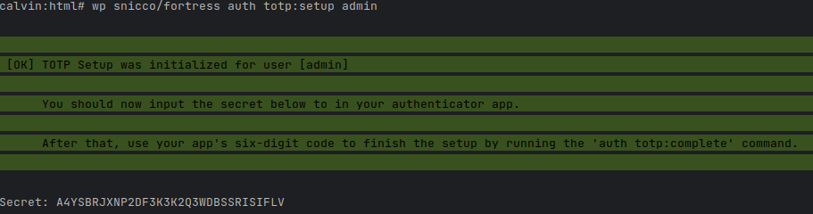
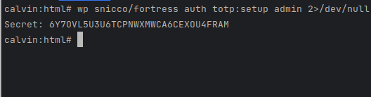
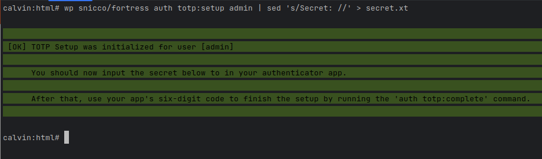
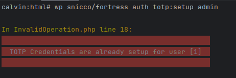
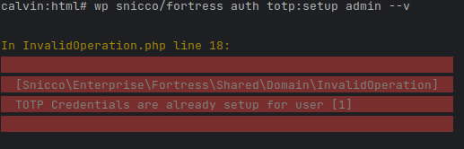
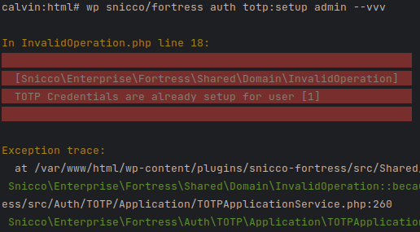
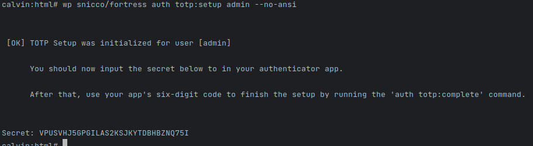

# Fortress WP-CLI integration

<!-- TOC -->
* [Introduction](#introduction)
* [General principles](#general-principles)
    * [Writing to `STDOUT` and `STDERR`](#writing-to-stdout-and-stderr)
    * [Exit codes](#exit-codes)
    * [Error handling](#error-handling)
    * [Default command options](#default-command-options)
        * [Output Verbosity](#output-verbosity)
        * [Color support](#color-support)
        * [Interactivity](#interactivity)
* [Command reference](#command-reference)
    * [Shared](#shared)
        * [info](#info)
        * [cache:config](#cacheconfig)
        * [cache:clear](#cacheclear)
        * [config:sources](#configsources)
        * [config:test](#configtest)
        * [trigger-activation](#trigger-activation)
    * [Password](#password)
        * [upgrade-legacy-hashes](#upgrade-legacy-hashes)
        * [force-reset-all](#force-reset-all)
        * [password reset](#password-reset)
    * [Session](#session)
        * [gc](#gc)
        * [destroy-all](#destroy-all)
        * [toggle-sudo](#toggle-sudo)
    * [Auth](#auth)
        * [totp:setup](#totpsetup)
        * [totp:complete](#totpcomplete)
        * [totp:deactivate](#totpdeactivate)
        * [totp:reset-recovery-codes](#totpreset-recovery-codes)
        * [totp:reset-failed-attempts](#totp-reset-failed-attempts)
        * [magic-link:create](#magic-linkcreate)
<!-- TOC -->

## Introduction

Support for WP-CLI is an afterthought in most WordPress plugins.

On the contrary, Fortress is built with a CLI-first approach to allow maximum automation in [appliance distribution](../getting-started/05_appliance_distribution.md).

Fortress has 100% feature parity between the Web UI and the WP-CLI. Therefore, everything that is (and will be) available in the Web UI can be performed using Fortress's WP-CLI commands.

Our open-source [`BetterWPCLI`](https://github.com/snicco/better-wp-cli) library was created because we wanted to build a proper enterprise console application.
Something that can not be accomplished using WP-CLI out of the box for [various reasons](https://github.com/snicco/better-wp-cli#motivation).

Using Fortress's CLI will resemble the quality and reliability of command line applications like Laravel's artisan or Symfony's console.

## General principles

### Writing to `STDOUT` and `STDERR`

The following rules are valid without exception, and every deviance will be considered a bug:

- `STDOUT` only contains the primary output of a command that might be piped into a different command. If a command has no output, it writes nothing to `STDOUT`.
- Everything else is written to `STDERR`, including all diagnostic output, messages for the user running the command, and progress information.

Let's illustrate this using the [auth totp:setup command](#totpsetup):

```shell
wp snicco/fortress auth totp:setup admin
```

By default, a user running the command from the terminal will see the following:

|  |
|----------------------------------------------------------|

All the text in green is written to `STDERR`.

`STDOUT` contains: <br>
`Secret: A4YSBRJXNP2DF3K3K2Q3WDBSSRISIFLV`.

Since both `STDOUT` and `STDERR` write to the terminal by default, the user sees both outputs.

Let's rerun the same command, but we silence `STDERR` by sending it to `/dev/null` this time.


|  |
|----------------------------------------------------------|

All the green text is gone, proving that both output streams are cleanly separated, allowing you to pipe Fortress's commands into other Unix commands.

```shell
wp snicco/fortress auth totp:setup admin | sed 's/Secret: //' > secret.txt
```

| The secret (`STDOUT`) is not displayed now. <br><br> |
|---------------------------------------------------------------------------------------------------------------|

```console
$ cat secret.txt

WJOLGQFBOBSKZM7VB52BHHBLNOT4HSFD
```

Achieving this using default WP-CLI commands would be very cumbersome pretty quickly:

> - WP_CLI::log(), WP_CLI::success(), WP_CLI::line() write to STDOUT.
> - WP_CLI::warning() and WP_CLI::error() write to STDERR.
> - Progress bars are written to STDOUT, making command piping impossible.
> - Prompts for input are written to STDOUT, making command piping impossible.
    > <br><br>Source: [BetterWPCLI](https://github.com/snicco/better-wp-cli#motivation)

### Exit codes

Fortress's WP-CLI commands return one of the following exit codes:

- `0`: Success.
- `1`: Failure.
- `2`: Command invalid.

### Error handling

Fortress's CLI commands have very robust error handling. [Read more here](../debugging-and-more/error-handling.md#fortress-wp-cli-commands).

### Default command options

Each of Fortress's commands has the following default options in addition to the default options of the WP-CLI.

#### Output Verbosity

[BetterWPCLI](https://github.com/snicco/better-wp-cli#verbosity-levels) has a concept of verbosity levels to allow the user to choose how detailed the command output should be.

- `--v`: Verbose output.
- `--vv`: Very verbose output.
- `--vvv`: Debugging.

Some commands output more detailed information if the user requests more verbosity.

The output verbosity also controls the level of detail of Fortress's exception messages.


|                 Default verbosity.<br><br>                 |
|:-----------------------------------------------------------------------------------------------------------------:|
|      **Running with verbose output**<br><br>       |
| **Running with very verbose output**.<br><br> |

--- 

#### Color support

Fortress can detect if the current environment supports ANSI colors for both `STDOUT` and `STDERR` individually.
Typically, this works without any intervention or configuration.

However, you can explicitly set the behavior using the `--ansi` or `-no-ansi` flag.

```shell
wp snicco/fortress auth totp:setup admin --no-ansi
```

|  |
|--------------------------------------------------|


#### Interactivity

Some Fortress commands might ask for user input, either requesting a secret that should not be passed from the command line or asking for confirmation.

|  |
|------------------------------------------------------------|

This won't work for commands that run in an automated fashion. In this scenario, you have two options:

- Pipe input into the Fortress command. i.e.: <br>
    ```shell
    echo "yes" | wp snicco/fortress some-command
    ```
- Use the `--no-interaction` flag, in which case Fortress will assume that the default answer was chosen.


## Command reference

### Shared

The `wp snicco/fortress shared` namespace contains commands that don't belong to any specific module.

Most of them are used to administrate Fortress itself.

#### info

The `wp snicco/fortress shared info` command can be used to display information about the current Fortress installation such as version and commit hash.

```log
NAME

  wp snicco/fortress shared info

DESCRIPTION

  Outputs information about the current Fortress installation

SYNOPSIS

  wp snicco/fortress shared info [--format=<format>] [--v] [--vv] [--vvv] [--interaction] [--ansi]

OPTIONS

  [--format=<format>]
    The output format of the information
    ---
    default: line
    options:
      - line
      - json
    ---

  [--v]
    Verbose output

  [--vv]
    More verbose output

  [--vvv]
    Maximum verbosity (equal to --debug)

  [--interaction]
    (--no-interaction) Do not ask any interactive question.

  [--ansi]
    Force (or disable --no-ansi) ANSI output.
```

#### cache:config

The `wp snicco/fortress shared cache:config` command lets your currently cached configuration
as JSON.

The `--key` option can be used to display sub-parts of the configuration.

A dot (`.`) can be used for navigating the JSON structure: 

For example: `--key=session.auth`, `--key=session.auth.disable_application_passwords`

A star (`*`) can be used to display the entire configuration including the Snicco Framework configuration.
(This will produce a lot of output).

```log
NAME

  wp snicco/fortress shared cache:config

DESCRIPTION

  Displays the current cached configuration.

SYNOPSIS

  wp snicco/fortress shared cache:config [--key=<key>] [--pretty] [--v] [--vv] [--vvv] [--interaction] [--ansi]

OPTIONS

  [--key=<key>]
    A specific key of the configuration. "." can be used for navigation. "*" can be used to display the entire
    configuration of the Snicco Framework.
    ---
    default: fortress
    ---

  [--pretty]
    Controls if the JSON output should be pretty-printed.

  [--v]
    Verbose output

  [--vv]
    More verbose output

  [--vvv]
    Maximum verbosity (equal to --debug)

  [--interaction]
    (--no-interaction) Do not ask any interactive question.

  [--ansi]
    Force (or disable --no-ansi) ANSI output.
```

#### cache:clear

The `wp snicco/fortress shared cache:clear` command can be used to clear Fortress's internal caches.
Running this command will trigger a full reload/rebuild of [Fortress's configuration](../configuration/01_how_to_configure_fortress.md#clearing-the-configuration-cache).

If you pass the `--factory-reset` flag, Fortress will also purge the snapshot of your [configuration sources](../configuration/01_how_to_configure_fortress.md#configuration-sources) during
the last successful cache build. Make sure that you have tested your configuration sources using
`shared config:test` command before running `shared cache:clear` with the `--factory-reset` flag.

To protect you from accidentally wiping snapshots of  [configuration sources](../configuration/01_how_to_configure_fortress.md#configuration-sources), Fortress will prompt your for confirmation in the terminal if
the `--factory-reset` flag is provided.

In automated environments you could run the command like so:

```shell
echo 'yes' | wp snicco/fortress shared cache:clear --factory-reset
```

```log
NAME

  wp snicco/fortress shared cache:clear

DESCRIPTION

  Clear internal cache of Fortress. The cache will be rebuilt on the subsequent request.

SYNOPSIS

  wp snicco/fortress shared cache:clear [--factory-reset] [--v] [--vv] [--vvv] [--interaction] [--ansi]

OPTIONS

  [--factory-reset]
    Reset all configuration caches. Including the backup snapshots of the last configuration sources.

  [--v]
    Verbose output

  [--vv]
    More verbose output

  [--vvv]
    Maximum verbosity (equal to --debug)

  [--interaction]
    (--no-interaction) Do not ask any interactive question.

  [--ansi]
    Force (or disable --no-ansi) ANSI output.
```

#### config:sources

The `wp snicco/fortress shared config:sources` command can be used to display detailed
information about the configuration sources that Fortress uses on a site. 

This command is highly useful for troubleshooting how different configuration sources
combined result in your final configuration cache.

```log
NAME

  wp snicco/fortress shared config:sources

DESCRIPTION

  Displays all configuration sources that are used on this site.

SYNOPSIS

  wp snicco/fortress shared config:sources [--type=<type>] [--pretty] [--v] [--vv] [--vvv] [--interaction] [--ansi]

OPTIONS

  [--type=<type>]
    Display a specific configuration source.
    ---
    options:
      - appliance
      - server
      - site
    ---

  [--pretty]
    Controls if the JSON output should be pretty-printed.

  [--v]
    Verbose output

  [--vv]
    More verbose output

  [--vvv]
    Maximum verbosity (equal to --debug)

  [--interaction]
    (--no-interaction) Do not ask any interactive question.

  [--ansi]
    Force (or disable --no-ansi) ANSI output.
```

#### config:test

The `wp snicco/fortress shared config:test` command can be used to validate that
your current configuration sources will be able to build a valid configuration cache.

```log
NAME

  wp snicco/fortress shared config:test

DESCRIPTION

  Tests that all configuration sources are valid.

SYNOPSIS

  wp snicco/fortress shared config:test [--format=<format>] [--reload-on-success] [--v] [--vv] [--vvv] [--interaction]
  [--ansi]

OPTIONS

  [--format=<format>]
    The output format of possible errors
    ---
    default: text
    options:
      - text
      - json
    ---

  [--reload-on-success]
    Automatically clear internal caches and reload the configuration if it is valid.

  [--v]
    Verbose output

  [--vv]
    More verbose output

  [--vvv]
    Maximum verbosity (equal to --debug)

  [--interaction]
    (--no-interaction) Do not ask any interactive question.

  [--ansi]
    Force (or disable --no-ansi) ANSI output.
```

#### trigger-activation

The `wp snicco/fortress shared trigger-activation` hook can be used to trigger Fortress's plugin activation hook if Fortress runs as a must-use plugin.

```log
NAME

  wp snicco/fortress shared trigger-activation

DESCRIPTION

  Trigger plugin activation hooks with the WP-CLI.

SYNOPSIS

  wp snicco/fortress shared trigger-activation [--v] [--vv] [--vvv] [--interaction] [--ansi]

OPTIONS

  [--v]
    Verbose output

  [--vv]
    More verbose output

  [--vvv]
    Maximum verbosity (equal to --debug)

  [--interaction]
    (--no-interaction) Do not ask any interactive question.

  [--ansi]
    Force (or disable --no-ansi) ANSI output.
```

### Password

The commands `wp snicco/fortress password` namespace belong to the [password module](../modules/password/readme.md) and are only available if the former is enabled.

#### upgrade-legacy-hashes

The `wp snicco/fortress password upgrade-legacy-hashes` command can be used to upgrade all password hashes of existing users to [Fortress's secure password hashing](../modules/password/password-hashing.md).

This command might take a significant amount of time, depending on the size of your database.
This is because each password hash needs to be rehashed using libsodium, which might take up to one second per hash, depending on your configured [default_hash_strength](../configuration/02_configuration_reference.md#default_hash_strength).

This command can be safely run on production sites with many users since it is executed in batches.

For each batch of users, the following steps are taken:

- Start a database transaction.
- Select all records of the batch using a `FOR UPDATE` read-write lock.
- Update all records of the batch.
- Commit the transaction after successful completion or rollback on failure.
- Repeat with the next batch.

The default batch size is `500`.

This command can also safely be retried on failure, timeout, etc.

```log
NAME

  wp snicco/fortress password upgrade-legacy-hashes

DESCRIPTION

  Upgrades legacy password hashes for all users. Users can still use their old password.

SYNOPSIS

  wp snicco/fortress password upgrade-legacy-hashes [--batch-size=<batch-size>] [--v] [--vv] [--vvv] [--interaction]
  [--ansi]

OPTIONS

  [--batch-size=<batch-size>]
    The batch size should be kept between 500-1000 users. This ensures that only a small amount of rows will be locked at
    a time in the database.
    ---
    default: "500"
    ---

  [--v]
    Verbose output

  [--vv]
    More verbose output

  [--vvv]
    Maximum verbosity (equal to --debug)

  [--interaction]
    (--no-interaction) Do not ask any interactive question.

  [--ansi]
    Force (or disable --no-ansi) ANSI output.
```

#### force-reset-all

The `wp snicco/fortress password force-reset-all` can be used to reset the password of all users to a randomly generated one.

**Important:** This command does not send any notification to the user. [Consider this solution](../modules/password/password-hashing.md#informing-users-about-forced-password-resets).

You can provide a comma-separated list of users whose passwords should NOT be reset.

```shell
wp snicco/fortress password force-reset-all --skip-roles="administrator,editor"
# Resets passwords for all users except admins and editors.
```

This command might take a significant amount of time, depending on the size of your database.
This is because each password hash needs to be calculated using libsodium, which might take up to one second per hash, depending on your configured [default_hash_strength](../configuration/02_configuration_reference.md#default_hash_strength).

This command can be safely run on production sites with many users since it is executed in batches.

For each batch of users, the following steps are taken:

- Start a database transaction.
- Select all records of the batch using a `FOR UPDATE` read-write lock.
- Update all records of the batch.
- Commit the transaction after successful completion or rollback on failure.
- Repeat with the next batch.

The default batch size is `500`.

This command can also safely be retried on failure, timeout, etc.

```log
NAME

  wp snicco/fortress password force-reset-all

DESCRIPTION

  Force resets the passwords of all users expect the excluded ones. Users will need to choose a new password.

SYNOPSIS

  wp snicco/fortress password force-reset-all [--skip-roles=<skip-roles>] [--batch-size=<batch-size>] [--v] [--vv] [--vvv]
  [--interaction] [--ansi]

OPTIONS

  [--skip-roles=<skip-roles>]
    Comma seperated list of users roles whose passwords should NOT be reset.
    ---
    default: ""
    ---

  [--batch-size=<batch-size>]
    The batch size should be kept between 500-1000 users. This ensures that only a small amount of rows will be locked at
    a time in the database.
    ---
    default: "500"
    ---

  [--v]
    Verbose output

  [--vv]
    More verbose output

  [--vvv]
    Maximum verbosity (equal to --debug)

  [--interaction]
    (--no-interaction) Do not ask any interactive question.

  [--ansi]
    Force (or disable --no-ansi) ANSI output.
```

#### password reset

The `wp snicco/fortress password reset` command can be used to set a new, randomly-generated, and secure password for a user.

The command will output the plaintext password so you can copy it to a password manager.

```log
NAME

  wp snicco/fortress password reset

DESCRIPTION

  Set the password of a user to securely generated password. The password will be strongly hashed and encrypted and can
  only be verified if the password module is active.

SYNOPSIS

  wp snicco/fortress password reset <user_login> [--v] [--vv] [--vvv] [--interaction] [--ansi]

OPTIONS

  <user_login>
    The username or email of an existing user.

  [--v]
    Verbose output

  [--vv]
    More verbose output

  [--vvv]
    Maximum verbosity (equal to --debug)

  [--interaction]
    (--no-interaction) Do not ask any interactive question.

  [--ansi]
    Force (or disable --no-ansi) ANSI output.
```

### Session

The commands `wp snicco/fortress session` namespace belong to the [session module](../modules/session/readme.md) and are only available if the former is enabled.


#### gc

The `wp snicco/fortress gc` will destroy all **expired** sessions of all users in the database.

It should be run [routinely as a CRON script](../modules/session/custom-session-storage.md#garbage-collecting-expired-session).

```log
NAME

  wp snicco/fortress session gc

DESCRIPTION

  Garbage collect all expired sessions from the database.

SYNOPSIS

  wp snicco/fortress session gc [--v] [--vv] [--vvv] [--interaction] [--ansi]

OPTIONS

  [--v]
    Verbose output

  [--vv]
    More verbose output

  [--vvv]
    Maximum verbosity (equal to --debug)

  [--interaction]
    (--no-interaction) Do not ask any interactive question.

  [--ansi]
    Force (or disable --no-ansi) ANSI output.
```

#### destroy-all

The `wp snicco/fortress session destroy-all` will destroy all users' sessions in the database.

This is a quick and effective way to force all users to log in again.

```log
NAME

  wp snicco/fortress session destroy-all

DESCRIPTION

  Destroy all sessions for all users. This will logout all users.

SYNOPSIS

  wp snicco/fortress session destroy-all [--v] [--vv] [--vvv] [--interaction] [--ansi]

OPTIONS

  [--v]
    Verbose output

  [--vv]
    More verbose output

  [--vvv]
    Maximum verbosity (equal to --debug)

  [--interaction]
    (--no-interaction) Do not ask any interactive question.

  [--ansi]
    Force (or disable --no-ansi) ANSI output.
```

#### toggle-sudo

The `wp snicco/fortress session toggle-sudo` command can be used to test that the [sudo mode](../modules/session/sudo-mode.md) is applied to protected pages without having to wait for a session to leave the sudo mode.

The most recently created session's sudo mode status will be toggled if a user id is provided.
You can also provide a specific (hashed) session token, but there are a few use cases for this.

```log
NAME

  wp snicco/fortress session toggle-sudo

DESCRIPTION

  Toggle the sudo mode status of the session associated with the provided token.

SYNOPSIS

  wp snicco/fortress session toggle-sudo <user_id_or_token> [--v] [--vv] [--vvv] [--interaction] [--ansi]

OPTIONS

  <user_id_or_token>
    A user id or an explicit (hashed) session token. If a user id is passed the most recently active session is used.

  [--v]
    Verbose output

  [--vv]
    More verbose output

  [--vvv]
    Maximum verbosity (equal to --debug)

  [--interaction]
    (--no-interaction) Do not ask any interactive question.

  [--ansi]
    Force (or disable --no-ansi) ANSI output.
```

### Auth

The commands `wp snicco/fortress auth` namespace belong to the [auth module](../modules/auth/readme.md) and are only available if the former is enabled.

#### totp:setup

The `wp snicco/fortress auth totp:setup` can be used to [enable TOTP-2FA](../modules/auth/2fa_totp.md) for a user.

This command will default output the TOTP secret for the user, which can then be pasted into an
authenticator app. However, TOTP-2FA will only be enabled if the user can prove that his authenticator device can generate a valid one-time password.
<br>This can be either achieved by running the [totp:complete](#totpcomplete) command or by using the [Web UI](../modules/auth/2fa_totp.md#ui-setup-walkthrough).

Alternatively, if you are not enabling TOTP-2FA for your account, but for a different user or maybe in an automated environment, you might provide
the `--force-complete` flag.

This will instruct Fortress to create AND activate TOTP-2FA for the user.
The command will output the plaintext TOTP secret and the recovery codes.

**For automated site setups: Do NOT store the 2FA secret and recovery codes indefinitely. Only show them once.**

```log
NAME

  wp snicco/fortress auth totp:setup

DESCRIPTION

  Setup new TOTP credentials for a WordPress user.

SYNOPSIS

  wp snicco/fortress auth totp:setup <user> [--force-complete] [--v] [--vv] [--vvv] [--interaction] [--ansi]

OPTIONS

  <user>
    A valid WordPress user ID, username, or user email.

  [--force-complete]
    Force complete the setup and skip TOTP validation. Use this option when setting up credentials for different users.

  [--v]
    Verbose output

  [--vv]
    More verbose output

  [--vvv]
    Maximum verbosity (equal to --debug)

  [--interaction]
    (--no-interaction) Do not ask any interactive question.

  [--ansi]
    Force (or disable --no-ansi) ANSI output.
```

#### totp:complete

The `wp snicco/fortress auth totp:complete` command can be used to [complete the TOTP-2FA setup](../modules/auth/2fa_totp.md#completion-screen) for a user.

This command can only be run after TOTP-credentials have been set up, either through the Web UI or by running the [`auth totp:setup`](#totpsetup) command.

Fortress will activate TOTP-2FA only if the provided one-time password is correct.

The command outputs the user's recovery codes.

```log
NAME

  wp snicco/fortress auth totp:complete

SYNOPSIS

  wp snicco/fortress auth totp:complete <user> <totp> [--v] [--vv] [--vvv] [--interaction] [--ansi]

OPTIONS

  <user>
    A valid WordPress user ID, username, or user email.

  <totp>
    The six-digit password generated by your authentication app.

  [--v]
    Verbose output

  [--vv]
    More verbose output

  [--vvv]
    Maximum verbosity (equal to --debug)

  [--interaction]
    (--no-interaction) Do not ask any interactive question.

  [--ansi]
    Force (or disable --no-ansi) ANSI output.
```

#### totp:deactivate

The `wp snicco/fortress auth:totp deactivate` command can be used to delete a user's TOTP credentials.

The `--force` flag has to be provided for the user's that [require TOTP-2FA to be enabled](../modules/auth/2fa_totp.md#enforcing-2fa-pre-login) pre-login.

```log
NAME

  wp snicco/fortress auth totp:deactivate

DESCRIPTION

  Deactivate TOTP for a WordPress user and delete their TOTP credentials.

SYNOPSIS

  wp snicco/fortress auth totp:deactivate <user> [--force] [--v] [--vv] [--vvv] [--interaction] [--ansi]

OPTIONS

  <user>
    A valid WordPress user ID, username, or user email.

  [--force]
    Force deactivate TOTP, even if it's required for the user role.

  [--v]
    Verbose output

  [--vv]
    More verbose output

  [--vvv]
    Maximum verbosity (equal to --debug)

  [--interaction]
    (--no-interaction) Do not ask any interactive question.

  [--ansi]
    Force (or disable --no-ansi) ANSI output.
```

#### totp:reset-recovery-codes

The `wp snicco/fortress auth totp:reset-recovery-codes` command can be used to reset a user's TOTP recovery codes in case the user uses access to them or assumes them to be compromised.

This command does NOT reset the TOTP-secret so that nothing has to be changed regarding the authenticator app.

```log
NAME

  wp snicco/fortress auth totp:reset-recovery-codes

DESCRIPTION

  Generate a new set of TOTP recovery codes for a WordPress users. The old recovery codes are invalidated. The TOTP secret
  stays the same.

SYNOPSIS

  wp snicco/fortress auth totp:reset-recovery-codes <user> [--v] [--vv] [--vvv] [--interaction] [--ansi]

OPTIONS

  <user>
    A valid WordPress user ID, username, or user email.

  [--v]
    Verbose output

  [--vv]
    More verbose output

  [--vvv]
    Maximum verbosity (equal to --debug)

  [--interaction]
    (--no-interaction) Do not ask any interactive question.

  [--ansi]
    Force (or disable --no-ansi) ANSI output.
```

### totp:reset-failed-attempts

The `wp snicco/fortress auth totp:reset-failed-attempts` command can be used reset the allowed failed attempts
for TOTP 2FA for a given user to the default value of [`max_totp_attempts_before_lockout`](../configuration/02_configuration_reference.md#max_totp_attempts_before_lockout).

```log
NAME

  wp snicco/fortress auth totp:reset-failed-attempts

DESCRIPTION

  Resets the allowed totp attempts to the default value for a given user.

SYNOPSIS

  wp snicco/fortress auth totp:reset-failed-attempts <user> [--v] [--vv] [--vvv] [--interaction] [--ansi]

OPTIONS

  <user>
    A valid WordPress user ID, username, or user email.

  [--v]
    Verbose output

  [--vv]
    More verbose output

  [--vvv]
    Maximum verbosity (equal to --debug)

  [--interaction]
    (--no-interaction) Do not ask any interactive question.

  [--ansi]
    Force (or disable --no-ansi) ANSI output.
```

### magic-link:create

The `wp snicco/fortress auth magic-link:create` command can be used created [Magic Login Links](../modules/auth/magic_login_links.md) for any user.

```log
NAME

  wp snicco/fortress auth magic-link:create

DESCRIPTION

  Creates a one-time, magic login link for the provided user.

SYNOPSIS

  wp snicco/fortress auth magic-link:create <user> [--bypass-2fa] [--sso] [--email] [--skip-squeeze-page] [--v] [--vv]
  [--vvv] [--interaction] [--ansi]

OPTIONS

  <user>
    A valid username, email, or id.

  [--bypass-2fa]
    Allow the login link to bypass Fortress's 2FA if the user has it configured.

  [--sso]
    Allow the login link to bypass other plugin's potential 2FA/login checks.

  [--email]
    Send the login link to the user's account email instead of outputting it. Can't be combined with
    --bypass-2fa/--sso.

  [--skip-squeeze-page]
    Immediately try to log in the user on the first GET request instead of displaying a squeeze page.

  [--v]
    Verbose output

  [--vv]
    More verbose output

  [--vvv]
    Maximum verbosity (equal to --debug)

  [--interaction]
    (--no-interaction) Do not ask any interactive question.

  [--ansi]
    Force (or disable --no-ansi) ANSI output.
```

---

Next: [Short-circuiting Fortress](../debugging-and-more/short-circuiting-fortress.md).
